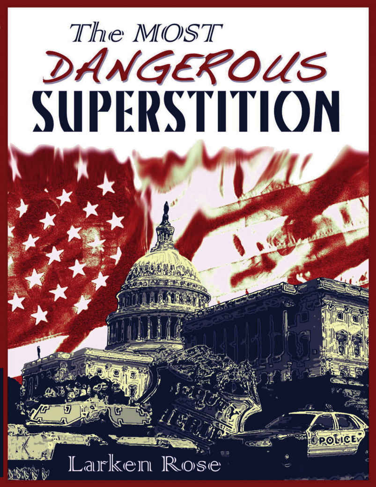
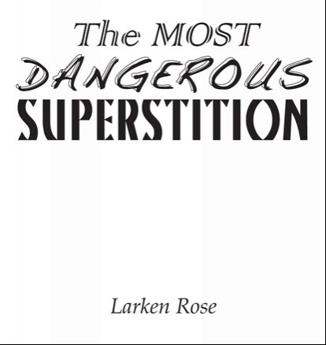

*Nejnebezpečnější pověra*, druhá edice

Copyright 2012, Larken Rose

ISBN 978-1-62407-169-0

### Poznámka o copyrightu

*"Copyright" je obvykle implicitní hrozbou ("Nekopíruj to, jinak!"). Doufám, že každý, komu se tato kniha líbí, si ode mne koupí další kopie, ale pokud ji někdo zkopíruje bez mého svolení, jen proto se necítím oprávněn použít proti takové osobě sílu, ať už sám, nebo prostřednictvím "státu." Kdyby někdo začal prodávat "falešné" kopie, to už je jiný příběh. Knihu jsem si ale opatřil autorskými právy především proto, aby si ji nemohl opatřit někdo jiný a tím mi pomocí státního násilí zabránit v jejím šíření.* - Larken Rose

### Obsah

 - [Než začnete číst](#než-začnete-číst)
 - [**Část I: Nejnebezpečnější pověra**](#část-i-nejnebezpečnější-pověra)
    - [Počínaje pointou](#počínaje-pointou)
    - [Přehled](#přehled)
    - [Identifikace nepřítele](#identifikace-nepřítele)
    - [Nic takového neexistuje](#nic-takového-neexistuje)
    - [Odnože pověry](#odnože-pověry)
    - [Pokusy o racionalizaci iracionálního](#pokusy-o-racionalizaci-iracionálního)
    - [Mýtus souhlasu](#mýtus-souhlasu)
    - [Další mytologie](#další-mytologie)
    - [Tajemná přísada](#tajemná-přísada)
    - [Výmluva na nezbytnost](#výmluva-na-nezbytnost)
 - [**Část II: Vyvrácení mýtu**](#část-ii-vyvrácení-mýtu)
    - [Opuštění mýtu](#opuštění-mýtu)
    - [Proč je mýtus lákavý](#proč-je-mýtus-lákavý)
    - [Náboženství státu](#náboženství-státu)
    - [Jen víc nemorálního násilí](#jen-víc-nemorálního-násilí)
    - [Kdo jim dal právo?](#kdo-jim-dal-právo)
    - [Určování morálky](#určování-morálky)
    - [Nelze neusuzovat](#nelze-neusuzovat)
 - [**Část III: Účinky pověry**](#část-iii-účinky-pověry)
    - [Účinky mýtu](#účinky-mýtu)
 - [**Část III(a): Účinky na pány**](#část-iiia-účinky-na-pány)
    - [Svaté právo politiků](#svaté-právo-politiků)
 - [**Část III(b): Účinky na vymahače**](#část-iiib-účinky-na-vymahače)
    - [Plnění příkazů](#plnění-příkazů)
    - [Milgramovy experimenty](#milgramovy-experimenty)
    - [Výuka slepé poslušnosti](#výuka-slepé-poslušnosti)
    - [Vytváření zrůd](#vytváření-zrůd)
    - [Démonizace oběti](#démonizace-oběti)
    - [Co znamená odznak](#co-znamená-odznak)
    - [Vznešené motivy, zlé činy](#vznešené-motivy,-zlé-činy)
    - [Hrdost páchat zlo](#hrdost-páchat-zlo)
 - [**Část III(c): Účinky na cíle**](#část-iiic-účinky-na-cíle)
    - [Hrdost být okraden](#hrdost-být-okraden)
    - [Hrdost být ovládán](#hrdost-být-ovládán)
    - [Dobro platí zlo](#dobro-platí-zlo)
    - [Vlastnoručně kopaný hrob](#vlastnoručně-kopaný-hrob)
    - [Účinky na skutečné zločince](#účinky-na-skutečné-zločince)
 - [**Část III(d): Účinky na pozorovatele**](#část-iiid-účinky-na-pozorovatele)
    - [Hřích nevzdoru](#hřích-nevzdoru)
    - ["Legální" zlo jako dobro](#legální-zlo-jako-dobro)
    - [Povinnost jednat špatně](#povinnost-jednat-špatně)
    - [Dvojí metr na násilí](#dvojí-metr-na-násilí)
    - [Nebezpečí nečinnosti](#nebezpečí-nečinnosti)
 - [**Část III(e): Účinky na zastánce**](#část-iiie-účinky-na-zastánce)
    - ["Legalizovaná" agrese](#"Legalizovaná"-agrese)
    - [Výmluvy pro agresi](#výmluvy-pro-agresi)
    - [Charita cestou násilí](#charita-cestou-násilí)
    - [Zastánci brutality](#zastánci-brutality)
    - [Nucené benefity](#nucené-benefity)
    - [Útok na obranu](#útok-na-obranu)
    - [Násilí jako standard](#násilí-jako-standard)
    - [Jak mýtus poráží ctnost](#jak-mýtus-poráží-ctnost)
    - ["Liberální" zbabělost](#"liberální"-zbabělost)
    - ["Konzervativní" zbabělost](#"konzervativní"-zbabělost)
    - [Opravdová tolerance](#opravdová-tolerance)
    - [Velký, malý, levý, pravý, vždycky zlý](#velký,-malý,-levý,-pravý,-vždycky-zlý)
    - [Žádná objektivní vzor](#žádná-objektivní-vzor)
    - [Účinky na zastánce svobody](#účinky-na-zastánce-svobody)
    - [Pravidla hry](#pravidla-hry)
    - [Legitimizace útlaku](#legitimizace-útlaku)
    - [Libertariánský protimluv](#libertariánský-protimluv)
    - [Stejný jako starý pán](#stejný-jako-starý-pán)
    - [Směs moudrosti a šílenství](#směs-moudrosti-a-šílenství)
    - [Mýtus o smlouvě](#mýtus-o-smlouvě)
 - [**Část IV: Život bez pověry**](#část-iv-život-bez-pověry)
    - [Řešení](#řešení)
    - [Skutečnost je anarchie](#skutečnost-je-anarchie)
    - [Strach ze svobody](#strach-ze-svobody)
    - [Pohled na jiný svět](#pohled-na-jiný-svět)
    - [Svět bez vládců](#svět-bez-vládců)
    - [Myslet jinak, mluvit jinak](#myslet-jinak,-mluvit-jinak)
    - [Výuka morálky vs. výuka autority](#výuka-morálky-vs.-výuka-autority)
    - [Žádný geniální plán](#žádný-geniální-plán)
    - [Vládneš ty, vládnu já](#vládneš-ty,-vládnu-já)
    - [Jiná společnost](#jiná-společnost)
    - [Jiný druh pravidel](#jiný-druh-pravidel)
    - [Organizace bez "autority"](#organizace-bez-autority)
    - [Obrana bez "autority"](#obrana-bez-"autority")
    - [Odrazující a podněcující prostředky](#odrazující-a-podněcující-prostředky)
    - [Anarchie v praxi](#anarchie-v-praxi)
    - [Anti-autoritářská výchova](#anti-autoritářská-výchova)
    - [Na půli cesty](#na-půli-cesty)
    - [Cesta ke spravedlnosti](#cesta-ke-spravedlnosti)
    - [Vedlejší účinky mýtu](#vedlejší-účinky-mýtu)
    - [Jaká může být společnost](#jaká-může-být-společnost)
    - [Přijetí reality](#přijetí-reality)
    - [Pointa znovu a naposled](#pointa-znovu-a-naposled)

*Tato kniha a ostatní díla Larkena Rose jsou dostupné na* www.LarkenRose.com

### Věnování

*Tato kniha je věnována dvěma lidem: prvnímu člověku, který kvůli přečtení této knihy neuposlechne příkazu, aby někomu ublížil, a člověku, kterému se v důsledku toho nic nestane.*

## Než začnete číst

To, co se dočtete v této knize, bude s největší pravděpodobností v přímém rozporu s tím, co vás učili vaši rodiče a učitelé, co vám říkaly církve, média a vláda, a s většinou toho, čemu jste vy, vaše rodina a vaši přátelé vždy věřili. Přesto je to pravda, jak uvidíte, pokud si dovolíte o této otázce objektivně uvažovat. Nejenže je to pravda, ale možná je to také ta nejdůležitější pravda, kterou kdy uslyšíte.

Stále více lidí tuto pravdu objevuje, ale k tomu je třeba překonat mnohé předsudky a hluboce zakořeněné pověry, odložit celoživotní indoktrinaci a poctivě a čestně prozkoumat některé nové myšlenky. Pokud to uděláte, zažijete dramatickou změnu ve svém pohledu na svět. Zpočátku se budete téměř jistě cítit nepříjemně, ale z dlouhodobého hlediska se vám to vyplatí. A pokud se dostatečný počet lidí rozhodne tuto pravdu vidět a přijmout ji, nejenže to drasticky změní způsob, jakým tito lidé vidí svět; drasticky to změní i svět samotný, a to k lepšímu.

Ale kdyby taková jednoduchá pravda mohla změnit svět, nevěděli bychom o ní všichni a neprosadili bychom ji už dávno? Pokud by lidé byli čistě rasou myslících, objektivních bytostí, pak ano. Ale historie ukazuje, že většina lidských bytostí raději doslova zemře, než aby objektivně přehodnotila systémy víry, v nichž byla vychována. Průměrný člověk, který si přečte v novinách o válce, útlaku a nespravedlnosti, se bude divit, proč taková bolest a utrpení existují, a bude si přát, aby skončily. Pokud mu však někdo naznačí, že k tomuto utrpení přispívají jeho *vlastní* názory, téměř jistě takový návrh bez rozmýšlení odmítne a možná dokonce napadne toho, kdo takový návrh vyslovil.

Takže, čtenáři, pokud pro tebe tvá víra a pověry - z nichž mnohé sis sám nevybral, ale pouze zdědil jako nezpochybnitelné "obnošené" přesvědčení - mají větší význam než pravda a spravedlnost, pak prosím přestaň číst a dej tuto knihu někomu jinému. Pokud jsi naopak ochotný zpochybnit některé ze svých dlouho zažitých, předpojatých názorů, pokud to může snížit utrpení druhých, pak si tuto knihu přečtěte. A *pak* ji dej někomu jinému.

# Část I: Nejnebezpečnější pověra

## Počínaje pointou

Kolik milionů lidí se dívalo na kruté hrůzy historie s nesčetnými příklady nelidského zacházení člověka s člověkem a nahlas přemýšlelo, jak se něco takového mohlo stát? Pravdou je, že většina lidí by nechtěla vědět, jak se to děje, protože sami nábožensky lpí právě na víře, která to umožňuje. Drtivou většinu utrpení a nespravedlnosti na světě, a to jak v současnosti, tak i tisíce let nazpět, lze přímo přičíst jediné *myšlence*. Není to chamtivost, nenávist ani žádná z dalších emocí či idejí, které se obvykle viní ze zla ve společnosti. Většina násilí, krádeží, přepadení a vražd ve světě je naopak důsledkem pouhé *pověry* - víry, která, ačkoli je téměř všeobecně rozšířená, je v rozporu se všemi důkazy a rozumem (ačkoli ti, kdo tuto víru zastávají, to tak samozřejmě nevidí). "Pointa" této knihy je snadno vyjádřitelná, i když pro většinu lidí je obtížné ji přijmout, nebo dokonce o ní klidně a racionálně uvažovat:

**Víra v autoritu, která zahrnuje veškerou víru ve stát, je iracionální a vnitřně rozporná; odporuje civilizaci a morálce a představuje nejnebezpečnější a nejničivější pověru, jaká kdy existovala. Víra v autoritu je spíše úhlavním nepřítelem lidstva, než aby byla hybnou silou řádu a spravedlnosti.**

Téměř všichni jsou ovšem vychováváni k přesnému opaku: že poslouchání "autority" je ctnost (alespoň ve většině případů), že respektování a dodržování "státních zákonů" nás činí civilizovanými a že nerespektování "autority" vede pouze k chaosu a násilí. Lidé jsou vlastně tak důkladně vycvičeni, aby si poslušnost spojovali s "dobrem," že napadání konceptu "autority" bude pro většinu lidí znít jako naznačování, že neexistuje nic takového jako dobro a zlo, že není třeba dodržovat žádné normy chování, že není třeba mít vůbec žádnou morálku. To však *není* to, co je zde obhajováno - spíše naopak.

Mýtus autority je totiž třeba zbořit právě proto, že *existuje* něco jako dobro a zlo, že *záleží* na tom, jak se k sobě lidé chovají, a že by se lidé *měli* vždy snažit žít morálně. Navzdory neustálé autoritářské propagandě, která tvrdí opak, se úcta k "autoritě" a úcta k lidem navzájem vylučují a diametrálně liší. Důvodem, proč nemít úctu k mýtu autority, je to, abychom *mohli* mít úctu k lidskosti a spravedlnosti.

Je zde ostrý kontrast mezi tím, co nás učí jako účel "autority" (vytvořit mírumilovnou, civilizovanou společnost), a skutečnými výsledky "autority" v praxi. Prolistujte si jakoukoli učebnici dějepisu a zjistíte, že většina nespravedlností a ničení, k nimž došlo na celém světě, nebyla výsledkem toho, že lidé "porušili zákon," ale spíše výsledkem toho, že lidé *poslouchali* a *vynucovali* "zákony" různých "států." Zlo, které bylo spácháno navzdory "autoritě," je zanedbatelné ve srovnání se zlem, které bylo spácháno *ve jménu* "autority."

Přesto se děti stále učí, že mír a spravedlnost jsou výsledkem autoritářské vlády a že navzdory zjevnému zlu, kterého se autoritářské režimy na celém světě v historii dopustily, jsou stále morálně povinny respektovat a poslouchat současnou "vládu" své země. Učí je, že "dělat, co se ti řekne," je synonymem dobrého člověka a že "hrát podle pravidel" je synonymem správného jednání. Naopak, být morálním člověkem vyžaduje převzít osobní odpovědnost za posuzování dobra a zla a řídit se vlastním svědomím, což je opakem respektování a poslouchání "autorit."

Důvod, proč je tak důležité, aby lidé tuto skutečnost pochopili, je ten, že hlavní nebezpečí, které představuje mýtus autority, se *nenachází* v myslích "státních" vládců, ale v myslích těch, kteří *jsou* ovládáni. Jeden zlý jedinec, který rád vládne ostatním, je pro lidstvo triviální hrozbou, pokud spousta dalších lidí nepovažuje takovou nadvládu za legitimní, protože je jí dosaženo prostřednictvím "státních zákonů." Zvrácená mysl Adolfa Hitlera sama o sobě nepředstavovala pro lidstvo téměř žádnou hrozbu. Byly to miliony lidí, kteří Hitlera vnímali jako "autoritu," a cítili se proto povinni poslouchat jeho příkazy a plnit jeho nařízení, kdo ve skutečnosti způsobil škody napáchané Třetí říší. Jinými slovy, problém není v tom, že *zlí* lidé věří v autoritu; problém je v tom, že v podstatě *dobří* lidé věří v autoritu, a v důsledku toho nakonec obhajují a dokonce páchají násilné, nespravedlivé a utlačující činy a dokonce i vraždy.

Průměrný etatista (ten, kdo věří ve stát) bude sice naříkat nad všemi způsoby, jimiž byla "autorita" použita jako nástroj zla, a to i v jeho vlastní zemi, ale stále bude trvat na tom, že je možné, aby "stát" byl silou dobra, a stále si bude představovat, že "autorita" může a musí zajistit cestu k míru a spravedlnosti.

Lidé se mylně domnívají, že mnoho užitečných a legitimních věcí, které přinášejí lidské společnosti prospěch, vyžaduje existenci "státu." Je například dobré, aby se lidé organizovali za účelem vzájemné obrany, aby spolupracovali na dosažení společných cílů, aby hledali způsoby, jak spolupracovat a vycházet spolu v míru, aby vymýšleli dohody a plány, které lidem lépe umožní existovat a prosperovat ve vzájemně výhodném a nenásilném stavu civilizace. Ale to *není* to, co je "stát." Navzdory tomu, že "státy" vždy tvrdí, že jednají ve prospěch lidí a společného dobra, pravdou je, že "stát" je ze své podstaty vždy v přímém rozporu se zájmy lidstva. "Autorita" není ušlechtilá myšlenka, která se někdy mýlí, ani v zásadě platný koncept, který je někdy zkažený. Od shora dolů, od začátku do konce, je samotný *koncept* "autority" protilidský a strašlivě destruktivní.

Většina lidí samozřejmě takové tvrzení těžko spolkne. Není snad stát nezbytnou součástí lidské společnosti? Není to mechanismus, díky němuž je civilizace možná, protože nás, nedokonalé lidi, nutí chovat se spořádaně a mírumilovně? Není právě uzákonění společných pravidel a zákonů tím, co nám umožňuje spolu vycházet, civilizovaně řešit spory a spravedlivě a nenásilně obchodovat a jinak komunikovat? Neslyšeli jsme snad vždy, že nebýt "právního státu" a společného respektu k "autoritám," nebyli bychom o nic lepší než banda hloupých, násilnických bestií, žijících ve stavu věčného konfliktu a chaosu?

Ano, to nám bylo řečeno. A ne, nic z toho není pravda. Ale snažit se vymanit z věčných lží, snažit se vydestilovat pravdu z džungle hluboce zakořeněných nepravd může být nesmírně obtížné, nemluvě o tom, že je to nepříjemné.

## Přehled

Na následujících stránkách čtenář projde několika etapami, aby plně pochopil, proč je víra v autoritu skutečně nejnebezpečnější pověrou v dějinách světa. Nejprve bude pojem "autority" destilován na jeho nejzákladnější podstatu, aby mohl být definován a objektivně zkoumán.

Ve druhé části se ukáže, že *koncept sám o sobě* je fatálně chybný, že základní předpoklad veškerého "státu" je naprosto neslučitelný s logikou a morálkou. Ve skutečnosti se ukáže, že "stát" je čistě *náboženská* víra - na víře založené přijetí nadlidské, mytologické entity, která nikdy neexistovala a existovat nebude. (Od čtenáře se neočekává, že přijme takové překvapivé tvrzení bez dostatečných důkazů a rozumného zdůvodnění, které budou poskytnuty.)

Ve třetí části bude ukázáno, proč je víra v autoritu, včetně veškeré víry ve stát, strašlivě nebezpečná a destruktivní. Konkrétně bude ukázáno, jak víra v autoritu dramaticky ovlivňuje jak *vnímání*, tak *jednání* různých kategorií lidí, což vede doslova miliardy jinak dobrých a mírumilovných lidí k tomu, že schvalují nebo páchají násilné a nemorální agresivní činy. Ve skutečnosti to dělá každý, kdo věří ve stát, ačkoli si to naprostá většina neuvědomuje a vehementně by to popírala.

Ve čtvrté části se čtenář konečně dozví, jak by mohl vypadat život *bez* víry v autoritu. V rozporu s obvyklým předpokladem, že absence "státu" by znamenala chaos a zkázu, se ukáže, že po opuštění mýtu autority se mnohé změní, ale mnohé také zůstane stejné. Ukáže se, proč spíše než víra ve stát, která je příznivá a nezbytná pro mírovou společnost, jak se téměř všichni učili, je tato víra zdaleka největší *překážkou* vzájemně prospěšné organizace, spolupráce a mírového soužití. Stručně řečeno, ukáže se, proč skutečná civilizace může existovat a bude existovat až poté, co bude vymýcen mýtus autority.

## Identifikace nepřítele

Od útlého dětství se učíme podřizovat se vůli "autorit," poslouchat nařízení těch, kteří tak či onak získali moc a vládu. Od počátku je dítě hodnoceno, ať už explicitně, nebo implicitně, nejprve podle toho, jak dobře poslouchá své rodiče, pak podle toho, jak dobře poslouchá své učitele, a nakonec podle toho, jak dobře poslouchá "státní zákony." Ať už implicitně, nebo explicitně, společnost je prosycena myšlenkou, že poslušnost je ctnost a že dobří lidé jsou ti, kteří dělají to, co jim "autorita" nařídí. V důsledku této myšlenky se pojmy morálka a poslušnost v myslích většiny lidí natolik zamotaly, že jakýkoli útok na pojem "autorita" bude většině lidí připadat jako útok na morálku samotnou. Jakýkoli návrh, že "stát" je ze své podstaty nelegitimní, bude znít jako návrh, že by se všichni měli chovat jako bezcitná, krutá zvířata, která žijí podle práva silnějšího.

Potíž je v tom, že systém víry průměrného člověka se opírá o změť nejasných, často protichůdných pojmů a předpokladů. Pojmy jako morálka a zločin, právo a legislativa, vládci a občané často používají lidé, kteří tyto pojmy nikdy racionálně nezkoumali. Abychom pochopili podstatu "autority" a "státu," musíme začít přesným vymezením toho, co tyto pojmy znamenají.

Co je to za věc, které říkáme "stát?" Je to organizace, která lidem říká, co mají dělat. Ale to samo o sobě není úplná definice, protože různé jiné osoby a organizace, které nenazýváme "státem," také říkají lidem, co mají dělat. "Stát" však pouze nenavrhuje a nežádá, ale přikazuje. Na druhou stranu by se dalo říci, že příkazy vydávají také inzerenti a kazatelé, ale ti se za "stát" nepovažují. Na rozdíl od "příkazů" kazatelů a inzerentů jsou příkazy "státu" vymáhány pod hrozbou trestu, použitím síly proti těm, kteří se nepodřídí. Ale ani to nám neposkytuje úplnou definici, protože pouliční rváči a tyrani také prosazují své příkazy, ale nikdo je nenazývá "státem."

Charakteristickým rysem "státu" je to, že se má za to, že má morální *právo* vydávat a vynucovat příkazy. Jeho příkazy se nazývají "zákony" a neuposlechnutí jeho příkazů se nazývá "zločin." Stručně řečeno, určujícím faktorem, který z něčeho dělá "stát," je vnímaná legitimita a správnost moci a vlády, kterou má nad ostatními - jinými slovy jeho "autorita."

"Autoritu" lze shrnout jako **právo vládnout**. Není to jen *schopnost* násilně ovládat druhé, kterou má do určité míry téměř každý. Je to údajné morální *právo* násilně ovládat druhé. Pouliční gang se od "státu" liší tím, jak je vnímán lidmi, které ovládá. Nepovolená vniknutí, loupeže, vydírání, přepadení a vraždy páchané obyčejnými gangstery vnímá téměř každý jako nemorální, neoprávněné a zločinné. Jejich oběti sice jejich požadavkům vyhoví, ale nikoli z pocitu morální povinnosti uposlechnout, pouze ze strachu. Pokud by se zamýšlené oběti pouličního gangu domnívaly, že se mohou postavit na odpor, aniž by jim hrozilo nebezpečí, učinily by tak bez sebemenšího pocitu viny. Nevnímají pouličního grázla jako nějakého legitimního, právoplatného vládce, nepředstavují si ho jako "autoritu." Kořist, kterou lump vybírá, nenazývají "daněmi" a jeho hrozby nenazývají "zákony."

Naproti tomu, příkazy vydávané těmi, kdo nosí nálepku "státu," většina těch, na něž jsou jejich příkazy zaměřeny, vnímá zcela jinak. Většina lidí vnímá moc a vládu, kterou "státní zákonodárci" vykonávají nad všemi ostatními, jako platnou a legitimní, "legální" a dobrou. Většina těch, kdo se těmto příkazům podřizují tím, že "dodržují zákony", a odevzdávají své peníze tím, že "platí daně", tak nečiní pouze ze strachu z trestu v případě neuposlechnutí, ale také z pocitu *povinnosti* poslouchat. Nikdo není hrdý na to, že ho okradl pouliční gang, ale mnozí nosí nálepku "zákona dbalého daňového poplatníka" jako čestný odznak. Je to dáno výhradně tím, jak poddaní vnímají ty, kteří jim dávají příkazy. Pokud jsou vládnoucí vnímáni jako autorita, pak jsou z definice vnímáni jako ti, kteří mají morální právo takové příkazy vydávat, což následně implikuje morální povinnost lidí tyto příkazy poslouchat. Označit se za "zákona dbalého daňového poplatníka" znamená *chlubit se* svou loajální poslušností vůči "státu".

V minulosti si některé církve nárokovaly právo trestat kacíře a jiné hříšníky, ale v dnešním západním světě je pojem "autority" téměř vždy spojen s vládou. Ve skutečnosti v dnešní době se oba z těchto pojmů navzájem implikují: "Autorita" údajně vychází z nařízení ("zákonů") "státu" a "stát" je organizace, která má podle představ právo vládnout, tj. "autorita."

Je třeba rozlišovat mezi tím, zda je příkaz ospravedlněn na základě *situace*, a tím, zda je ospravedlněn na základě toho, kdo příkaz vydal. V této knize se zabýváme pouze druhým typem "autority," ačkoli se tento termín občas používá v jiném smyslu, který má tendenci toto rozlišení zamlžovat. Když například někdo tvrdí, že měl "autoritu" zastavit lupiče, aby vrátil kabelku staré paní, nebo říká, že měl "autoritu" vyhnat vetřelce ze svého pozemku, netvrdí, že má nějaká zvláštní práva, která jiní nemají. Říká pouze, že se domnívá, že určité *situace* ospravedlňují vydání rozkazu nebo použití síly.

Naproti tomu koncept "státu" je o tom, že *někteří lidé* mají zvláštní právo vládnout. A tato představa, představa, že někteří lidé - například v důsledku "voleb" nebo jiných politických rituálů - mají morální právo ovládat ostatní v situacích, kdy by většina lidí neměla, je konceptem, o němž se zde hovoří. Má se za to, že pouze ti, kdo jsou ve "vládě," mají právo vydávat "zákony;" má se za to, že pouze oni mají právo vybírat "daně;" má se za to, že pouze oni mají právo vést války, regulovat určité záležitosti, udělovat licence k různým činnostem atd. Když se v této knize hovoří o "víře v autoritu," má se na mysli právě tento význam: myšlenka, že někteří lidé mají morální právo násilně ovládat druhé, a že v důsledku toho mají tito druzí morální povinnost je poslouchat.

Je třeba zdůraznit, že "autorita" je vždy v očích pozorovatele. Pokud ovládaný věří, že ten, kdo ho ovládá, na to má právo, pak ovládaný vnímá ovládajícího jako autoritu. Pokud ovládaný nevnímá nadvládu jako oprávněnou, pak ovládajícího nevnímá jako autoritu, ale jednoduše jako tyrana nebo grázla. Chapadla víry v autoritu zasahují do všech aspektů lidského života, ale společným jmenovatelem je vždy *vnímaná legitimita* moci, kterou má nad druhými. Každý "zákon" a "daň," (federální, státní i komunální) každé volby a kampaň, každá licence a povolení, každá politická debata a hnutí - zkrátka vše, co má co do činění s vládou, od banální městské vyhlášky až po "světovou válku" - se zcela opírá o myšlenku, že někteří lidé získali morální právo - tím či oním způsobem, v té či oné míře - vládnout nad ostatními.

Nejde jen o zneužití "autority" nebo o spor o "dobrým státem" a "špatným státem", ale o zkoumání základního koncpetu "autority". To, zda je "autorita" chápána jako absolutní, nebo zda má své podmínky či omezení, může mít vliv na to, kolik škody tato "autorita" napáchá, ale nemá to vliv na to, zda je základní koncept racionální. Například americká ústava je představována tak, že vytvořila "autoritu", která měla, alespoň teoreticky, značně omezené právo vládnout. Přesto se stále snažila vytvořit "autoritu" s právem dělat věci (např. "zdaňovat" a "regulovat"), které průměrný občan nemá právo dělat sám. Ačkoli předstírala, že dává právo vládnout pouze v určitých specifických záležitostech, stále si nárokovala propůjčení určité "autority" vládnoucí třídě, a jako taková je terčem následující kritiky "autority" stejně, jako by byla "autorita" nejvyššího diktátora.

(Pojem "autority" se někdy používá ve smyslu, který nemá s tématem této knihy nic společného. Například člověk, který je odborníkem v nějakém oboru, je často označován jako "autorita." Stejně tak některé vztahy připomínají "autoritu," ale nezahrnují žádné právo vládnout. Na vztah zaměstnavatel-zaměstnanec se často pohlíží, jako by existoval "šéf" a "podřízený." Avšak bez ohledu na to, jak moc je zaměstnavatel panovačný nebo povýšený, nemůže pracovníky povolat do služby nebo je uvěznit za neposlušnost. Jedinou pravomocí, kterou skutečně má, je pravomoc ukončit dohodu propuštěním zaměstnance. A stejnou moc má i zaměstnanec, protože může dát výpověď. Totéž platí i pro jiné vztahy, které mohou připomínat "autoritu," například řemeslník a jeho učeň, sensei bojových umění a jeho žák nebo trenér a sportovec, kterého trénuje. Takové scénáře zahrnují ujednání založená na vzájemné, dobrovolné dohodě, v níž má každá ze stran možnost z ujednání vystoupit. Takový vztah, kdy jedna osoba dobrovolně dovolí druhé, aby řídila její činnost v naději, že bude mít prospěch ze znalostí nebo dovedností druhé osoby, není typem "autority," který je předmětem této knihy.)

## Nic takového neexistuje

Většina lidí věří, že "stát" je nezbytný, i když zároveň uznávají, že "státní moc" často vede ke korupci a zneužívání. Vědí, že "stát" může být neefektivní, nespravedlivý, nerozumný a utlačující, ale stále věří, že "autorita" může být silou dobra. Neuvědomují si, že problém nespočívá jen v tom, že "stát" přináší horší výsledky nebo že "autorita" je často zneužívána. Problém je v tom, že samotný *koncept* je naprosto iracionální a vnitřně rozporný. Není to nic jiného než pověra postrádající jakoukoli logickou či důkazní oporu, kterou lidé zastávají pouze v důsledku neustálé sektářské indoktrinace, jejímž cílem je zakrýt logickou absurditu tohoto konceptu. Nezáleží na míře nebo způsobu použití; pravda je taková, že "autorita" *vůbec neexistuje a nemůže existovat*, a neuznání této skutečnosti vedlo miliardy lidí k tomu, že věří věcem a dělají věci, které jsou strašlivě destruktivní. Nic takového jako dobrá "autorita" nemůže existovat - ve skutečnosti nic takového jako "autorita" *vůbec* neexistuje. Ačkoli to může znít divně, lze to snadno dokázat.

Stručně řečeno, **stát neexistuje**. Nikdy neexistoval a nikdy existovat nebude. Politici jsou skuteční, vojáci a policisté, kteří prosazují vůli politiků, jsou skuteční, budovy, které obývají, jsou skutečné, zbraně, kterými vládnou, jsou velmi skutečné, ale jejich údajná "autorita" není. A bez této "autority," bez *práva* dělat to, co dělají, nejsou ničím jiným než bandou zločinců. Pojem "stát" znamená *legitimitu* - znamená výkon "autority" nad určitým lidem nebo místem. Způsob, jakým lidé mluví o těch, kdo jsou u moci, nazývají jejich příkazy "zákony," označují neuposlechnutí těchto příkazů za "zločin" a tak dále, implikuje právo "státu" vládnout a odpovídající povinnost jejích poddaných poslouchat. Bez *práva* vládnout ("autority") není důvod nazývat tento subjekt "státem" a všichni politici a jejich žoldáci se stávají naprosto neodlišitelnými od obřího syndikátu organizovaného zločinu, jejich "zákony" nemají o nic větší platnost než výhrůžky lupičů a zlodějů aut. A takový je ve skutečnosti každý "stát:" nelegitimní banda zločinců, zlodějů a vrahů, která se vydává za právoplatný vládnoucí orgán.

(Důvodem, proč se pojmy "stát" a "autorita" v této knize objevují v uvozovkách, je skutečnost, že nikdy neexistuje legitimní právo vládnout, takže stát a autorita vlastně nikdy neexistují. V této knize se tyto pojmy vztahují pouze na lidi a gangy, o nichž se mylně *předpokládá*, že mají právo vládnout.)

Veškeré politické diskuse hlavního proudu - všechny debaty o tom, co by mělo být "legální" a "nelegální," kdo by měl být dosazen k moci, jaká by měla být "národní politika," jak by měl "stát" řešit různé problémy - to vše je naprosto iracionální a naprostá ztráta času, protože to vše vychází z falešného předpokladu, že jedna osoba může mít právo vládnout druhé, že "autorita" vůbec může existovat. Celá debata o tom, jak by se měla používat "autorita" a co by měl dělat "stát," je přesně tak užitečná jako debata o tom, jak by měl Ježíšek zvládnout Vánoce. Je však neskonale nebezpečnější. Na druhou stranu, odstranění tohoto nebezpečí - vlastně největší hrozby, jaké kdy lidstvo čelilo - nevyžaduje změnu základní podstaty člověka, přeměnu veškeré nenávisti na lásku ani provedení jakékoli jiné drastické změny stavu vesmíru. Místo toho to vyžaduje pouze to, aby si lidé uvědomili a následně opustili jednu konkrétní pověru, jednu iracionální lež, které se téměř všichni naučili věřit. V jistém smyslu by se většina problémů světa vyřešila přes noc, kdyby všichni udělali něco obdobného, jako kdyby přestali věřit v Ježíška.

Jakýkoliv nápad nebo návrh řešení problému, který závisí na existenci "státu," což zahrnuje naprosto vše, co spadá do oblasti politiky, je ze své podstaty neplatný. Použijeme-li analogii, dva lidé by mohli vést užitečnou a racionální diskusi o tom, zda je pro jejich město lepší vyrábět elektřinu z jaderné energie nebo z vodních elektráren. Pokud by však někdo navrhl, že lepší variantou by bylo vyrábět elektřinu pomocí kouzelného skřítčího prachu, jeho připomínky by byly a měly by být odmítnuty jako směšné, protože skutečné problémy nelze řešit pomocí mýtických entit. Přesto téměř všechny moderní diskuse o společenských problémech nejsou ničím jiným než sporem o to, který typ kouzelného skřítčího prachu lidstvo zachrání. Veškerá politická diskuse se opírá o nezpochybnitelný, ale falešný předpoklad, který všichni berou na vědomí jen proto, že vidí a slyší všechny ostatní opakovat tento mýtus: představu, že může existovat něco takového jako legitimní "stát."

Problémem rozšířených mylných představ je právě to, že jsou rozšířené. Když nějaké přesvědčení - i to nejnesmyslnější a nejnelogičtější - zastává většina lidí, nebude věřícím připadat nerozumné. Setrvávat v této víře jim bude připadat snadné a bezpečné, zatímco zpochybňovat ji bude nepříjemné a velmi obtížné, ne-li nemožné. Dokonce ani hojné důkazy o strašlivě ničivé síle mýtu autority, na téměř nepochopitelné úrovni a táhnoucí se tisíce let zpět, nestačily k tomu, aby více než hrstka lidí byť jen začala zpochybňovat tento základní koncept. A tak se lidé, věřící, že jsou osvícení a moudří, nadále potácejí v jedné kolosální katastrofě za druhou, což je důsledek jejich neschopnosti zbavit se *nejnebezpečnější pověry*: víry v autoritu.

## Odnože pověry

Z konceptu "autority" vyrůstá rozsáhlý soubor terminologie. Všechny tyto termíny mají společné to, že implikují určitou legitimitu jedné skupiny lidí, která násilně ovládá jinou skupinu. Zde je jen několik příkladů:

**"Stát:"** Jak již bylo zmíněno, "stát" je prostě označení pro organizaci nebo skupinu lidí, kteří si představují, že mají právo vládnout. Mnoho dalších termínů, které popisují části "státu" (jako "prezident," "kongresman," "soudce" a "zákonodárce"), posiluje domnělou legitimitu vládnoucí třídy.

**"Zákon:"** Výrazy "zákon" a "právní předpis" mají zcela odlišný význam než slova "hrozba" a "příkaz." Rozdíl opět závisí na tom, zda si ti, kdo takové "zákony" vydávají a nařizují, představují, že k tomu mají *právo*. Pokud pouliční gang vydává příkazy všem ve svém okolí, nikdo takové příkazy nenazývá "zákony." Pokud však "stát" vydává příkazy prostřednictvím "legislativního" procesu, téměř každý je nazývá "zákony." Ve skutečnosti je každý autoritářský "zákon" příkaz podpořený hrozbou postihu vůči těm, kteří se mu nepodřídí. Ať už se jedná o "zákon" proti páchání vražd nebo proti stavbě terasy bez stavebního povolení, není to ani návrh, ani žádost, ale příkaz podpořený hrozbou násilí, ať už v podobě nucené konfiskace majetku (tj. pokuty), nebo únosu lidské bytosti (tj. uvěznění). To, co by se dalo nazvat "vydíráním," kdyby to dělal běžný občan, se nazývá "zdaněním," když to dělají lidé, kteří si představují, že mají právo vládnout. To, co by se za normálních okolností považovalo za obtěžování, napadení, únos a další trestné činy, je považováno za "regulaci" a "vymáhání práva," pokud je provádějí ti, kdo tvrdí, že představují "autoritu."

Používání pojmu "zákon" k popisu přirozených vlastností vesmíru, jako jsou *zákony* fyziky a matematiky, samozřejmě nemá nic společného s principem "autority." Kromě toho existuje ještě jeden pojem, nazývaný "přirozené právo," který se od zákonného "práva" (tj. "legislativy") velmi liší. Koncept přirozeného práva spočívá v tom, že existují normy dobra a zla vlastní lidstvu, které nezávisí na žádné lidské "autoritě" a které ve skutečnosti nahrazují všechny lidské "autority." Ačkoli byl tento koncept v nepříliš vzdálené minulosti předmětem mnoha diskusí, dnes už Američany jen zdřídka uslyšíme používat pojem "právo" v tomto kontextu. Tento koncpet není tím, co je v této knize myšleno pod pojmem "právo".

**"Zločin:"** Odvozeninou pojmu "právo" je pojem "zločin." Výraz "spáchání trestného činu" má samozřejmě negativní konotaci. To, že pojem "porušení zákona" je morálně špatný, implikuje, že příkaz, který je neuposlechnut, je ze své podstaty legitimní, a to pouze na základě toho, kdo příkaz vydal. Pokud pouliční gang řekne majiteli obchodu: "Dej nám polovinu svého zisku, nebo ti ublížíme," nikdo nebude považovat majitele obchodu za "zločince," pokud se postaví proti takovému vydírání. Pokud však stejný požadavek vznesou ti, kdo nesou označení "stát," přičemž tento požadavek se nazývá "zákon" a "daně," pak by stejného majitele obchodu téměř každý považoval za "zločince," pokud by se mu odmítl podřídit.

Pojmy "zločin" a "zločinec" samy o sobě ani nenaznačují, jaký "zákon" je porušován. Pomalá jízda na červenou na prázdné křižovatce je "zločin" stejně jako je "zločin" vražda souseda. Před sto lety bylo "zločinem" učit otroka číst; v Německu čtyřicátých let bylo "zločinem" ukrývat Židy před SS. V Pensylvánii je "zločinem" spát venku v nebo na lednici. Spáchat "zločin" znamená doslova neuposlechnout příkazů politiků a "zločinec" je každý, kdo tak učiní. Takové pojmy mají opět zjevně negativní konotaci. Většina lidí nechce být nazývána "zločincem" a myslí to jako urážku, pokud někoho jiného nazvou "zločincem". Opět to předpokládá, že "orgán", který vydává a prosazuje "zákony", má na to *právo*.

**"Zákonodárci:"** "Zákonodárci" mají zvláštní paradox, neboť se má za to, že mají právo vydávat příkazy, vybírat "daně," regulovat chování a jinak donucovat lidi, ale pouze pokud tak činí prostřednictvím "legislativního" procesu. Lidé ve "zákonodárných sborech" jsou vnímáni jako ti, kdo mají právo vládnout, ale *jen* tehdy, pokud svou domnělou "autoritu" uplatňují prostřednictvím určitých přijatých politických rituálů. Když tak učiní, jsou pak "zákonodárci" představováni jako osoby, které mají výlučné právo vydávat příkazy a najímat lidi k jejich prosazování - což je právo, které nemají žádní jiní jedinci. Jinak řečeno, široká veřejnost si upřímně představuje, že morálka je pro "zákonodárce" *jiná* než pro všechny ostatní. Požadování peněz pod pohrůžkou násilí je nemorální krádež, když to dělá většina lidí, ale když to dělají politici, je to vnímáno jako "zdanění." Šéfování lidem a násilné ovládání jejich chování je považováno za obtěžování, zastrašování a napadání, když to dělá většina lidí, ale když to dělají politici, je to považováno za "regulaci" a "vymáhání práva." Říká se jim "zákonodárci," nikoli "příkazodárci," protože jejich příkazy - pokud jsou prováděny určitými "legislativními" postupy - jsou považovány za přirozeně legitimní. Jinými slovy, jsou vnímáni jako "autorita" a poslušnost jejich legislativním příkazům je považována za morální imperativ.

**"Strážci zákona:"** Jeden z nejčastějších příkladů "autority," se kterým se mnoho lidí denně setkává, nese označení "policie" nebo "strážci zákona." Chování "strážců zákona" a způsob, jakým je ostatní vnímají a jak s nimi jednají, zcela jasně ukazuje, že nejsou vnímáni *jen* jako lidé, ale jako zástupci entity zvané "autorita," na kterou se podle přesvědčení vztahují velmi odlišné morální normy.

Předpokládejme například, že někdo řídil auto, aniž by byl připoután bezpečnostním pásem. Kdyby si toho všiml jiný průměrný občan, donutil řidiče zastavit a požadoval po něm vysokou částku peněz, řidič by byl pobouřen. Bylo by to považováno za vydírání, obtěžování, případně napadení a únos. Ale když někdo, kdo tvrdí, že jedná jménem "státu," udělá přesně totéž blikajícími světly (a pronásleduje dotyčného, pokud nezastaví) a pak mu dá "pokutu," většina lidí takové jednání považuje za naprosto legitimní.

Ve zcela reálném smyslu lidé, kteří nosí odznaky a uniformy, nejsou všemi ostatními vnímáni jako obyčejní lidé. Jsou vnímáni jako odnož abstraktní věci zvané "autorita." V důsledku toho se správnost chování "policistů" a oprávněnost jejich činů měří podle daleko jiných měřítek než chování všech ostatních. Jsou posuzováni spíše podle toho, jak dobře prosazují "zákon," než podle toho, zda jejich individuální jednání odpovídá běžným normám správnosti a nesprávnosti, které platí pro všechny ostatní. Tento rozdíl vyjadřují sami "strážci zákona," kteří své jednání často obhajují slovy jako: "Já zákon nevytvářím, já ho jen vymáhám." Zjevně očekávají, že budou posuzováni pouze podle toho, jak věrně plní vůli "zákonodárců," a nikoli podle toho, zda se chovají jako civilizované, rozumné lidské bytosti.

**"Země" a "národy :"** Pojmy "právo" a "zločin" jsou zřejmými odnožemi pojmů "stát" a "autorita," ale mnoho dalších slov v českém jazyce je buď změněno vírou v autoritu, nebo existují výhradně kvůli této víře. Například "země" nebo "národ" je čistě politický pojem. Hranice kolem "země" je podle definice hranicí vymezující území, nad nímž si jedna konkrétní "autorita" nárokuje právo vládnout, čímž se toto místo odlišuje od území, nad nímž si právo vládnout nárokují *jiné* "autority."

Zeměpisné lokality jsou samozřejmě velmi reálné, ale pojem "země" neoznačuje pouze místo. Vždy odkazuje na politickou "jurisdikci" (další termín vycházející z víry v "autoritu"). Když lidé mluví o lásce ke své zemi, málokdy jsou schopni vůbec definovat, co to znamená, ale nakonec jediné, co slovo "země" může znamenat, není místo nebo lidé nebo nějaký abstraktní princip či pojem, ale pouze území, na kterém si určitá parta nárokuje právo vládnout. V kontextu této skutečnosti je pojem lásky k vlasti poněkud zvláštní myšlenkou; vyjadřuje jen o málo víc než psychologickou náklonnost k ostatním subjektům, které ovládá stejná vládnoucí třída - což vůbec není to, co si většina lidí představuje pod pojmem národní loajalita a vlastenectví. Lidé mohou pociťovat lásku k určité kultuře nebo k určitému místu a lidem, kteří tam žijí, nebo k nějakému filozofickému ideálu a zaměňovat to za lásku k vlasti, ale v konečném důsledku je "země" prostě oblast, ve které si určitý "stát" nárokuje právo vládnout. Tohle je to, co určuje hranice, a jsou to právě tyto hranice, které definují "zemi."

## Pokusy o racionalizaci iracionálního

Lidé, kteří se považují za vzdělané, svobodomyslné a pokrokové, se nechtějí považovat za otroky pána, nebo dokonce za poddané vládnoucí třídy. Z tohoto důvodu bylo provedeno mnoho racionalizace a zastírání ve snaze popřít základní povahu "státu" jako vládnoucí třídy. Bylo vytvořeno mnoho verbální gymnastiky, zavádějící terminologie a mytologie, které se snaží zastřít skutečný vztah mezi "vládou" a jejich poddanými. Tato mytologie se učí děti jako "občanská nauka," přestože většina z ní je zcela nelogická a odporuje všem poznatkům. Následující text se zabývá několika oblíbenými typy propagandy, které se používají k zamlžování podstaty "autority."

## Mýtus souhlasu

V moderním světě je otroctví téměř všeobecně odsuzováno. Vztah domnělé "autority" k jejímu podřízenému je však do značné míry vztahem otrokáře (majitele) k otrokovi (majetku). Protože nechtějí připustit a schválit to, co se rovná otroctví, jsou ti, kdo věří v autoritu, vyškoleni, aby si zapamatovali a opakovali zjevně nepřesnou rétoriku, která má zakrýt skutečnou povahu situace. Jedním z příkladů je fráze "souhlas občanů."

Existují dva základní způsoby interakce mezi lidmi: na základě vzájemné dohody, nebo pod výhružkami či násilím od jedné osoby ke druhé. První způsob lze označit jako "souhlas" - obě strany dobrovolně a ochotně souhlasí s tím, co se má udělat. Druhý způsob lze označit jako "vládnutí" - jedna osoba ovládá druhou. Protože tyto dva pojmy - souhlas a vládnutí - jsou protikladné, nedává smysl, aby někdo vládl se "souhlasem občanů." Pokud existuje vzájemný souhlas, nejedná se o "vládu"; pokud existuje vládnutí, neexistuje souhlas. Někteří budou tvrdit, že většina neboli lid jako celek dal souhlas k tomu, aby se mu vládlo, i když mnozí jednotlivci tak neučinili. Takový argument však staví pojem souhlasu na hlavu. Nikdo, jednotlivec ani skupina, nemůže dát souhlas k tomu, aby se něco dělo někomu *jinému*. To prostě není to, co "souhlas" znamená. Říci: "Dávám *svůj* souhlas k tomu, abyste vy byli okradeni." odporuje logice. Přesto je to základem kultu "demokracie:" představa, že většina může dát souhlas také za menšinu. To není "souhlas občanů"; je to násilné ovládání občanů se "souhlasem" třetí strany.

I kdyby byl někdo natolik hloupý, že by někomu skutečně řekl: "Souhlasím s tím, abyste mě násilím ovládali," v okamžiku, kdy vládce musí "ovládaného" k něčemu nutit, již zjevně nejde o "souhlas." Před tímto okamžikem neexistuje žádné "ovládání" - pouze dobrovolná spolupráce. Přesnější vyjádření formulace tohoto konceptu odhaluje jeho vnitřní schizofrenii: "Souhlasím s tím, abyste mě k něčemu nutili, ať už s tím souhlasím, nebo ne."

Ve skutečnosti však nikdo nikdy nesouhlasí s tím, aby si "vláda" dělala, co chce. A tak, aby vykonstruovali "souhlas" tam, kde žádný není, přidávají věřící v autoritu do mytologie další, ještě bizarnější krok: pojem "implicitního souhlasu." Tvrdí, že pouhým životem ve městě, státu nebo zemi člověk "souhlasí" s tím, že bude dodržovat jakákoli pravidla, která vydávají lidé, kteří tvrdí, že mají právo vládnout tomuto městu, státu nebo zemi. Myšlenka je taková, že pokud se někomu pravidla nelíbí, může město, stát nebo zemi zcela opustit, a pokud se rozhodne neodejít, znamená to, že souhlasí s tím, aby ho vládci této jurisdikce ovládali.

Ačkoli je tato myšlenka neustále omílána jako svatá pravda, odporuje zdravému rozumu. Nedává to o nic větší smysl, než když zloděj zastaví v neděli řidiče a řekne mu: "Tím, že v neděli jedete touto čtvrtí, mi dáváte souhlas k tomu vzít si vaše auto." Jedna osoba zjevně nemůže rozhodovat o tom, co se považuje za to, že někdo jiný s něčím "souhlasí." Dohoda je, když si dva nebo více lidí sdělí vzájemné svolení nějakou dohodu uzavřít. Pouhým narozením na určitém území nikdo nedává k ničemu souhlas, stejně jako jej nedává bydlením ve vlastním domě, o kterém nějaký král nebo politik prohlásil, že patří do říše, které vládne. Jedna věc je, když někdo řekne: "Jestli chceš jet v mém autě, nesmíš kouřit," nebo "Do mého domu můžeš vstoupit, jen když si sundáš boty." Něco jiného je snažit se druhým lidem říkat, co mohou dělat na svém vlastním pozemku. Ten, kdo má právo stanovit pravidla pro určité místo, je z definice vlastníkem tohoto místa. To je základem myšlenky soukromého vlastnictví: že může existovat "vlastník," který má výlučné právo rozhodovat o tom, co se s tímto majetkem a na tomto majetku bude dělat. Vlastník domu má právo ostatní z domu vykázat a v důsledku toho má právo říkat návštěvníkům, co mohou a co nemohou dělat, dokud jsou uvnitř.

A to objasňuje základní předpoklady, který stojí za myšlenkou implicitního souhlasu. Říci někomu, že jeho jedinou platnou volbou je buď opustit "zemi," nebo se podřídit jakýmkoli příkazům, které politici vydají, logicky znamená, že vše v "zemi" je majetkem politiků. Pokud člověk rok co rok platí za dům nájem, nebo si ho dokonce sám postavil, a jeho volba je stále buď poslechnout politiky, nebo odejít, znamená to, že jeho dům *a* čas a úsilí, které do něj investoval, jsou majetkem politiků. A to, že čas a úsilí jednoho člověka právem patří druhému, je definice otroctví. Přesně to znamená teorie "implicitního souhlasu:" že každá "země" je obrovskou otrokářskou plantáží a že všechno a všichni v ní jsou majetkem politiků. A pán samozřejmě nepotřebuje souhlas svého otroka.

Věřící ve "stát" nikdy nevysvětlí, jak je možné, že několik politiků získalo právo jednostranně si přivlastnit tisíce čtverečních kilometrů země, kde již žili jiní lidé, jako své území, které mohou ovládat a využívat podle svého uvážení. Nebylo by to nic jiného, než kdyby nějaký šílenec prohlásil: "Tímto prohlašuji Severní Ameriku za své právoplatné panství, takže každý, kdo zde žije, musí dělat, co řeknu. Pokud se vám to nelíbí, můžete odejít."

S přístupem "poslouchej, nebo vypadni" je také praktický problém, který spočívá v tom, že vystoupením by se jedinec pouze přemístil na nějakou *jinou* obří otrokářskou plantáž, do jiné "země." Konečným výsledkem je, že každý na zemi je otrokem a jedinou volbou je, pod jakým pánem bude žít. To zcela vylučuje skutečnou svobodu. Přesněji řečeno, to není to, co znamená "souhlas."

Víra, že politikům patří všechno, se ještě výrazněji projevuje v pojetí imigračních "zákonů." Představa, že člověk potřebuje povolení politiků, aby mohl vkročit kamkoli do celé země - představa, že může být "zločin," když někdo překročí neviditelnou hranici, z jedné autoritářské jurisdikce do druhé - znamená, že celá země je majetkem vládnoucí třídy. Pokud občan "ilegálního imigranta" nesmí zaměstnat, nesmí s ním obchodovat a "ilegála" dokonce nesmí ani pozvat do svého domu, pak tento jednotlivý občan nevlastní nic a politici vlastní všechno.

Teorie "implicitního souhlasu" je nejen logicky chybná, ale zjevně ani nepopisuje realitu. Jakýkoli "stát," který by měl souhlas svých poddaných, by nepotřeboval "vymáhat právo." K vynucování dochází pouze tehdy, pokud někdo s něčím nesouhlasí. Každý, kdo má otevřené oči, vidí, že "stát" běžně dělá spoustě lidí věci proti jejich vůli. Vědět o nesčetném množství výběrčích daní, pochůzkářů, inspektorů a regulátorů, pohraničníků, protidrogových agentů, státních zástupců, soudců, vojáků a všech ostatních žoldáků "státu," a přesto tvrdit, že "stát" dělá to, co dělá, se *souhlasem* "občanů," je naprosto směšné. Každý jednotlivec, pokud je k sobě alespoň trochu upřímný, ví, že těm, kteří jsou u moci, je jedno, zda souhlasí s dodržováním jejich "zákonů." Příkazy politiků budou vymáhány, v případě potřeby i hrubou silou, ať už se souhlasem jednotlivce, nebo bez něj.

## Další mytologie

Kromě mýtu o "souhlasu občanů" se často opakují i další politická rčení a dogmatická rétorika, přestože jsou zcela nepravdivá. V České republice se například lidé učí - a věrně i opakují - výroky jako "Stát *jsme* my" a "Stát je náš sluha" a "Vláda nás *zastupuje*". Takové aforismy jsou očividně hrubě nepravdivé, přestože je neustále papouškují jak vládci, tak poddaní.

Jedním z nejbizarnějších a nejbludnějších (ale velmi častých) tvrzení je, že "stát *jsme* my, všichni lidé". Děti se ve škole učí tuto absurditu opakovat, přestože si všichni plně uvědomují, že politici vydávají příkazy a požadavky a všichni ostatní se jim buď podřídí, nebo jsou potrestáni. V České republice existuje vládnoucí třída a třída poddaných a rozdíly mezi nimi jsou mnohé a zřejmé. Jedna skupina přikazuje, druhá poslouchá. Jedna skupina požaduje obrovské sumy peněz, druhá skupina platí. Jedna skupina říká druhé skupině, kde mohou žít, kde mohou pracovat, co mohou jíst, co mohou pít, čím mohou jezdit, pro koho mohou pracovat, jakou práci mohou vykonávat atd. Jedna skupina bere a utrácí biliony dolarů z toho, co vydělá druhá skupina. Jedna skupina se skládá výhradně z ekonomických parazitů, zatímco úsilí druhé skupiny vytváří veškeré bohatství.

V tomto systému je zcela zřejmé, kdo poroučí a kdo poslouchá. Lidé ani náhodou nejsou "státem" a věřit v opak vyžaduje zásadní zapírání. Ve snaze, aby tato lež zněla racionálně, se však používají i jiné mýty. Například se také tvrdí, že "stát pracuje pro nás, je to náš služebník". Takové tvrzení opět ani zdaleka neodpovídá zjevné realitě; je to jen o málo víc než sektářská mantra, blud záměrně naprogramovaný do obyvatelstva, aby překroutil jejich pohled na realitu. A většina lidí o tom ani nepochybuje. Většina si nikdy nepoloží otázku: Pokud "stát" pracuje pro nás, pokud je naším zaměstnancem, proč rozhoduje o tom, kolik jí budeme platit? Proč náš "zaměstnanec" rozhoduje o tom, co pro nás bude dělat? Proč nám náš "zaměstnanec" říká, jak máme žít? Proč náš "zaměstnanec" vyžaduje naši poslušnost při plnění jakýchkoli svévolných příkazů, které vydává, a posílá na nás ozbrojené vymahače, pokud neuposlechneme? Není možné, aby "stát" byl služebníkem už z jeho samotné podstaty. Jednoduše a konkrétně řečeno, pokud vám někdo může poroučet a brát vám peníze, není vaším služebníkem; a pokud tyto věci *nemůže* dělat, nevládne vám a není "státem". Jakkoli omezená, "stát" je organizace, o níž se má za to, že má právo násilně ovládat chování svých poddaných prostřednictvím "zákonů", což činí všeobecně přijímanou rétoriku o "státních úřednících" zcela směšnou. Představa, že by *vládce* mohl být někdy *služebníkem* těch, nad nimiž vládne, je zjevně absurdní. Přesto se tato nemožnost v hodinách občanské nauky vykládá jako nezpochybnitelná svatá pravda.

Ještě rozšířenější lží, která se snaží zakrýt vztah mezi "státem" a veřejností, je pojem "zastupitelská demokracie". Tvrdí se, že lidé si volbou určitých osob do mocenských pozic "vybírají své vůdce" a že ti, kteří jsou ve funkci, jen zastupují vůli lidu. Opět platí, že nejenže toto tvrzení vůbec neodpovídá realitě, ale i abstraktní teorie, ze které vychází, je ze své podstaty chybná.

V reálném světě takzvaní "zastupitelé" neustále dělají věci, které jejich poddaní nechtějí: zvyšují "daně", zahajují válečné konflikty, prodávají moc a vliv tomu, kdo jim dá nejvíce peněz, a tak dále. Každý daňový poplatník si snadno vybaví příklady věcí financovaných z jeho peněz, které mu vadí, ať už jde o dotace obrovským korporacím, sociální dávky určitým jednotlivcům, akce porušující lidská práva nebo jen celkově plýtvající, zkorumpovanou a neefektivní byrokratickou mašinérii "státu". Neexistuje nikdo, kdo by mohl upřímně říci, že "stát" dělá vše, co chce, a nic, co nechce.

I teoreticky je koncept "zastupitelské demokracie" z podstaty chybný, protože "stát" nemůže zastupovat lid jako celek, pokud všichni nechtějí přesně to samé. Protože různí lidé chtějí, aby "stát" dělal různé věci, bude "stát" vždy postupovat proti vůli alespoň části lidí. I kdyby "stát" dělal přesně to, co chce většina poddaných (což se ve skutečnosti nikdy nestane), stále by nesloužil lidu jako celku; násilím by diskriminoval menšiny ve prospěch většin.

Navíc ten, kdo zastupuje někoho jiného, nemůže mít *více* práv než ten, koho zastupuje. Pokud například jeden člověk nemá právo vloupat se do domu svého souseda a ukrást mu cennosti, pak nemá ani právo určit zástupce, který by to udělal za něj. Zastupovat někoho znamená jednat jeho jménem. Skutečný zástupce může dělat pouze to, na co má osoba, kterou zastupuje, právo. V případě "státu" však lidé, o nichž politici tvrdí, že je zastupují, nemají právo dělat *cokoli*, co dělají politici: ukládat "daně", přijímat "zákony" atd. Průměrní občané nemají právo násilím omezovat svobody svých sousedů, říkat jim, jak mají žít, a trestat je, pokud neuposlechnou. Když tedy "stát" dělá takové věci, nezastupuje nikoho ani nic jiného než sám sebe.

Zajímavé je, že i ti, kteří mluví o "zastupitelské demokracii", odmítají přijmout jakoukoli osobní odpovědnost za činy těch, které volili. Pokud jimi zvolený kandidát přijme škodlivý "zákon", zvýší "daně" nebo rozpoutá válku, voliči nikdy necítí stejnou vinu nebo stud, jaký by cítili, kdyby takové věci dělali oni sami osobně nebo kdyby k tomu najali či pověřili někoho jiného. Tato skutečnost ukazuje, že ani ti nejzapálenější voliči ve skutečnosti nevěří rétorice o "zastupitelské demokracii" a nepovažují politiky za své zástupce. Terminologie neodpovídá realitě a jediným účelem této rétoriky je zastřít skutečnost, že vztah mezi každou "vládou" a jejími poddanými je stejný jako vztah mezi pánem a otrokem. Jeden pán může své otroky bičovat méně přísně než jiný; jeden pán může svým otrokům dovolit, aby si ponechali více z toho, co vyprodukují; jeden pán se může o své otroky lépe starat - ale nic z toho nemění základní, základní povahu vztahu pána a otroka. Ten, kdo má právo vládnout, je pán; ten, kdo má povinnost poslouchat, je otrok. A to platí i tehdy, když se lidé rozhodnou popsat situaci pomocí nepřesné rétoriky a klamavých eufemismů, jako je "zastupitelská demokracie", "souhlas občanů" a "vůle lidu".

Celá představa "demokracie" a "vlády lidí pro lidi" je sice hezká politická rétorika, ale je logicky nesmyslná. Vládnoucí třída nemůže sloužit ani zastupovat ty, kterým vládne, stejně jako nemůže otrokář sloužit ani zastupovat své otroky. Jediný způsob, jak to může udělat, je přestat být otrokářem, tedy osvobodit své otroky. Stejně tak jediným způsobem, jak by se vládnoucí třída mohla stát služebníkem lidu, je *přestat být* vládnoucí třídou, vzdát se veškeré své moci. "Stát" nemůže sloužit lidu, pokud nepřestane být "státem".

Dalším příkladem iracionální etatistické doktríny je koncept "právního státu". Podle této myšlenky je vláda pouhých *lidí* špatná, protože slouží těm, kdo mají zlovolnou touhu po moci, zatímco "vláda práva", jak zní teorie, spočívá v tom, že lidstvu jsou rovným dílem vnucována objektivní, rozumná pravidla. Chvilka zamyšlení odhalí absurditu tohoto mýtu. Navzdory tomu, že se o "právu" často hovoří jako o nějakém svatém, neomylném souboru pravidel, která spontánně vyplývají z podstaty vesmíru, ve skutečnosti je "právo" pouhým souborem příkazů vydávaných a vynucovaných *lidmi* ze "státu". Rozdíl mezi "vládou práva" a "vládou lidí" by byl pouze tehdy, kdyby takzvané "zákony" psalo něco *jiného* než lidé.

## Tajemná přísada

Ve snaze ospravedlnit existenci vládnoucí třídy ("vlády") etatisté často popisují naprosto rozumné, legitimní a užitečné věci a pak je prohlašují za "stát". Mohou tvrdit: "Jakmile lidé spolupracují, aby vytvořili organizovaný systém vzájemné obrany, je to stát". Nebo mohou tvrdit: "Když lidé kolektivně rozhodují o tom, jak budou v jejich městě fungovat věci jako silnice, obchod a vlastnická práva, je to stát". Nebo mohou tvrdit: "Když lidé spojí své zdroje, aby dělali věci kolektivně, místo aby každý jednotlivec musel dělat všechno sám za sebe, to je stát". Ani jedno z těchto tvrzení není pravdivé.

Taková tvrzení mají za cíl, aby "stát" zněl jako přirozená, legitimní a užitečná součást lidské společnosti. Všem těmto tvrzením však zcela uniká základní povaha "státu". "Stát" není organizace, spolupráce nebo vzájemná dohoda. Nespočet skupin a organizací - supermarkety, fotbalové týmy, automobilky, lukostřelecké kluby atd. - se zapojují do kooperativních, vzájemně výhodných kolektivních akcí, ale nenazývají se "státem", protože si nepředstavují, že mají právo vládnout. A to je právě ta tajná složka, která z něčeho dělá "autoritu": domnělé *právo* násilně ovládat druhé.

"Státy" nevznikají jen ze supermarketů nebo fotbalových týmů, ani z lidí, kteří se připravují a zajišťují svou vzájemnou obranu. Mezi otázkou "Jak se můžeme účinně bránit?" a tvrzením "Mám právo vám vládnout" je zásadní rozdíl! Navzdory tomu, co mohou tvrdit učebnice občanské nauky, "státy" nejsou výsledkem ani ekonomiky, ani základní lidské interakce. Nevznikají jen v důsledku toho, že jsou lidé civilizovaní a organizovaní. Jsou zcela produktem mýtu, že "někdo musí vládnout". Bez pověry o autoritě by se žádná spolupráce nebo organizace nikdy nestala "státem". K tomu, aby se *poskytovatel služeb*, ať už jde o jídlo, přístřeší, informace, ochranu nebo cokoli jiného, proměnil v právoplatného *vládce*, je zapotřebí drastické změny ve vnímání veřejnosti. Systém organizace se nemůže zázračně stát "státem", stejně jako se ochranka nemůže zázračně stát králem.

A tato skutečnost souvisí s dalším tvrzením etatistů, že odstranění "státu" by vedlo k tomu, že by se k moci dostaly násilnické gangy, které by se následně staly novým "státem". Násilná nadvláda se však přirozeně nestává "státem" stejně jako mírová spolupráce. Pokud si nový gang nebude představovat, že má *právo* vládnout, nebude vnímán jako "stát". Schopnost ovládat moderní obyvatelstvo - zejména ozbrojené - ve skutečnosti zcela závisí na vnímání *legitimity* budoucích vládců. Vládnout dnes jakékoli populaci značné velikosti pouze hrubou silou by vyžadovalo obrovské množství zdrojů (zbraně, špehové, žoldáci atd.), a to natolik, že by to bylo téměř nemožné. Představa bandy nelítostných zločinců, kteří ovládnou zemi, může být zábavným filmem, ale ve skutečnosti se to nemůže stát v zemi, která je vybavena dokonce jen základními komunikačními prostředky a střelnými zbraněmi. Jediný způsob, jak dnes ovládnout velkou populaci, je, že budoucí vládce nejprve přesvědčí lidi, že má morální *právo* nad jim vládnout; nadvládu může získat pouze tehdy, pokud se mu nejprve podaří vtlouct svým zamýšleným obětem do hlavy mýtus autority, a tím je přesvědčit, že je legitimní a správnou "vládou". A pokud se mu to podaří, bude k získání a udržení moci zapotřebí jen velmi málo skutečné síly. Pokud však jeho režim někdy ztratí legitimitu v očích svých obětí, nebo ji od začátku ani nikdy nezíská, samotná hrubá síla mu žádnou trvalou moc nezajistí.

Zkrátka, ani gangy, ani spolky se nikdy nemohou stát "státem", pokud lidé nevěří, že někdo má právo jim vládnout. Stejně tak, jakmile se lidé jako celek osvobodí od mýtu autority, nebudou potřebovat žádnou revoluci, aby byli svobodní; "stát" prostě přestane existovat, protože jediné místo, kde kdy existoval, je v myslích těch, kteří věří v pověru o autoritě. Opět platí, že politici a žoldáci, kteří vymáhají své hrozby, jsou velmi skuteční, ale bez vnímané *legitimity* jsou uznáváni jako banda mocichtivých zločinců, nikoli jako "stát".

Je třeba také zmínit, že někteří tvrdili (včetně Thomase Jeffersona v Deklaraci nezávislosti), že je možné a žádoucí mít "stát", který nedělá nic jiného než chrání práva jednotlivců. Ale organizace, která by dělala pouze toto, by nebyla "státem". Každý jednotlivec má právo bránit sebe i ostatní proti útočníkům. Uplatňování tohoto práva, a to i prostřednictvím velmi organizované, rozsáhlé operace, by nebylo "státem", stejně jako organizovaná, rozsáhlá výroba potravin nepředstavuje "stát". Aby něco bylo "státem", musí to podle definice dělat něco, na co průměrní lidé nemají právo. "Stát", který má stejná práva jako všichni ostatní, není "státem", stejně jako není "státem" průměrný člověk na ulici.

## Výmluva na nezbytnost

Výmluva, ke které se etatisté (lidé věřící ve stát) nakonec často uchylují, je, že lidstvo *vyžaduje* "stát", že společnost potřebuje vládce, že někdo musí vládnout, jinak by zde byl neustálý chaos a krvavé nepokoje. Ale nutnost, ať už skutečná, nebo falešná, nemůže zhmotnit mýtickou entitu. Právo vládnout nevznikne jen proto, že ho údajně "potřebujeme", abychom měli mírumilovnou společnost. Nikdo nebude tvrdit, že Ježíšek musí být skutečný, protože ho potřebujeme, aby Vánoce fungovaly. Pokud "autorita" neexistuje a nemůže existovat, jak bude prokázáno níže, je tvrzení, že ji "potřebujeme", nejen zbytečné, ale zjevně i nepravdivé. Pouhou silou vůle nemůžeme něco vykouzlit k existenci. Pokud vyskočíte z letadla bez padáku, vaše "potřeba" padák nezhmotní. Ze stejného důvodu, pokud je nemožné, aby jeden člověk získal právo vládnout nad druhým, a nemožné, aby jeden člověk získal povinnost podřídit se druhému (jak je dokázáno níže), pak je tvrzení, že se takové věci "musí" stát, prázdným argumentem.

# Část II: Vyvrácení mýtu

## Opuštění mýtu

Stále více lidí dnes věří, že "stát" není nutný a že lidská společnost by v praxi fungovala mnohem lépe bez něj. Jiní tvrdí, že bez ohledu na to, co "funguje" lépe, je společnost bez násilného státu jedinou morální volbou, protože je to jediná volba, která neobhajuje iniciování násilí proti nevinným lidem. Ačkoli jsou takové argumenty platné a přínosné, ve skutečnosti existuje zásadnější fakt, který tyto diskuse činí bezpředmětnými: "autorita", ať už morální či nikoli, a ať už "funguje" či nikoli, nemůže existovat. A to není pouhé konstatování toho, co by *mělo být*, ale popis toho, co *je*. Pokud "autorita" nemůže existovat - což bude logicky prokázáno níže -, je jakákoli debata o tom, zda ji "potřebujeme" nebo jak dobře funguje v praktické rovině, zbytečná.

Smyslem této knihy tedy není, že by "stát" měl být zrušen, ale že "stát" - tedy *legitimní* vládnoucí třída, která má "autoritu" - *neexistuje a nemůže existovat* a že neschopnost uznat tuto skutečnost vedla k nezměrnému utrpení a nespravedlnosti. Dokonce i většina těch, kteří uznávají "stát" jako obrovskou hrozbu pro lidstvo, mluví o jejím odstranění, jako by skutečně existovala. Mluví, jako by existovala volba mezi tím, zda "stát" mít, nebo nemít. Ale neexistuje. "Stát" je logicky nemožný. Problémem ve skutečnosti není "stát", ale *víra* ve "stát". Analogicky, ten, kdo si uvědomí, že Santa Claus není skutečný, nezačne křížovou výpravu za zrušení Santy nebo za jeho vystěhování ze severního pólu. Prostě v něj přestane věřit. Rozdíl je v tom, že víra v Santa Clause způsobuje jen málo škody, zatímco víra v mýtické monstrum zvané "autorita" vede k nepředstavitelné bolesti a utrpení, útlaku a nespravedlnosti.

Nejde o to, že bychom se měli snažit vytvořit svět bez "autorit", ale o to, že by bylo vhodné, aby lidé přijali skutečnost, že svět bez "autorit" je *všechno, co kdy existovalo*, a že lidstvo by na tom bylo mnohem lépe a lidé by se chovali mnohem racionálněji, morálněji a civilizovaněji, kdyby byla tato skutečnost přijata širokou veřejností.

## Proč je mýtus lákavý

Než se ukáže, že "autorita" nemůže existovat, je třeba se krátce zmínit o tom, proč by někdo něco takového chtěl. Je zřejmé, proč ti, kdo usilují o nadvládu nad druhými, chtějí, aby "stát" existoval: poskytuje jim snadný, údajně legitimní mechanismus, jehož prostřednictvím mohou druhé násilně ovládat. Ale proč by ji měl chtít někdo jiný - proč by ji měli chtít ti, kteří jsou *ovládáni*?

Myšlení etatistů obvykle začíná rozumnou obavou, ale končí šíleným "řešením". Průměrný člověk, který se dívá na svět s vědomím, že na něm žijí miliardy lidských bytostí, z nichž mnohé jsou hloupé nebo nepřátelské, chce přirozeně mít nějakou jistotu, že bude chráněn před všemi nedbalostmi a zlovůlí, které mohou ostatní napáchat. Většina věřících ve stát to otevřeně popisuje jako důvod, proč je "stát" potřeba: protože lidem nelze věřit, protože je v lidské přirozenosti krást, rvát se atd. Etatisté často tvrdí, že bez mocenského orgánu, bez "státu", který by stanovoval a vynucoval společenská pravidla pro každého, by každý spor skončil krveprolitím, spolupráce by byla omezená nebo žádná, obchod by se téměř zastavil, každá by byl "sám za sebe" a lidstvo by degradovalo na lovce a sběrače nebo na svět z filmu "Šílený Max".

V debatě mezi etatismem a anarchismem (nebo voluntaryismem) se často nesprávně předpokládá, že jde o to, zda jsou lidé ze své podstaty dobří a důvěryhodní, a proto nepotřebují být ovládáni, nebo jsou ze své podstaty špatní a nedůvěryhodní, a proto potřebují "vládu", která by je hlídala. Ve skutečnosti, ať už jsou lidé všichni dobří, všichni špatní, nebo něco mezi tím, je víra v autoritu stále iracionální pověrou. Ale nejoblíbenější výmluva pro "stát" - že lidé jsou špatní a je třeba jim vládnout - bezděčně odhaluje šílenství vlastní každému etatismu.

Pokud jsou lidé tak neopatrní, hloupí a zlomyslní, že jim nelze věřit, že sami udělají správnou věc, jak by se situace zlepšila, kdybychom vzali *podskupinu* těch samých neopatrných, hloupých a zlomyslných lidí a dali jim společenské *povolení* násilně ovládat všechny ostatní? Proč si někdo myslí, že přeskupení a reorganizace skupiny nebezpečných bestií je zcivilizuje? Odpověď naznačuje mytologickou povahu víry v autoritu. Autoritáři neusilují pouze o jiné uspořádání lidských bytostí, ale o zapojení jakési *nadlidské* entity s právy, která lidské bytosti nemají, a s *ctnostmi*, které lidské bytosti nemají, a kterou lze použít k udržení všech nedůvěryhodných lidí na uzdě. Tvrdit, že lidské bytosti jsou tak nedokonalé, že je třeba jim vládnout - což je běžný refrén etatistů - znamená, že to vládnutí musí provádět něco *jiného* než lidské bytosti. Ale ať studujete "stát" jakkoli usilovně, zjistíte, že jej vždy řídí výhradně *lidé*. Tvrdit, že "stát" je nutný, protože *lidé* jsou nedůvěryhodní, je stejně iracionální jako tvrdit, že když někoho napadne roj včel, řešením je vytvořit autoritářskou hierarchii *mezi včelami* a některým z nich přidělit povinnost bránit *ostatním* včelám škodit. Ať už jsou včely jakkoli nebezpečné, takové "řešení" je směšné.

To, co věřící od "státu" skutečně chtějí, je obrovská, nezastavitelná moc, která bude použita pro dobro. Neexistuje však žádný kouzelnický ani politický trik, který by byl schopen zaručit, že nastane spravedlnost, že zvítězí "ti dobří" nebo že nevinní budou chráněni a bude o ně postaráno. Obrovský, nadlidský, magický spasitel, na jehož potřebě etatisté trvají, aby zachránil lidstvo před jemi samými, *neexistuje*. Minimálně na této planetě jsou lidé to nejvyšší, co známe - nad nimi už není nic, co by jim vládlo a nutilo chovat se správně, a halucinování o takové nadlidské entitě ji nečiní skutečnou a situaci nijak nepomáhá.

## Náboženství státu

"Stát" není ani vědecký pojem, ani racionální sociologický konstrukt, ani logická, praktická metoda lidské organizace a spolupráce. Víra ve stát není založena na rozumu, ale na víře. Ve skutečnosti je víra ve stát náboženstvím, které se skládá ze souboru dogmatických rčení a iracionálních doktrín, které odporují důkazům i logice a které si věřící metodicky zapamatovali a neustále je opakují. Stejně jako jiná náboženství popisuje evangelium "státu" nadlidskou, nadpřirozenou entitu, která stojí nad obyčejnými smrtelníky a vydává přikázání rolníkům, pro něž je bezvýhradná poslušnost morálním imperativem. Neuposlechnutí přikázání ("porušení zákona") je považováno za hřích a věřící se vyžívají v trestání nevěřících a hříšníků ("zločinců"), přičemž jsou zároveň velmi hrdí na svou vlastní loajalitu a pokornou podřízenost svému bohu (jako "zákonů dbalí daňoví poplatníci"). A zatímco smrtelníci mohou svého pána pokorně prosit o laskavosti a o povolení dělat určité věci, je považováno za rouhačské a pobuřující, když si někdo z pokorných rolníků představuje, že je způsobilý rozhodovat o tom, které "zákony" státního boha má dodržovat a které je v pořádku ignorovat. Jejich mantra zní: "Můžete se snažit zákon změnit, ale dokud je to zákon, musíme ho všichni dodržovat"!

Náboženská povaha víry v autoritu je všem na očích, kdykoli lidé slavnostně stojí s rukama na srdci a nábožensky proklamují svou nehynoucí víru a loajalitu k vlajce a "státu" ("republice"). Těm, kteří odříkávají slib věrnosti a cítí přitom hlubokou hrdost, jen zřídkakdy dojde, že ve skutečnosti přísahají věrnost systému podřízení a autoritářské nadvládě. Stručně řečeno, slibují, že budou dělat, co se jim řekne, a chovat se jako loajální poddaní svých pánů. Kromě zjevně nepřesné věty na konci o "svobodě a spravedlnosti pro všechny" je celý slib o podřízenosti "vládě", která tvrdí, že zastupuje kolektiv, jako by to samo o sobě byl nějaký velký a vznešený cíl. Slib a myšlení a emoce, které má vyvolávat, by se stejně dobře uplatnily v jakémkoli tyranském režimu v dějinách. Je to spíše slib poslušnosti a snadné ovladatelnosti, podřízení se "republice" než slib konat správné věci. Mnoho dalších vlasteneckých rituálů a písní, stejně jako otevřeně náboženská úcta vzdávaná dvěma kusům pergamenu - Deklaraci nezávislosti a Ústavě USA - také ukazují, že lidé nepovažují "stát" pouze za praktickou nutnost; považují ji za boha, kterého je třeba chválit a uctívat, ctít a poslouchat. Hlavním faktorem, který dnes odlišuje víru ve stát od jiných náboženství, je to, že lidé skutečně věří v boha zvaného "stát". Ostatní bohové, o nichž lidé tvrdí, že v ně věří, a církve, které navštěvují, jsou dnes ve srovnání s nimi jen prázdnými rituály a polohlasně papouškovanými pověrami. Pokud jde o jejich každodenní život, bohem, ke kterému se lidé skutečně modlí, aby je ochránil před neštěstím, porazil jejich nepřátele a zahrnul je požehnáním, je "stát". Je to "stát", jehož přikázání lidé nejčastěji respektují a poslouchají.

Kdykoli dojde ke konfliktu mezi "státem" a naukou menších bohů - například "zaplať svůj podíl" (daně) versus "nepokradeš" nebo "služba vlasti" (vojenská služba) versus "nezabiješ" -, příkazy "státu" nahradí všechna učení ostatních náboženství. Politici, velekněží církve "státu" - mluvčí a představitelé "státu", kteří shora vydávají posvátný "zákon" - dokonce otevřeně prohlašují, že je lidem dovoleno praktikovat jakékoli náboženství, pokud se nedostanou do rozporu s nejvyšším náboženstvím tím, že neuposlechnou "zákon" - tedy diktát boha zvaného "stát".

Snad nejvýmluvnější je, že když průměrnému člověku navrhnete, že Bůh možná neexistuje, bude pravděpodobně reagovat méně emotivně a nepřátelsky, než když nadhodíte myšlenku života bez "státu". To naznačuje, ke kterému náboženství jsou lidé citově silněji vázáni a ve které náboženství skutečně pevněji věří. Ve skutečnosti věří ve "stát" tak hluboce, že ji jako víru vůbec neuznávají. Důvodem, proč tolik lidí reaguje na myšlenku bezstátní společnosti ("anarchie") urážkami, apokalyptickými předpověďmi a emocionálními záchvaty vzteku, a nikoliv klidným uvažováním, je to, že jejich víra ve stát není výsledkem pečlivého, racionálního zvážení důkazů a logiky. Je to v každém ohledu náboženská víra, které věří jen díky dlouhodobé indoktrinaci. A téměř nic není pro uctívače státu existenciálně děsivější než úvahy o tom, že "stát" - jejich spasitel a ochránce, učitel a pán - ve skutečnosti neexistuje a nikdy neexistoval.

Mnoho politických rituálů má otevřeně náboženský podtext. Velkolepé budovy připomínající katedrály, okázalost při inauguracích a jiných "státních" ceremoniálech, tradiční kostýmy a odvěké rituály, způsob, jakým se zachází s příslušníky vládnoucí třídy a jak se o nich mluví (např. "čestní"), to vše dodává takovým jednáním atmosféru posvátnosti a úcty, která mnohem více připomíná náboženské obřady než praktický způsob kolektivní organizace.

Bylo by užitečné mít nějaké morálně nadřazené, všemocné božstvo, které by chránilo nevinné a bránilo nespravedlnosti. A právě takový má být, jak doufají etatisté, "stát": moudrý, nestranný, vševědoucí a všemocný "konečný rozhodčí", který bude nadřazen sobeckým rozmarům člověka a neomylně rozdávat spravedlnost a právo. Nic takového však neexistuje a ani existovat nemůže a existuje mnoho důvodů, proč je pošetilé hledat ve "státu" řešení lidské nedokonalosti. Lidé mohou říkat, že chtějí, aby "stát" prosazoval objektivní pravidla civilizovaného chování, ale ve skutečnosti si každý etatista přeje, aby "autorita" prosazovala jeho *vlastní* představu o spravedlnosti a morálce. Etatista si však neuvědomuje, že v okamžiku, kdy existuje "autorita", již není na etatistovi, aby rozhodoval o tom, co se považuje za morální nebo spravedlivé - "autorita" si bude nárokovat právo dělat to za něj. A tak se vyznavači autority znovu a znovu pokoušeli vytvořit všemocnou sílu dobra tím, že některé lidi jmenovali vládci, aby rychle zjistili, že jakmile je pán na trůně, je mu jedno, co jeho otroci doufali, že s mocí, kterou mu dali, udělá. A to se stalo všemožným etatistům s velmi odlišnými názory a programy. Socialisté tvrdí, že "stát" je potřeba k "spravedlivému" přerozdělování bohatství; objektivisté tvrdí, že "stát" je potřeba k ochraně práv jednotlivců; konstitucionalisté tvrdí, že "stát" je potřeba pouze k plnění těch úkolů, které jsou uvedeny v ústavě; věřící v demokracii tvrdí, že "stát" je potřeba k plnění vůle většiny; mnozí křesťané tvrdí, že "stát" je potřeba k prosazování Božích zákonů; a tak dále. A v každém případě je lid nakonec zklamán, protože "autorita" vždy změní plán tak, aby sloužil zájmům lidí u moci. Jakmile se "státu" ujme skupina vládců, nezáleží na tom, co si masy předsevzaly, že se svou mocí udělají. Tuto skutečnost prokázal každý "stát" v dějinách. Jakmile si lid vytvoří vládce, lid už z definice nevládne.

Očekávat něco jiného je absurdní i bez všech historických příkladů. Očekávat, že pán bude sloužit otrokovi - očekávat, že moc bude využívána výhradně ve prospěch toho, kdo je ovládán, nikoliv toho, kdo ovládá - je absurdní. Ještě šílenější je, že etatisté tvrdí, že jmenování vládců je jediným způsobem, jak překonat nedokonalost a nedůvěryhodnost člověka. Etatisté se dívají na svět plný cizích lidí, kteří mají pochybné motivy a pochybnou morálku, a bojí se toho, co by někteří z těchto lidí mohli udělat. To je samo o sobě zcela oprávněná obava. Ale jako ochranu před tím, co by někteří z těchto lidí mohli udělat, etatisté obhajují to, že některým z těchto pochybných lidí dají obrovskou moc a společenské *povolení* vládnout všem ostatním v marné naději, že se tito lidé nějakým zázrakem rozhodnou využít svou nově nabytou moc pouze k dobru. Jinými slovy, etatista se dívá na své spoluobčany a říká si: "Nevěřím ti, že jsi můj přítel, ale věřím ti, že jsi můj pán".

Bizarní je, že téměř každý etatista připouští, že politici jsou více nečestní, zkorumpovaní, zákeřní a sobečtí než většina lidí, ale přesto trvá na tom, že civilizace může existovat pouze tehdy, pokud tito obzvláště nedůvěryhodní lidé dostanou moc a právo násilně ovládat všechny ostatní. Věřící ve stát skutečně věří, že jediné, co je může ochránit před vadami lidské povahy, je vzít *některé* z těchto vadných lidí - ve skutečnosti některé z těch nejvadnějších - a jmenovat je bohy s právem ovládat celé lidstvo v absurdní naději, že pokud jim bude dána taková obrovská moc, budou ji tito lidé využívat pouze k dobru. A skutečnost, že se to v dějinách světa nikdy nestalo, etatistům nebrání trvat na tom, že se to "musí" stát, aby byla zajištěna mírová civilizace.

(*Osobní poznámka autora: To vše říkám jako bývalý oddaný etatista, který po většinu svého života nejenže přijímal sobě odporující a klamné racionalizace, na nichž je založen mýtus státu, ale sám tuto mytologii vehementně šířil. Své vlastní autoritářské indoktrinaci jsem neunikl rychle a pohodlně, ale pouštěl jsem se této pověry pomalu a neochotně, s velkým duševním "kopáním a řevem" na cestě. Zmiňuji se o tom jen proto, aby bylo zřejmé, že když mluvím o víře v autoritu jako o naprosto iracionální a šílené, útočím tím na své vlastní předchozí přesvědčení stejně jako na přesvědčení kohokoli jiného.*)

Jiný pohled na věc je, že etatisté se obávají, že různí lidé mají různá přesvědčení, různé názory, různá měřítka morálky. Vyjadřují obavy typu: "Co když nebude existovat stát a někdo si bude myslet, že je v pořádku mě zabít a ukrást mi věci?". Ano, pokud existují protichůdné názory - jako že vždy existovaly a vždy existovat budou -, mohou vést ke konfliktu. Autoritářské "řešení" spočívá v tom, že namísto toho, aby každý sám rozhodoval o tom, co je správné a co by měl dělat, by měla existovat centrální "autorita", která vytvoří jeden soubor pravidel, který bude vynucován na všech. Etatisté samozřejmě doufají, že "autorita" bude vydávat a prosazovat *správná* pravidla, ale nikdy nevysvětlí, jak a proč by se to mělo stát. Vzhledem k tomu, že nařízení "státu" píší pouhé lidské bytosti - obvykle výjimečně zkorumpované lidské bytosti toužící po moci - proč by měl někdo očekávat, že jejich "pravidla" budou lepší než "pravidla", která by si každý jednotlivec zvolil sám?

Víra ve stát nezajistí, aby se všichni shodli; pouze vytváří příležitost k drastickému přerůstání osobních neshod do rozsáhlých válek a masového útlaku. Ani přítomnost "autority", která spor řeší, nijak nezaručuje, že zvítězí "správná" strana. Přesto etatisté mluví, jako by "stát" byl spravedlivý, rozumný a racionální v situacích, kdy by jednotlivci takoví nebyli. To opět ukazuje, že věřící ve stát si představují "autoritu" jako nadlidské ctnosti, kterým je třeba důvěřovat více než ctnostem obyčejných smrtelníků. Historie ukazuje opak. Pokřivený smysl pro morálku jednoho člověka nebo několika málo lidí může vést k vraždě jednoho člověka nebo dokonce desítek lidí, ale tentýž pokřivený smysl pro morálku klidně jen několika lidí, když se dostanou k mašinérii zvané "stát", může vést k vraždě milionů lidí. Etatista chce, aby jeho představa "dobrých pravidel" byla vnucena všem centrální "autoritou", ale nemá žádný způsob, jak to uskutečnit, a nemá žádný důvod očekávat, že se tak stane. Při hledání všemocného "klaďase", který by zachránil situaci, etatisté vždy nakonec vytvoří všemocné záporáky. Znovu a znovu vytvářejí obrovská, nezastavitelná "státní" monstra v naději, že budou bránit nevinné, jen aby zjistili, že se tato monstra stávají pro nevinné mnohem větší hrozbou než hrozby, před nimiž je měli chránit.

Ironií je, že etatisté ve své snaze zajistit spravedlnost pro všechny ve skutečnosti prosazují legitimizaci zla. Pravdou je, že jediné, co víra v autoritu dělá a co může dělat, je *vnášet do společnosti více nemorálního násilí*. To není nešťastná náhoda ani vedlejší účinek v zásadě dobré myšlenky. Je to truismus vycházející z podstaty víry v autoritu, což lze snadno logicky dokázat.

## Jen víc nemorálního násilí

Téměř všichni souhlasí s tím, že někdy je fyzická síla oprávněná a někdy ne. Ačkoli se lidé mohou přít o detaily a "šedé zóny", obecně se uznává, že *agresivní* síla - iniciování násilí proti jiné osobě - je neoprávněná a nemorální. Patří sem krádeže, napadení a vraždy, ale i nepřímé formy agrese, jako je vandalismus a podvod. Naproti tomu použití síly na obranu nevinných je všeobecně přijímáno jako oprávněné a morální, dokonce ušlechtilé. Oprávněnost použití síly je dána situací, v níž je použita, nikoli tím, *kdo* ji používá. Zjednodušeně řečeno, sílu, kterou má právo použít každý, lze označit za "dobrou sílu" a sílu, kterou nemá právo použít nikdo, za "špatnou sílu". (Čtenář může použít svá vlastní měřítka, a logika zde bude stále platit.)

Kvůli víře v autoritu si představujeme, že zástupci "státu" mají právo použít sílu nejen v situacích, kdy by takové právo měl každý, ale i v jiných situacích, například při použití síly k výběru "daní". Je logické, že pokud má každý právo použít "dobrou sílu", ale "zákon" údajně opravňuje představitele "státu" použít sílu i v *jiných* situacích, pak "zákon" není nic jiného než pokus o *legitimizaci* špatné síly. Stručně řečeno, "autorita" je povolení páchat zlo - dělat věci, které by byly uznány za nemorální a neoprávněné, kdyby je dělal kdokoli jiný.

Tuto skutečnost samozřejmě nechápe ani nadšený volič, který si hrdě vyvěsí na dvorek kamaňovou ceduli, ani občan s dobrými úmysly, který "kandiduje". Kdyby to věděli, pochopili by, že "demokracie" není nic jiného než většinově schválené nemorální násilí a že nemůže napravit společnost ani být nástrojem svobody či spravedlnosti. Navzdory mytologii, která tvrdí, že hlas člověka je jeho "hlasem" a že právo volit činí lidi svobodnými, je pravda taková, že jediné, co "demokracie" dělá, je legitimizace agrese a neoprávněného násilí. Logika tohoto jevu je tak jednoduchá a zřejmá, že je zapotřebí obrovského množství propagandy, aby se lidé naučili ji *nevidět*. Pokud má každý právo použít ve své podstatě spravedlivou sílu a představitelé "státu" mohou použít "sílu" i v *jiných* situacích, pak to, co "stát" přidává společnosti, je ze své podstaty nemorální násilí.

Problém spočívá v tom, že lidé se učí, že když je násilí "legální" a páchá ho "autorita", mění se z nemorálního násilí na spravedlivé "vymáhání práva". Základním předpokladem, na němž staví veškerý "stát", je myšlenka, že to, co by bylo morálně špatné pro průměrného člověka, může být morálně *správné*, pokud to dělají zástupci "autority", což naznačuje, že normy morálního chování, které platí pro lidské bytosti, *neplatí* pro zástupce "státu" (opět narážka na to, že věc zvaná "stát" je nadlidská). Ve své podstatě spravedlivá síla, která je, jak se většina lidí obecně shoduje, omezena na obrannou sílu, nevyžaduje žádný "zákon" nebo zvláštní "autoritu", aby byla platná. "Zákon" a "stát" jsou potřeba jedině ke snaze legitimizovat nemorální sílu. A to je přesně to, co "stát" společnosti dává, to jediné co dává: více z podstaty nespravedlivého násilí. Nikdo, kdo tuto jednoduchou pravdu chápe, by nikdy netvrdil, že "stát" je pro lidskou civilizaci nezbytný.

Představa, že "zákon" vytvořený člověkem obchází obvyklá pravidla civilizovaného chování, má docela děsivé důsledky. Pokud "stát" není omezen základní lidskou morálkou, což samotný pojem "autorita" předpokládá, jakými normami či principy by mělo být jednání "státu" vůbec omezeno? Jestliže platí 30% "zdanění", proč by nemělo platit 100% "zdanění"? Je-li "legální" krádež legitimní a spravedlivá, proč by nemohlo být legitimní a spravedlivé "legalizované" mučení a vražda? Pokud nějaká "kolektivní potřeba" vyžaduje, aby společnost měla instituci, která má výjimku z morálky, proč by měla mít nějaká omezení toho, co může dělat? Pokud je vyhlazení celé rasy, zákaz náboženství nebo násilné zotročení milionů lidí považováno za nezbytné pro "obecné dobro", podle jakých morálních norem by si mohl někdo stěžovat, když už přijal předpoklad "autority"? Veškerá víra ve stát spočívá na myšlence, že "obecné dobro" ospravedlňuje "legální" zahájení násilí proti nevinným v té či oné míře. A jakmile byla tato premisa přijata, neexistuje žádný objektivní morální standard, který by omezoval chování "státu". Historie to ukazuje až příliš jasně.

Téměř každý přijímá mýtus, že lidé nejsou dostatečně důvěryhodní, morální a moudří, aby mohli v míru existovat bez "státu", který by je držel na uzdě. Dokonce i mnozí, kteří souhlasí s tím, že v ideální společnosti by nebyli žádní vládci, často zastávají názor, že lidské bytosti nejsou na takovou společnost "připraveny". Takové názory vycházejí ze zásadního nepochopení toho, co je "autorita" a co společnosti přináší. Představa "státu" jako "nutného zla" (jak jej popsal Patrick Henry) naznačuje, že existence "státu" omezuje násilnou, agresivní povahu lidských bytostí, zatímco ve skutečnosti činí pravý opak: víra v autoritu legitimizuje a "legalizuje" agresi.

Bez ohledu na to, jak hloupé nebo moudré jsou lidské bytosti, jak zlovolné nebo ctnostné mohou být, říkat, že lidské bytosti nejsou "připraveny" na bezstátní společnost nebo že jim nelze "věřit", že by mohly existovat bez "autority", které se podřizují, znamená tvrdit, že mírová civilizace může existovat pouze tehdy, pokud existuje obrovská, mocná mašinérie, která do společnosti vnáší obrovské množství nemorálního násilí. Etatisté samozřejmě násilí jako nemorální neuznávají, protože pro ně násilí nepáchají obyčejní smrtelníci, ale zástupci boha známého jako "stát", a bohové mají právo dělat věci, které smrtelníci nemají. Když se toto téměř všeobecně rozšířené přesvědčení - že je nutné zavést do společnosti nemorální násilí, aby se zabránilo lidem páchat nemorální násilí - popíše přesně a doslovně, odhalí se jako zjevně absurdní mýtus, kterým je. Ale každý, kdo věří v mýtus státu, musí věřit přesně tomu. Nevěří tomu v důsledku racionálního myšlení a logiky; přijímají to jako prvek víry, protože je to součástí nezpochybnitelné doktríny "státní" církve.

## Kdo jim dal právo?

Existuje několik způsobů, jak ukázat, že mytologie, kterou se veřejnost učí o "státu", je vnitřně rozporná a iracionální. Jedním z nejjednodušších způsobů je položit si otázku: Jak někdo získá právo vládnout druhému? Staré pověry tvrdily, že někteří lidé byli výslovně určeni bohem nebo skupinou bohů, aby vládli ostatním. Různé legendy vyprávějí o nadpřirozených událostech (Dáma v jezeře, Meč v kameni atd.), které určovaly, kdo bude mít právo vládnout ostatním. Naštěstí lidstvo tyto hloupé pověry z větší části překonalo. Bohužel je nahradily nové pověry, které jsou ještě méně racionální.

Staré mýty přinejmenším připisovaly nějaké "vyšší moci" úkol jmenovat určité lidi vládci nad ostatními - něco, co by božstvo mohlo alespoň teoreticky udělat. Nová zdůvodnění "autority" však tvrdí, že stejného úžasného výkonu lze dosáhnout i bez nadpřirozené pomoci. Stručně řečeno, navzdory všem složitým rituálům a spletitým zdůvodněním spočívá veškerá moderní víra ve stát na představě, že obyčejní smrtelníci mohou prostřednictvím určitých politických procedur udělit některým lidem různá práva, která na počátku nikdo z lidí neměl. Bláznivost takové představy by měla být zřejmá. Neexistuje žádný rituál nebo dokument, kterým by nějaká skupina lidí mohla někomu jinému delegovat právo, které nikdo z této skupiny nemá. A tato samozřejmá pravda sama o sobě boří jakoukoli možnost legitimní "vlády".

Průměrný člověk věří, že "stát" má právo dělat věci, na které průměrný jednotlivec právo nemá. Je tedy zřejmé, že otázka zní: Jak a od koho získali lidé ve "vládě" taková práva? Například - ať už tomu říkáte "krádež" nebo "zdanění" - jak získali ti ve "vládě" právo násilně odebírat majetek těm, kteří si na něj vydělali? Žádný volič takové právo nemá. Jak tedy mohli voliči takové právo politikům udělit? Dnes je veškerý etatismus založen výhradně na předpokladu, že *lidé mohou delegovat práva, která nemají*. Dokonce i americká ústava předstírala, že dává "Kongresu" právo "zdaňovat" a "regulovat" určité věci, ačkoli autoři ústavy sami žádné takové právo neměli, a proto nemohli takové právo nikomu jinému dát.

Protože každý člověk má právo "vládnout" sám sobě (jakkoli je tato myšlenka schizofrenní), může, alespoň teoreticky, k tomu zmocnit někoho jiného. Ale právo vládnout ostatním lidem je právem, které nemá a nemůže jím ani nikoho jiného pověřit. A kdyby "stát" vládl pouze těm jednotlivcům, z nichž každý dobrovolně delegoval své právo vládnout sám sobě, nebyl by to stát.

A počet zúčastněných osob nemá na logiku vliv. Tvrdit, že většina může někomu udělit právo, které nikdo z jednotlivců v této většině nemá, je stejně iracionální jako tvrdit, že tři lidé, z nichž žádný nemá auto ani peníze na jeho koupi, mohou někomu darovat auto. Jednoduše řečeno, nemůžete někomu dát něco, co nemáte. A tato jednoduchá pravda sama o sobě vylučuje *veškerý* "stát", protože pokud mají ti, kdo jsou ve "vládě", pouze ta práva, která mají ti, kdo je zvolili, pak "stát" ztrácí jedinou složku, která jej činí "státem": právo vládnout nad ostatními ("autoritu"). Pokud má stejná práva a pravomoci jako všichni ostatní, není důvod nazývat jej "státem". Pokud politici nemají o nic víc práv než vy, všechny jejich požadavky a příkazy, všechny jejich politické rituály, sbírky "zákonů", soudy atd. se nepodobají ničemu jinému než symptomům hluboké bludné psychózy. Nic z toho, co dělají, nemůže mít žádnou legitimitu, stejně jako kdybyste totéž dělali vy sami, ledaže by nějakým způsobem získali práva, která vy nemáte. A to je nemožné, protože nikdo na světě a žádná skupina lidí na světě jim taková nadlidská práva nemohla dát.

Žádný politický rituál nemůže změnit morálku. Žádné volby nemohou udělat ze zlého činu dobrý čin. Pokud je pro vás špatné něco dělat, pak je špatné, aby to dělali ti, kdo jsou ve "vládě".

A pokud stejná morálka, která platí pro vás, platí i pro ty, kteří jsou ve "vládě" - pokud ti, kteří jsou ve "veřejné funkci", nemají více práv než vy - pak "stát" přestává být státem. Budeme-li je posuzovat podle stejných měřítek jako ostatní smrtelníky, pak ti, kdo nesou označení "stát", jsou jen bandou zločinců, teroristů, zlodějů a vrahů a jejich činy postrádají jakoukoli legitimitu či "autoritu". Není to nic jiného než banda glázlů, kteří trvají na tom, že různé dokumenty a rituály jim dávají *právo* být grázly. Bohužel jim to věří i většina jejich obětí.

## Určování morálky

Pojem "autorita" závisí na pojmech dobra a zla (tj. morálky). Mít "autoritu" neznamená pouze mít *schopnost* násilně ovládat jiné lidi, což je něco, co mají nesčetní zločinci, zloději a gangy, kteří nejsou označováni jako "autorita"; znamená to mít *právo* ovládat jiné lidi, což znamená, že poddaní mají morální *povinnost* poslouchat, a to nejen proto, aby se vyhnuli trestu, ale také proto, že taková poslušnost ("dodržování zákona") je morálně *dobrá* a neposlušnost ("porušování zákona") je morálně *špatná*. Aby tedy existovalo něco jako "autorita", musí existovat něco jako dobro a zlo. (Na tom, jak kdo definuje dobro a zlo nebo co považuje za zdroj morálky, pro účely této diskuse nijak zvlášť nezáleží. Použijte své vlastní definice a logika bude platit i nadále.) Pojem "autorita" sice vyžaduje existenci dobra a zla, ale zároveň se zcela vylučuje s existencí dobra a zla. Toto zdánlivě podivné tvrzení dokáže jednoduchá analogie.

Matematické zákony jsou objektivní, neměnnou součástí reality. Když ke dvěma jablkům přičtete dvě jablka, získáte čtyři jablka. Ti, kdo studují matematiku, se snaží pochopit více o realitě, dozvědět se o tom, co už je. Ten, kdo by vstoupil na pole matematiky s jasným cílem změnit matematické zákony, by byl považován za blázna, a to právem. Představte si, jak absurdní by bylo, kdyby nějaký profesor matematiky prohlásil: "Tímto vyhlašuji, že od nynějška se dvě plus dvě bude rovnat pěti". Přesto k takovému šílenství dochází pokaždé, když politici přijímají "zákony". Nejenže pozorují svět a snaží se co nejlépe určit, co je správné a co ne - to by měl a musí udělat každý jednotlivec sám za sebe. Ne, oni tvrdí, že *mění* morálku tím, že vydávají nějaké nové nařízení. Jinými slovy, podobně jako šílený profesor matematiky, který si myslí, že pouhým prohlášením může *přimět*, aby se dvě plus dvě rovnalo pěti, politici mluví a jednají, jako by byli *zdrojem* morálky, jako by měli moc *vymýšlet* (prostřednictvím "zákonů"), co je správné a co špatné, jako by se nějaký čin mohl stát špatným jen proto, že ho prohlásili za "nezákonný".

Ať už jde o matematiku, morálku nebo cokoli jiného, je obrovský rozdíl mezi snahou *poznat*, co je pravda, a snahou *diktovat*, co je pravda. To první je užitečné, to druhé je šílené. A to druhé je to, co ti ve "vládě" předstírají každý den. Politici ve svých "zákonech" nevyjadřují pouze to, jak by se podle nich měli lidé chovat, a to na základě univerzálních norem morálky. Každý má právo říci: "Myslím si, že dělat tuhle věc je špatné a dělat tamtu věc je dobré", ale nikdo by takové názory nenazval "zákony". Místo toho je poselství politiků: "My *děláme* tuhle věc špatnou a *děláme* tuhle věc dobrou". Stručně řečeno, každý "zákonodárce" trpí hluboce bludným božským komplexem, který ho vede k přesvědčení, že prostřednictvím politických rituálů má spolu se svými kolegy "zákonodárci" skutečně moc *změnit* dobro a zlo, a to pouhým nařízením.

Smrtelníci nemohou změnit morálku stejně jako nemohou změnit zákony matematiky. Jejich chápání něčeho se může změnit, ale nemohou svým nařízením změnit podstatu vesmíru. Nikdo rozumný by se o to ani nepokoušel. Přesto se za to každý nový "zákon" přijatý politiky vydává: *změna* toho, co představuje morální chování. A jakkoli je tato představa absurdní, je nezbytným prvkem víry ve stát: představa, že masy jsou morálně povinny poslouchat "tvůrce zákonů" - že neuposlechnutí ("porušení zákona") je morálně špatné - nikoli proto, že příkazy politiků náhodou odpovídají objektivním pravidlům morálky, ale proto, že jejich příkazy *diktují* a *určují*, co je morální a co ne.

Pochopení prostého faktu, že obyčejní smrtelníci nemohou z dobra udělat zlo a ze zla dobro, samo o sobě způsobuje, že se mýtus státu rozpadá. Každý, kdo plně pochopí tuto jedinou jednoduchou pravdu, nemůže nadále věřit ve stát, protože pokud politici postrádají takovou nadpřirozenou moc, jejich příkazy nemají žádnou přirozenou legitimitu a přestávají být "autoritou". Pokud dobro není tím, co politici říkají, že je - pokud dobro a zlo skutečně nevychází z rozmarů politikobohů - pak nikdo nemůže mít žádnou morální povinnost respektovat nebo poslouchat příkazy politiků a jejich "zákony" se stávají naprosto neplatnými a irelevantními. Stručně řečeno, pokud vůbec existuje něco jako dobro a zlo, ať už si tyto pojmy definujete jakkoli, pak jsou "státní zákony" vždy nelegitimní a bezcenné.

Každý člověk je (z definice) morálně povinen dělat to, co považuje za správné. Pokud mu nějaký "zákon" nařizuje, aby jednal jinak, je tento "zákon" ze své podstaty nelegitimní a měl by být neuposlechnut. A pokud se "zákon" náhodou shoduje s tím, co je správné, je "zákon" prostě irelevantní. Důvodem, proč se například zdržet vraždy, je to, že vražda je ze své podstaty špatná. To, zda nějací politici přijali "zákon", který prohlašuje vraždu za špatnou - zda ji "postavili mimo zákon" - nemá na morálnost tohoto činu žádný vliv. "Legislativa", ať už říká cokoli, nikdy není *důvodem*, proč je něco dobré nebo špatné. V důsledku toho jsou i "zákony" zakazující zlé činy, jako je napadení, vražda a krádež, nelegitimní. Lidé by se sice takových činů neměli dopouštět, ale proto, že tyto činy jsou samy o sobě špatné, nikoli proto, že "zákony" vytvořené člověkem říkají, že jsou špatné. A pokud neexistuje povinnost dodržovat "zákony" politiků, pak z definice nemají žádnou "autoritu".

Vrátíme-li se k analogii s profesorem matematiky, pak pokud by profesor autoritativně prohlásil, že pouhým dekretem dosáhne toho, že dvě plus dvě se bude rovnat pěti, každý rozumný člověk by tento dekret považoval za nesprávný a bludný. Kdyby naopak profesor prohlásil, že se chystá *přimět*, aby se dva plus dva rovnaly čtyřem, bylo by takové prohlášení stále hloupé a nesmyslné, i když se dva plus dva *rovná* čtyřem. Profesorovo prohlášení není *důvodem*, proč se to rovná čtyřem. Tak či onak, profesorovo prohlášení by nemělo žádný vliv na schopnost lidí sčítat dvě a dvě. A tak je to i se "zákony" politiků: bez ohledu na to, zda se skutečně shodují s objektivním dobrem a zlem, nikdy nemají "autoritu", protože nikdy nejsou *zdrojem* dobra a zla, nikdy nikomu *neukládají* povinnost chovat se určitým způsobem, a neměly by tedy mít žádný vliv na to, co kterýkoli jednotlivec posoudí jako morální či nemorální.

Vezměme si příklad "zákony" zakazující drogy. Domnívat se, že je špatné použít násilí proti někomu za to, že si dal pivo (což je "legální"), ale je dobré, aby "strážci zákona" použili násilí proti někomu, kdo kouří trávu (protože je to "nelegální"), logicky znamená, že politici skutečně mají schopnost měnit morálku - vzít dvě v podstatě stejná chování a z jednoho udělat nemorální čin, který dokonce ospravedlňuje násilnou odplatu. Navíc pokud někdo připustí legitimitu "zákonů" (příkazů politiků), musí také připustit, že pití alkoholu bylo jeden den naprosto morální, ale druhý den - v den, kdy byla uzákoněna "prohibice" - bylo nemorální. Poté, o nemnoho let později, to bylo jeden den nemorální a druhý den morální - v den, kdy byla prohibice zrušena.

Dokonce ani bohové většiny náboženství si nenárokují moc neustále měnit a revidovat svá přikázání, pravidelně *měnit* to, co je správné a co ne. Takovou moc si nárokují pouze politici. Každý akt "legislativy" zahrnuje takové šílenství: představu, že jeden den by nějaký čin mohl být naprosto přípustný a hned druhý den - v den, kdy by byl "zakázán" - by byl nemorální.

## Nelze neusuzovat

Téměř všichni jsou vedeni k tomu, že pro civilizaci je nejdůležitější respekt k "zákonu" a že dobří lidé jsou ti, kteří "hrají podle pravidel", což znamená, že plní příkazy vydané "státem". Ve skutečnosti jsou však morálka a poslušnost často přímými protiklady. Bezmyšlenkovité podřizování se jakékoli "autoritě" pro lidstvo představuje největší zradu, jaká může existovat, protože se snaží odhodit svobodnou vůli a individuální úsudek, které nás činí lidmi a činí nás schopnými morálky, ve prospěch slepé poslušnosti, která redukuje lidské bytosti na nezodpovědné roboty. Víra v autoritu - myšlenka, že jedinec má někdy povinnost ignorovat svůj vlastní úsudek a rozhodovací proces ve prospěch poslušnosti někomu jinému - není jen špatná myšlenka; je vnitřně rozporná a absurdní. Hluboké šílenství, které s tím souvisí, lze shrnout následovně:

"*Myslím, že je dobré dodržovat zákony. Jinými slovy, usuzuji, že bych měl dělat to, co mi zákonodárci přikazují. Jinými slovy, usuzuji, že místo abych sám rozhodoval o tom, co bych měl dělat, měl bych se podřídit vůli těch, kteří jsou ve vládě. Jinými slovy, usuzuji, že je lepší, aby se mé jednání řídilo úsudkem lidí u moci, než mým osobním úsudkem. Jinými slovy, usuzuji, že je správné, abych se řídil úsudkem druhých, a špatné, abych se řídil svým vlastním úsudkem. Jinými slovy, usuzuji, že bych neměl usuzovat.*"

Pokaždé, když dojde ke konfliktu mezi vlastním svědomím a tím, co přikazuje "zákon", existují pouze dvě možnosti: buď by se člověk měl řídit svým svědomím bez ohledu na to, co říká takzvaný "zákon", nebo je povinen poslouchat "zákon", i když to znamená dělat to, co on osobně považuje za špatné. Bez ohledu na to, zda je úsudek jednotlivce chybný, či nikoli, je schizofrenní šílenství, když člověk věří, že je pro něj *dobré* dělat to, co považuje za špatné. Přesto je to základem víry v autoritu. Pokud člověk chápe skutečnost, že každý jedinec je povinen vždy a všude dělat to, co považuje za správné, pak nemůže mít žádnou morální povinnost poslouchat nějakou vnější "autoritu". Opět platí, že pokud se "zákon" shoduje s úsudkem jednotlivce, je "zákon" irelevantní. Pokud je naopak "zákon" v rozporu s jeho individuálním úsudkem, pak je třeba na "zákon" pohlížet jako na nelegitimní. Ať tak či onak, "zákon" nemá žádnou "autoritu".

(Povinnost poslouchat "autoritu" není totéž to stejné, jako kdžyž lidé dobrovolně přizpůsobí své chování zájmu mírového soužití. Například člověk si může myslet, že má plné právo pouštět si hudbu na svém dvorku, ale přesto se může rozhodnout, že to na žádost svého souseda neudělá. Nebo může člověk změnit způsob oblékání, mluvení a chování, když navštíví nějakou jinou kulturu nebo prostředí, kde by jeho obvyklé chování mohlo ostatní pohoršovat. Existuje mnoho faktorů, které mohou ovlivnit něčí názor na to, co by měl nebo neměl dělat. Přiznat si, že "autorita" je mýtus není vůbec totéž jako nezajímat se o to, co si myslí ostatní. Souhlasit s různými zvyky, etickými zásadami a dalšími společenskými normami v zájmu toho, abychom spolu vycházeli a vyhnuli se konfliktům, je často naprosto racionální a užitečné. Racionální není, když se někdo cítí morálně zavázán dělat něco, co sám o sobě za daných okolností nepovažuje za správné.)

Řečeno na rovinu, víra v autoritu slouží jako mentální berlička pro lidi, kteří se snaží uniknout odpovědnosti kterou nesou za to, že jsou myslícími lidmi. Je to pokus přenést odpovědnost za rozhodování na někoho jiného: na ty, kteří si nárokují "autoritu". Snaha vyhnout se odpovědnosti tím, že "prostě plníme rozkazy", je však hloupá, protože každý člověk se musí *rozhodnout* udělat to, co mu bylo řečeno. Dokonce i to, co se jeví jako slepá poslušnost, je stále výsledkem toho, že se člověk *rozhodl* být poslušný. Nevybrat si nic není možné. Nebo, jak to vyjádřila kapela Rush ve své písni "Free Will": "*I když se rozhodneš nerozhodnout se, stejně ses rozhodnul.*"

Výmluva "pouze jsem plnil rozkazy" se elegantně vyhýbá skutečnosti, že se dotyčný musel nejprve rozhodnout, že bude poslouchat "autoritu". I když nějaká "autorita" prohlásí: "Musíš mě poslouchat", jak tvrdí nespočet protichůdných "autorit", jedinec si stejně musí vybrat, které z nich, pokud vůbec nějaké, uvěří. Skutečnost, že většina lidí o takových věcech příliš nepřemýšlí, nic nemění na tom, že měli možnost neuposlechnout, a jsou tedy za své činy plně odpovědní - právě té odpovědnosti, které je chtěli "autority" zbavit. Není možné neusuzovat, není možné se nerozhodnout. Aby člověk předstíral, že někdo nebo něco jiného rozhodlo za něj - že se na rozhodnutí nijak nepodílel, a tudíž nenese žádnou odpovědnost za výsledek - je naprosto šílené. Loajální poslušnost vůči "autoritám", ačkoli je mnohými vykreslována jako velká ctnost, není ve skutečnosti ničím jiným než ubohým pokusem uniknout odpovědnosti za to, že je člověk, a redukovat se na nemyslící, amorální, programovatelný stroj.

Každý se vždy rozhoduje sám a je za to osobně odpovědný. Dokonce i ti, kteří halucinují "autoritu", se stále rozhodují pro víru a poslušnost a jsou stále odpovědní za to, že tak učinili. "Autorita" je pouhý klam, díky němuž si lidé představují, že je možné vyhnout se odpovědnosti tím, že pouze udělají, co jim bylo řečeno. Nebo, abychom to vyjádřili osobněji:

Vaše činy jsou vždy určovány výhradně vaším vlastním úsudkem a vašimi vlastními rozhodnutími. Snažit se své chování přičítat nějaké vnější síle, například "autoritě", je zbabělé a nepoctivé. *Vy* jste se rozhodli a nesete za to odpovědnost. I kdybyste jen hloupě poslechli nějakou samozvanou "autoritu", *vy* jste se tak rozhodli. Tvrzení, že za vás rozhodovalo něco mimo vás - tvrzení, že jste neměli na výběr; že jste se museli podřídit "autoritě" - je zbabělá lež.

Neexistuje žádná zkratka k určení pravdy, ať už jde o morálku nebo cokoli jiného. Až příliš často se základem lidského systému víry stává toto: "Abych věděl, co je pravda, stačí se zeptat mé neomylné autority; a já vím, že moje autorita má vždycky pravdu, protože mi *říká*, že má vždycky pravdu". Samozřejmě bude vždy existovat nespočet konkurenčních, protichůdných "autorit" a každá z nich se bude prohlašovat za zdroj pravdy. Není tedy jen dobré, aby lidé sami posuzovali, co je pravda a co ne; je to zcela nevyhnutelné. Dokonce i ti, kteří považují za velkou ctnost mít systém přesvědčení - politický, náboženský nebo jiný - založený na "víře", si neuvědomují, že pouze jednotlivec se může rozhodnout, *čemu* bude věřit. Ať už si to chce připustit, nebo ne, vždy je tím, kdo rozhoduje v konečném důsledku; vždy se na základě vlastního úsudku rozhoduje, čemu věřit a co dělat.

# Část III: Účinky pověry

## Účinky mýtu

Lidé se po celé věky podléhali nejrůznějším pověrám a falešným domněnkám, z nichž mnohé byly relativně neškodné. Například když většina lidí věřila, že Země je placatá, neměla tato fakticky nesprávná představa téměř žádný vliv na to, jak lidé žili svůj každodenní život nebo jak se k sobě navzájem chovali. Stejně tak, pokud děti věří v zubní vílu nebo v to, že čápi rodí děti, nestanou se z nich v důsledku přijetí těchto mýtů šiřitelé zla. Na druhou stranu v průběhu let představovaly jiné falešné domněnky a mýty pro lidstvo skutečné nebezpečí. Mohlo jít o prosté nedorozumění mezi lékaři, které je vedlo k tomu, že zkoušeli "léky", které pro jejich pacienty představovaly větší hrozbu než nemoci, které se snažili léčit. Drastičtějším příkladem jsou některé kultury, které přinášely lidské oběti v naději, že si tak získají přízeň svých imaginárních bohů.

Nic jiného se však nepřibližuje míře destrukce - duševní, emocionální i fyzické - k níž došlo na celém světě a v celé zaznamenané historii v důsledku víry v autoritu. Tím, že mýtus autority dramaticky mění to, jak lidé vnímají svět, mění i jejich myšlení a jednání. Víra v legitimitu vládnoucí třídy ("státu") totiž vede téměř každého k tomu, že buď schvaluje, nebo páchá činy zla, aniž by si to uvědomoval. Po přesvědčení, že "autorita" je skutečná a že díky ní některé lidské bytosti získaly morální právo iniciovat násilí a páchat akty agrese vůči ostatním (prostřednictvím takzvaných "zákonů"), je každý demokrat, každý republikán, každý volič a každý, kdo obhajuje "stát" v jakékoli podobě, zastáncem násilí a bezpráví. Samozřejmě to tak nevidí, protože jejich víra v autoritu pokřivila a zvrátila jejich vnímání reality.

Potíž je v tom, že když nám něco změní vnímání reality, člověk si toho málokdy všimne. Například pro člověka, který nosí barevné kontaktní čočky, může svět vypadat úplně jinak, i když samotné čočky nevidí. Totéž platí pro mentální "čočky". Každý člověk si myslí, že svět je skutečně takový, jak ho vidí. Každý může ukázat na ostatní a tvrdit, že jsou mimo realitu, ale téměř nikdo si nemyslí, že jeho vlastní vnímání je zkreslené, i když mu to ostatní tvrdí. Výsledkem jsou miliardy lidí, kteří na sebe navzájem ukazují prstem a říkají si, jak jsou bludní a pomýlení, přičemž téměř nikdo z nich není ochoten nebo dokonce schopen poctivě prozkoumat mentální "čočky", které zkreslují jejich vlastní vnímání.

Vše, čemu byl člověk vystaven, zejména v mládí, má vliv na jeho pohled na svět. To, co ho naučili rodiče, co se naučil ve škole, jak viděl chování lidí, kultura, ve které vyrůstal, náboženství, ve kterém byl vychováván, to vše vytváří dlouhodobý soubor mentálních "čoček", které ovlivňují jeho pohled na svět. Existuje nespočet příkladů toho, jak pouhé rozdíly v perspektivě vedly k hrozivým následkům. Sebevražedný atentátník, který úmyslně zabíjí civilisty, si představuje, že dělá správnou věc. Téměř každý na obou stranách každé války si představuje, že je v právu. Nikdo si nepředstavuje, že je ten zlý. Vojenské konflikty jsou výhradně výsledkem rozdílů v perspektivě, které jsou důsledkem mentálních "čoček", jež byly vycvičeny u vojáků na obou stranách. Mělo by být samozřejmé, že kdyby tisíce v zásadě dobrých lidí viděly svět takový, jaký je, nesnažily by se zoufale zabíjet jeden druhého. Ve většině případů není problém ve skutečném zlu nebo zlovůli, ale prostě v neschopnosti vidět věci tak, jak jsou.

Vezměme si jako analogii někoho, kdo požil silný halucinogen a v důsledku toho nabyl přesvědčení, že jeho nejlepší přítel je ve skutečnosti zákeřné mimozemské monstrum v přestrojení. Z pohledu toho, kdo má halucinace, je násilný útok na jeho přítele naprosto rozumný a oprávněný. Problém v případě člověka, jehož vnímání reality bylo takto zkresleno, nespočívá v tom, že by byl nemorální, hloupý nebo zlovolný. Problém je v tom, že nevidí věci tak, jak ve skutečnosti jsou, a v důsledku toho jsou rozhodnutí a činy, které se mu zdají naprosto přiměřené, ve skutečnosti strašlivě destruktivní. A když takovou halucinaci sdílí mnoho lidí, jsou následky ještě mnohem horší.

Když mají všichni stejně mylné vnímání reality - když všichni věří něčemu nepravdivému, dokonce i něčemu zjevně absurdnímu - nepřipadá jim to nepravdivé nebo absurdní. Když nepravdivou nebo nelogickou myšlenku neustále opakují a posilují téměř všichni, málokdy někoho napadne ji začít zpochybňovat. Ve skutečnosti se většina lidí stává doslova neschopnou ji zpochybnit, protože se časem v jejich myslích upevní jako samozřejmost - předpoklad, který nepotřebuje racionální základ a není třeba ho analyzovat nebo přehodnocovat, protože všichni vědí, že je pravdivý. Ve skutečnosti však každý člověk prostě předpokládá, že je to pravda, protože si nedokáže představit, že by všichni ostatní - včetně všech těch vážených, známých a vzdělaných lidí z rádia a televize - mohli všichni věřit něčemu nepravdivému. Co je jednomu průměrnému jedinci do toho, že pochybuje o něčem, co všichni ostatní zřejmě naprosto bez problémů přijímají jako nezpochybnitelnou pravdu?

Takto hluboce zakořeněná víra je pro ty, kdo jí věří, neviditelná. Když si mysl vždy myslela něco jedním způsobem, bude si představovat důkazy a halucinovat zkušenosti, které tuto myšlenku podporují. Před tisíci lety by lidé s jistotou prohlašovali, že je prokázáno, že Země je placatá, a říkali by to se stejnou jistotou a upřímností, s jakou my nyní prohlašujeme, že je kulatá. Představa, že svět je obrovská kulovitá věc, která se vznáší ve vesmíru a není k ničemu připoutána, jim připadala zjevně směšná. A jejich naprosto falešný předpoklad, že svět je plochý, by jim připadal jako vědecký, samozřejmý fakt.

Stejně tak je to s vírou v autoritu a "stát". Většině lidí připadá "stát" jako samozřejmá realita, stejně racionální a samozřejmá jako gravitace. Málokdo tento pojem někdy objektivně zkoumal, protože k tomu nikdy neměl důvod. "Každý ví", že "stát" je skutečný, nutný, legitimní a nevyhnutelný. Všichni předpokládají, že tomu tak je, a mluví, jako by tomu tak bylo, tak proč by to někdo zpochybňoval? Nejenže lidé málokdy dostanou důvod pojem "stát" zkoumat, ale mají i velmi přesvědčivou psychologickou motivaci jej nezkoumat. Pro někoho je nesmírně nepříjemné a znepokojivé, dokonce existenciálně děsivé, když zpochybňuje jeden ze základních předpokladů, na nichž je celý jeho pohled na realitu a celý jeho morální kodex po celý život založen. Pro člověka, jehož vnímání a úsudek byly zkresleny pověrou autority (a to se týká téměř každého), nebude snadné ani příjemné uvažovat o možnosti, že celý jeho systém víry je založen na lži a že mnohé z toho, co v důsledku víry v tuto lež po celý život dělal, škodilo jemu samotnému, jeho přátelům a rodině a lidstvu obecně. Víra v autoritu a "stát" zkrátka pokřivuje vnímání téměř každého člověka, zkresluje jeho úsudek a vede ho k tomu, že říká a dělá věci, které jsou často iracionální, nesmyslné, kontraproduktivní, pokrytecké, nebo dokonce strašlivě destruktivní a odporně zlé. Věřící v mýtus to tak samozřejmě nevidí, protože ho vůbec nevnímají jako víru. Jsou pevně přesvědčeni, že "autorita" je skutečná, a na základě tohoto falešného předpokladu usuzují, že jejich výsledné vnímání, myšlení, názory a činy jsou naprosto rozumné, ospravedlnitelné a správné, stejně jako Aztékové nepochybně věřili, že jejich lidské oběti jsou rozumné, ospravedlnitelné a správné. Pověra, která je schopna přimět jinak slušné lidi, aby považovali dobro za zlo a zlo za dobro - což je přesně to, co víra v autoritu dělá - představuje skutečnou hrozbu pro lidstvo.

Pověra o autoritě ovlivňuje vnímání a jednání různých lidí různým způsobem, ať už jde o "zákonodárce", kteří si představují, že mají právo vládnout, "strážce zákona", kteří si představují, že mají právo a povinnost prosazovat příkazy "zákonodárců", poddané, kteří si představují, že mají morální povinnost poslouchat, nebo pouhé pozorovatele, kteří jen neutrálně přihlížejí. Působení víry v autoritu na tyto různé skupiny vede dohromady k takové míře útlaku, nespravedlnosti, krádeží a vražd, která by jinak prostě nemohla existovat a neexistovala.

# Část III(a): Účinky na pány

## Svaté právo politiků

V této zemi jsou na vrcholu gangu zvaného "stát" kongresmani, prezidenti a "soudci". (V jiných zemích se vládci nazývají jinak, například "králové", "císaři" nebo "poslanci".) A přestože stojí na vrcholu autoritářské organizace, nejsou vnímáni jako "autorita" sama o sobě (jako kdysi králové). Stále si představují, že jednají jménem něčeho jiného, než jsou oni sami - jakési abstraktní entity zvané "stát". V důsledku víry v autoritu si představují, že mají právo dělat jménem "státu" věci, na které nikdo z nich nemá právo jako jednotlivec. Legitimita jejich jednání se neměří podle toho, co dělají, ale podle toho, jak to dělají. V očích většiny lidí jsou činnosti, které politici vykonávají ve své "oficiální funkci", a příkazy, které vydávají prostřednictvím přijatých politických rituálů, posuzovány podle zcela jiných měřítek než jejich činnosti jakožto soukromých osob.

Pokud se kongresman vloupe do domu svého souseda a vezme si 1000 dolarů, je považován za zločince. Pokud naopak spolu se svými kolegy politiky uvalí "daň" a požaduje od téhož souseda stejných 1000 dolarů, je to považováno za legitimní. To, co by bylo ozbrojenou loupeží, by pak téměř všichni považovali za legitimní "zdanění". Nejenže by kongresman nebyl považován za gaunera, ale všichni "daňoví podvodníci", kteří by se *vzpírali* jeho vyděračským požadavkům, by byli považováni za "zločince".

Víra v autoritu však nemění jen to, jak jsou "zákonodárci" vnímáni masami, ale také to, jak "zákonodárci" vnímají sami sebe. Mělo by být zřejmé, že pokud člověk nabude přesvědčení, že má morální právo vládnout ostatním, bude mít toto přesvědčení významný vliv na jeho chování. Pokud je přesvědčen, že má právo pod hrozbou trestu požadovat část příjmu všech lidí (za předpokladu, že tak učiní prostřednictvím uznávaných "zákonných" postupů), bude tak téměř jistě to bude dělat. Pokud je přesvědčen, že má právo donucovacím způsobem určovat rozhodnutí svých sousedů - že je morální a legitimní, aby tak postupoval - téměř jistě to udělá. A přinejmenším zpočátku tak může dokonce jednat s těmi nejlepšími úmysly.

Jednoduché mentální cvičení umožňuje nahlédnout do toho, jak a proč politici jednají. Zamyslete se nad tím, co byste udělali vy, kdybyste se stali králem světa. Kdybyste byli u moci, jak byste věci zlepšili? Než budete číst dál, pečlivě tuto otázku zvažte.

Na otázku, co by udělali, kdyby byli ve vedení, téměř nikdo neodpoví: "Nechal bych lidi na pokoji." Místo toho si většina lidí začne představovat, jak by mohli schopnost *ovládat* lidi využít jako nástroj pro dobro, pro zlepšení lidstva. Pokud člověk vychází z předpokladu, že takové ovládání může být legitimní a spravedlivé, jsou možnosti téměř nekonečné. Mohli bychom vytvořit zdravější zemi tím, že bychom lidi nutili jíst výživnější potraviny a pravidelně cvičit. Chudým by se dalo pomoci tím, že bohaté donutíme, aby jim dávali peníze. Lidé by mohli být ve větším bezpečí, kdyby byli nuceni platit za silný obranný systém. Mohli bychom zajistit větší spravedlnost a soucit ve společnosti tím, že donutíme lidi, aby se chovali tak, jak by se chovat měli.

Ačkoli si lze představit mnoho pozitivních přínosů pro společnost, pokud by se "státní" moc využívala k dobrým účelům, stejně snadno si lze představit i možnost tyranie a útlaku - nebo spíš *nevyhnutelnost* tyranie a útlaku. Jakmile se někdo domnívá, že má právo ovládat ostatní, je jen málo pravděpodobné, že se rozhodne tuto moc nepoužívat. A bez ohledu na to, jaké ušlechtilé úmysly měl na začátku, ve skutečnosti nakonec použije násilí a hrozbu násilí, aby vnutil svou vůli ostatním. Dokonce i zdánlivě dobročinné cíle, jako je "dávání chudým", nejprve vyžadují, aby "vláda" násilím odebrala bohatství jinému. Jakmile někdo - jakkoli ctnostný a s dobrými úmysly - přijme premisu, že "legální" agrese je legitimní, a jakmile dostane otěže moci a s nimi i domnělé právo vládnout, šance, že se tento člověk *nerozhodne* násilně ovládat své bližní, je téměř nulová. Míra nátlaku a násilí, které způsobí ostatním, se může lišit, ale v té či oné míře se stane tyranem, protože jakmile někdo skutečně uvěří, že má právo vládnout (byť jen "omezeně"), nebude se na ostatní dívat a jednat s nimi jako se sobě rovnými. Bude na ně pohlížet a jednat s nimi jako s poddanými.

A to v případě, že dotyčný začal s dobrými úmysly. Mnozí z těch, kdo usilují o "vysokou funkci", to od začátku dělají z čistě sobeckých důvodů, protože touží po bohatství a moci pro sebe a libují si v ovládání ostatních lidí. Získání "vysoké funkce" je pro takové lidi samozřejmě prostředkem k dosažení obrovské moci, kterou by jinak neměli. Příklady megalomanů, kteří využívají fasádu "autority" k páchání ohavných zvěrstev, jsou po celém světě i v dějinách tak běžné a známé, že je snad ani není třeba zmiňovat. Dosazení zlých lidí do pozic "autority" (např. Stalin, Lenin, Mao, Hitler, Mussolini, Pol Pot) vedlo k okrádání, přepadávání, šikanování, terorizování, mučení a přímému vraždění téměř nepochopitelného množství lidských bytostí. Je to tak zřejmé, až je skoro hloupé to vůbec zmiňovat: předání moci špatným lidem představuje nebezpečí pro lidstvo.

Ale dát moc *dobrým* lidem - lidem, kteří alespoň zpočátku hodlají svou moc využívat k dobru - může být stejně nebezpečné, protože věřit, že má právo vládnout, nutně vyžaduje, aby věřil, že je osvobozen od základní morálky. Když si někdo představuje, že je legitimním "zákonodárcem", bude se snažit použít sílu "zákona" k ovládání svých bližních a nebude při tom cítit žádnou vinu.

Ironií je, že ačkoli jsou "zákonodárci" na samém vrcholu autoritářské hierarchie, ani oni nepřijímají osobní odpovědnost za to, co "stát" dělá. Dokonce i oni mluví, jako by "zákon" byl něco jiného než příkazy, které vydávají. Je například velmi nepravděpodobné, že by se nějaký politik cítil oprávněn najmout ozbrojené bandity, aby vtrhli do domu jeho souseda, odvlekli ho a zavřeli do klece za údajný přečin kouření marihuany. Přesto mnozí politici právě toto prostřednictvím protidrogové "legislativy" prosazují. Zdá se, že necítí žádný stud ani vinu za to, že jejich "legislativa" vedla k tomu, že miliony lidí, kteří nepáchali násilí, byly násilím odebrány svým přátelům a rodinám a donuceny žít v klecích po dlouhá léta - někdy až do konce života. Když mluví o násilných činech, za něž jsou přímo odpovědní - a "protidrogové zákony" jsou jen jedním z příkladů - používají "zákonodárci" výrazy jako "zákony země", jako by oni sami byli pouhými pozorovateli a "země", "národ" nebo "lid" byly těmi, kdo takové násilí způsobili.

Úroveň psychického odstupu politiků od toho, co osobně a přímo způsobili svými "zákony", vskutku hraničí s šílenstvím. Rozkazují armádám "výběrčích daní", aby násilím zabavili majetek vydělaný stovkami milionů lidí. Přijímají jeden dotěrný "zákon" za druhým a za pomoci hrozeb násilím ovládají každý aspekt života milionů lidí, které nikdy neviděli a o kterých nic nevědí. A poté, co jsou přímo zodpovědní za pravidelné iniciování násilí vůči téměř každému, kdo žije v okruhu stovek či tisíců kilometrů od nich, jsou upřímně šokováni a uraženi, když některá z jejich obětí vyhrožuje, že proti nim použije násilí. Považují za opovrženíhodné, když obyčejný rolník jen vyhrožuje tím, co oni, politici, denně dělají milionům lidí. Zároveň si zřejmě ani nevšimnou milionů lidí, kteří jsou vězněni, kterým je ukraden majetek, kterým je zruinován finanční život, jejichž svoboda a důstojnost jsou napadány, kteří jsou obtěžováni, napadáni a někdy i vražděni "státními" gaunery, a to v přímém důsledku právě těch "zákonů", které tito politici vytvořili.

Když mladí muži a ženy umírají po tisících v aktuální válečné hře politiků, politici o nich mluví jako o "obětech za svobodu", ačkoli o nic takového nejde. Politici dokonce používají scény s vojáky v rakvích - což je důsledek, který lze přímo přičíst tomu, co tito politici udělali - jako šou, aby veřejnosti ukázali, jak jsou starostliví a soucitní. Ti samí lidé, kteří poslali mladé lidi zabíjet nebo umírat, pak o tom, co se stalo, mluví, jako by sami byli pouhými pozorovateli, a říkají věci jako "zemřeli za svou zemi" a "v každé válce jsou oběti", jako by se válka stala sama od sebe.

A samozřejmě tisíce a tisíce lidí na "druhé straně" - poddaných nějaké jiné "moci", občanů nějaké jiné "země" - kteří jsou zabíjeni ve válkách vedených politiky, nejsou téměř vůbec zmíněni. Jsou jen příležitostnou statistikou ve večerních zprávách. A politici nikdy nepřijmou ani špetku odpovědnosti za plošnou, rozsáhlou, vlečnou bolest a utrpení, duševní i fyzické, které jejich válečná propaganda způsobila tisícům či milionům lidských bytostí. O hloubce jejich popírání a naprostého vyhýbání se osobní odpovědnosti svědčí opět skutečnost, že pokud se některá z obětí válečných her politiků rozhodne zaútočit na zdroj, a to přímým útokem na ty, kteří vydali rozkaz k útoku, *všichni* politici, dokonce i ti, kteří tvrdí, že jsou proti válce, a všechny mluvící hlavy v televizi vyjadřují šok a rozhořčení nad tím, že by někdo něco tak odporného udělal. Je tomu tak proto, že v očích "zákonodárců" - díky úžasné síle mýtu autority, který zcela pokřivuje a zkresluje jejich vnímání reality - jsou věci, které mají za následek smrt tisíců nevinných, "nešťastná daň za válku", ale když se některá z jejich obětí pokusí udeřit zpět na zdroj, je to "terorismus".

Je dost špatné, když ti, kdo jen plní rozkazy, odmítají osobní odpovědnost za své činy (o tom se píše níže), ale když ti, kdo skutečně vydávají rozkazy a vymýšlejí je, odmítají jakoukoli odpovědnost za to, co jejich rozkazy přímo způsobily, je to naprosté šílenství. Přesto to "zákonodárci" vždy dělají, a to na všech úrovních. Ať už jde o federální vládu, nebo o nějaké místní zastupitelstvo města či obce, pokaždé, když "zákonodárce" na něco uvalí "daň" nebo zavede nějaké nové "zákonné" omezení, používají politici hrozbu násilí k ovládání lidí. Kvůli své nezlomné víře v mýtus autority však nevidí, že tohle opravdu dělají, a nikdy nepřijmou osobní odpovědnost za to, že svým bližním vyhrožují a vydírají je.

# Část III(b): Účinky na vymahače

## Plnění příkazů

"Zákonodárci" vydávají příkazy, ale jsou to jejich věrní vymahači, kdo je plní. Miliony a miliony jinak slušných a civilizovaných lidí tráví den za dnem obtěžováním, vyhrožováním, vydíráním, ovládáním a jiným utlačováním ostatních, kteří nikomu neublížili ani nikoho neohrozili. Protože je však jednání těchto "vymahačů práva" považováno za "legální" a protože se domnívají, že jednají jménem "autority", představují si, že za své činy nenesou žádnou odpovědnost. Ve skutečnosti ani nepovažují své vlastní činy za *vlastní* činy. Mluví a jednají, jako by jejich mysl a tělo nějakým způsobem ovládla jakási neviditelná entita zvaná "zákon" nebo "st8t". Říkají věci jako: "Hej, já zákony nevytvářím, já je jen vymáhám; nezáleží to na mně." Mluví a jednají, jako by pro ně nebylo možné dělat nic jiného než bezmocně vykonávat vůli moci zvané "autorita", a že tedy nejsou za své činy osobně zodpovědní o nic víc, než je loutka zodpovědná za to, co ji loutkář nutí dělat.

Když "strážci zákona" jednají ve své "úřední" funkci a jsou zdánlivě bezmocně posedlí duchem "autority", chovají se tak, jak by se jinak nikdy nechovali, a dělají věci, které by sami uznali za necivilizované, násilné a zlé, kdyby je dělali sami od sebe, aniž by jim to nařizovala "autorita". Příklady takového jednání se objevují po celém světě, každou hodinu a každý den, a to nejrůznějšími způsoby. Voják může zastřelit úplně cizího člověka, jehož jediným prohřeškem bylo, že se po vyhlášeném zákazu vycházení procházel ve vojensky okupované zóně. Skupina těžce ozbrojených mužů může někomu vykopnout dveře a odvléct ho pryč nebo zastřelit muže před očima jeho ženy a dětí, protože pěstoval rostlinu, kterou politici prohlásili za zakázanou ("nelegální"). Byrokrat by mohl vyplnit papír, který by finanční instituci nařídil, aby z něčího bankovního účtu vybrala tisíce dolarů ve jménu "výběru daní". Jiný byrokrat může poslat ozbrojené hrdlořezy, když zjistí, že si někdo dovolil postavit terasu na vlastním pozemku se souhlasem sousedů, ale bez "státního" souhlasu (v podobě "stavebního povolení"). Dopravní policista může někoho zastavit a vydírat (prostřednictvím "pokuty") za rozbité zadní světlo. Agent TSA může někoho prohledat a prohrabat mu osobní věci, aniž by měl sebemenší důvod k podezření, že dotyčný udělal nebo se chystá udělat něco špatného. "Soudce" může nařídit ozbrojeným zločincům, aby někoho zavřeli na týdny, měsíce nebo roky do klece za cokoli, od projevení pohrdání soudcem přes řízení bez písemného souhlasu politiků (v podobě řidičského průkazu) až po účast na jakémkoli druhu vzájemně dobrovolného, ale politiky neschváleného ("nezákonného") obchodu.

Tyto příklady a doslova miliony dalších, které by bylo možné uvést, jsou akty agrese spáchané pachateli, kteří by se jich nedopustili, kdyby k nim nedostali pokyn od domnělé "autority". Stručně řečeno, k většině případů krádeží, napadení a vražd dochází jen proto, že "autorita" někomu *přikázala*, aby kradl, útočil nebo zabíjel. Většinou by lidé, kteří takové příkazy plní, sami od sebe takové zločiny nespáchali. Kolik ze 100 000 lidí, kteří pracují pro daňový úřad, se podílelo na obtěžování, vydírání a krádežích *předtím*, než se stali agenty daňového úřadu? Málo, pokud vůbec někdo. Kolik vojáků obtěžovalo, vyhrožovalo nebo zabíjelo lidi, které neznali, *předtím* než vstoupili do armády? Málo, pokud vůbec. Kolik policistů pravidelně zastavovalo, vyslýchalo a unášelo nenásilné lidi *předtím*, než se stali "strážci zákona"? Velmi málo. Kolik "soudců" nechalo zavírat lidi do klecí za nenásilné chování *předtím*, než byli jmenováni do "soudu"? Pravděpodobně žádný.

Když se takové agresivní činy stanou "legálními" a jsou prováděny ve jménu "vymáhání práva", ti, kdo je páchají, si představují, že jsou ze své podstaty legitimní a platné, i když si uvědomují, že kdyby tytéž činy páchali sami, a nikoli jménem "autority", jednalo by se o zločiny a byly by nemorální. Ačkoli samozřejmě existují významnější i méně významná kolečka v soukolí "státní" mašinérie, od podřadných úředníčků až po ozbrojené žoldáky, všichni mají společné dvě věci: 1) způsobují druhým nepříjemnosti způsobem, jakým by to sami neudělali, a 2) nepřijímají žádnou osobní odpovědnost za své činy, když jsou v režimu "vymahače práva". Nic to neukazuje tak zřetelně jako skutečnost, že když je správnost nebo morálnost jejich jednání zpochybněna, jejich odpovědí je téměř vždy nějaká variace na "já jen dělám svou práci". Ze všech takových prohlášení vyplývá zřejmý důsledek: "Nejsem zodpovědný za své činy, protože 'autorita' mi *řekla*, abych to udělal". Jediný způsob, jak to dává alespoň trochu smysl, je ten, že dotyčný doslova nedokáže odmítnout udělat něco, co mu domnělá "autorita" nařídila. Bohužel je strašnou pravdou, že většina lidí se v důsledku autoritářské indoktrinace zdá být psychicky *neschopná* neuposlechnout příkazů domnělé "autority". Většina lidí, kteří mají na výběr mezi tím, co vědí, že je správné, a tím, co vědí, že je špatné, udělá to druhé, když jim to nařídí domnělá "autorita". Nic to neprokazuje jasněji než výsledky psychologických experimentů, které v 60. letech 20. století prováděl Dr. Stanley Milgram.

## Milgramovy experimenty

Stručně řečeno, cílem Milgramových studií bylo zjistit, do jaké míry jsou obyčejní lidé ochotni působit bolest cizím lidem jen proto, že jim to řekla "autorita". Kompletní popis experimentů a jejich výsledků najdete v knize Dr. Milgrama *Obedience to Authority* (Poslušnost vůči autoritě). Následující text je stručným shrnutím jeho experimentů a zjištění.

Subjekty byly požádány, aby se dobrovolně přihlásily k experimentu, o němž jim bylo řečeno, že testuje lidskou paměť. Pod dohledem vědce ("autority") byla jedna osoba připoutána k židli a napojena na elektrody a druhá - skutečný subjekt studie - seděla před přístrojem generujícím šoky. Osobě sedící před "elektrošokovým" přístrojem bylo řečeno, že cílem je otestovat, zda šok, který dostane druhá osoba při špatné odpovědi na otázku týkající se zapamatování, ovlivní její schopnost zapamatovat si věci. Skutečným cílem však bylo otestovat, do jaké míry osoba před přístrojem způsobí bolest nevinnému cizinci jen proto, že jí to nařídila domnělá "autorita". Stroj na "šoky" měl řadu spínačů s napětím až 450 voltů a "zkoušející" měl zvýšit napětí a dát další šok pokaždé, když "zkoušený" odpověděl špatně. "Zkoušený" při testech byl ve skutečnosti herec, který vůbec nedostával šoky, ale při daných úrovních napětí vydával výkřiky bolesti, protesty o srdečních potížích, žádosti o zastavení experimentu, výkřiky o milost a nakonec mlčení (předstíral bezvědomí nebo smrt). A přístroj na "šoky" byl na horním konci řady spínačů zřetelně označen štítky s nebezpečím.

Výsledky experimentu šokovaly i doktora Milgrama. Stručně řečeno, značná většina subjektů, téměř dvě ze tří, pokračovala v experimentu až do konce a způsobovala zcela cizí osobě šoky, které považovala za nesnesitelně bolestivé, ne-li smrtelné, a to navzdory výkřikům agónie, volání o milost, dokonce i bezvědomí nebo smrti (předstírané) oběti. Sám Dr. Milgram stručně shrnul závěr, ke kterému je třeba dospět:

"*S otupující pravidelností bylo vidět, jak se dobří lidé podřizují požadavkům autority a vykonávají bezcitné a kruté činy. ... Značná část lidí dělá to, co se jim řekne, bez ohledu na obsah činu a bez omezení svědomí, pokud vnímají, že příkaz pochází od legitimní autority.*"

Za zmínku stojí, že při pokusech nebylo vyhrožováno, že "zkoušející" bude potrestán za neuposlechnutí, ani nebyla slíbena žádná zvláštní odměna za poslušnost. Zjištění tedy nebyla výsledkem toho, že by někdo škodil někomu jinému, aby si "zachránil krk" nebo aby z toho jinak profitoval. Místo toho výsledky ukazují, že i bez jakéhokoli příslibu odměny nebo trestu způsobí průměrný člověk nevinnému cizímu člověku nesnesitelnou bolest, dokonce i smrt, jen proto, že mu to nařídila domnělá "autorita".

Tento bod nelze přeceňovat: existuje určitá víra, která vede v podstatě dobré lidi k tomu, aby dělali špatné věci, dokonce i odporně zlé věci. Dokonce i zvěrstva Hitlerovy Třetí říše byla výsledkem nikoli milionů zlých lidí, ale velmi malé hrstky skutečně zlých lidí, kteří získali pozice "autority", a milionů poslušných lidí, kteří pouze dělali to, co jim domnělá "autorita" nařídila.

Hannah Arendtová ve své knize o Hitlerově nejvyšším úředníkovi Adolfu Eichmannovi (někdy nazývaném "architekt holocaustu") použila výraz "banalita zla", aby poukázala na skutečnost, že většina zla není výsledkem osobní zloby nebo nenávisti, ale pouze výsledkem slepé poslušnosti - jednotlivci se vzdávají vlastní svobodné vůle a úsudku ve prospěch bezmyšlenkovitého podřízení se pomyslné "autoritě".

Zajímavé je, že jak kniha Arendtové, tak experimenty doktora Milgrama mnoho lidí urazily. Důvod je prostý: lidé, kteří byli naučeni respektovat "autoritu" a byli naučeni, že poslušnost je ctnost a že spolupráce s "autoritou" je to, co nás činí civilizovanými, neradi slyší pravdu, která zní, že skutečně zlí lidé se vší svou zlobou a nenávistí představují pro lidstvo mnohem menší *hrozbu* než v zásadě *dobří* lidé, kteří věří v autoritu. Každý, kdo poctivě zkoumá výsledky experimentů doktora Milgrama, nemůže této skutečnosti uniknout. Ale kromě obecného poučení, které si z Milgramových experimentů lze odnést - že většina lidí bude úmyslně ubližovat jiným lidem, pokud jim to nařídí domnělá "autorita" -, stojí za zmínku několik dalších poznatků z Milgramovy práce:

1) Mnoho pokusných osob vykazovalo známky stresu, viny a úzkosti, když působily bolest druhým, a přesto v tom pokračovaly. Tato skutečnost svědčí o tom, že se nejednalo o pouhé odporné sadisty čekající na záminku, aby mohli ubližovat druhým; nedělali to rádi. Navíc to ukazuje, že tito lidé *věděli*, že dělají něco špatného, a přesto to dělali, protože jim to "autorita" nařídila. Některé pokusné osoby protestovaly, prosily, aby mohly přestat, nekontrolovatelně se třásly, dokonce plakaly, a přesto většina z nich pokračovala až do konce experimentu. Závěr může být jen stěží zřejmější: *Víra v autoritu nutí dobré lidi páchat zlo.*

2) Zdá se, že výše příjmu, úroveň vzdělání, věk, pohlaví a další demografické faktory měly na výsledky malý nebo žádný vliv. Statisticky řečeno, bohatá, kulturní a vzdělaná mladá žena uposlechne autoritářský příkaz ublížit někomu jinému stejně ochotně jako negramotný, chudý, manuálně pracující muž. Jediným společným faktorem všech, kteří pokračovali až do konce experimentu, je to, že věřili v "autoritu" (samozřejmě). Znovu připomínám, že poučení, které z toho plyne, ať už je jakkoli znepokojivé, je logicky nevyhnutelné: *Bez ohledu na téměř všechny ostatní faktory víra v autoritu mění dobré lidi v pachatele zla.*

3) Průměrný člověk, když je mu experiment popsán, nepočítaje v to výsledky, odhadne, že soucit a svědomí většiny lidí by jim zabránily pokračovat v celém experimentu. Profesionální psychiatři předpovídali, že jen asi jeden z tisíce by se podřídil až do konce experimentu, zatímco ve skutečnosti to bylo asi 65 %. A když se průměrného člověka, který ve skutečnosti nebyl testován, zeptáme, zda by on osobně došel až do konce studie, kdyby byl testován, obvykle trvá na tom, že ne. Přesto to většina udělá. Znovu opakuji, že toto sdělení je znepokojivé, ale nesporné: *Téměř každý nesmírně podceňuje míru, v jaké může být víra v autoritu, dokonce i vlastní, využita k přesvědčení dobrých lidí, aby páchali zlo.*

4) Dr. Milgram také zjistil, že některé pokusné osoby byly v rozporu s rozumem odhodlány svést vinu za výsledky své slepé poslušnosti na oběť: na toho, kdo dostával šoky. Jinými slovy, někteří z těch, kteří trestali, si díky své zvrácené mentalitě představovali, že trestaný si za své utrpení může sám. S ohledem na to by nemělo překvapit, že když jsou policisté přistiženi při napadení nevinných občanů nebo když jsou vojáci přistiženi při terorizování či vraždění civilistů nebo když jsou vězeňští dozorci přistiženi při mučení vězňů, jejich obhajoba často spočívá v tom, že vinu svalují na *oběť*, bez ohledu na to, jak moc kvůli tomu musí autoritářští agresoři pokřivit pravdu a logiku.

Zajímavé je, že i když v Norimberském procesu nebylo "pouhé plnění rozkazů" přijato jako platná omluva pro to, co nacisté dělali, je to stále standardní odpověď vojáků, policistů, výběrčích daní, úředníků a dalších představitelů "moci", kdykoli je zpochybněna morálnost jejich chování. V Milgramových experimentech i v nesčetných případech skutečného zneužití moci se ti, kdo úmyslně ubližují druhým, jednoduše vrátí ke standardní výmluvě a tvrdí, že nejsou osobně zodpovědní, protože pouze plní rozkazy. V Milgramových experimentech se několik subjektů dokonce přímo zeptalo "autority", kdo z nich je zodpovědný za to, co se děje. Když postava "autority" řekla, že je to on, kdo je zodpovědný, většina subjektů pokračovala bez další debaty, zřejmě spokojena s představou, že cokoli se od té chvíle stane, není jejich vina a oni nebudou bráni k odpovědnosti. Opět je těžké uniknout poselství:

*Víra v autoritu umožňuje v zásadě dobrým lidem distancovat se od zlých činů, které sami páchají, a zbavuje je pocitu osobní odpovědnosti.*

5) Když bylo ponecháno na "zkoušejícím", jaké napětí použije, jen velmi zřídkakdy překročil 150 voltů, což byl bod, kdy ten, kdo předstíral, že je šokován, řekl, že nechce pokračovat. Je velmi důležité poznamenat, že až do tohoto bodu - a téměř všechny pokusné osoby se do tohoto bodu dostaly - "trestaný" vydával bolestivé skřeky, ale nežádal o ukončení experimentu. V důsledku toho mohl ten, kdo šoky prováděl, zcela oprávněně tvrdit, že trestaný s tímto uspořádáním souhlasil a až do tohoto okamžiku byl stále dobrovolným účastníkem. Zajímavé je, že z těch několika subjektů, které nevydržely až do konce, jich mnoho přestalo, jakmile "trestaný" řekl, že chce skončit. To by se dalo nazvat "libertariánskou linií", protože jakmile "trestaný" požádá, aby byl odvázán, pro trestajícího znamená pokračování iniciování násilí vůči druhému - což je přesně to, proti čemu libertariáni vystupují.

Bohužel ti, kteří se zastaví na "libertariánské hranici", tvoří jen malou menšinu populace. Pokud jde o zbytek, zjištění jsou znepokojivě jasná: z lidí, kteří by na příkaz "autority" šokovali někoho, kdo klidně řekl: "Už to nechci dělat," by většina pokračovala v působení bolesti, i kdyby oběť křičela v agónii. Je to proto, že většina lidí je zlá? Ne. Je to proto, že byli naučeni dělat, co se jim řekne, a byli indoktrinováni nejnebezpečnější pověrou ze všech: vírou v autoritu.

Je třeba poznamenat, že ani Dr. Milgram neunikl vlastní indoktrinaci kultem uctívání "autority". Dokonce i on se jen tak mimochodem a bez většího komentáře vyjádřil, že "*nemůžeme mít společnost bez určité struktury autority*". Chabě se pokusil obhájit výuku poslušnosti vůči "autoritě" slovy: "*Poslušnost je často racionální. Je rozumné řídit se příkazy lékaře, dodržovat dopravní značky a vyklidit budovu, když nás policie informuje o hrozbě teroristického útoku*." Žádný z těchto příkladů však ve skutečnosti nevyžaduje ani neospravedlňuje víru v autoritu. Navzdory tomu, jak lidé často mluví, lékaři nevydávají "rozkazy". Jsou "autoritami" v tom smyslu, že jsou znalí v oboru medicíny, ale ne v tom smyslu, že by měli nějaké právo vládnout. Co se týče ostatních příkladů, hlavním důvodem, proč dodržovat pravidla silničního provozu nebo proč opustit budovu, v níž je bomba, není to, že poslušnost vůči "autoritě" je ctnost, ale to, že alternativou je zranění nebo smrt. Kdyby nějaký neautoritativní člověk v divadle vytáhl zpod sedadla bombu, podržel ji všem na očích a řekl: "Bomba! Vypadněme odsud!", zůstali by všichni ostatní na svých místech, protože tato osoba nebyla vnímána jako "autorita"? Jistěže ne. A kdyby "vláda" zrušila "zákon", který říká, po které straně silnice má každý jezdit, začali by lidé náhodně kličkovat? Samozřejmě že ne. Jezdili by dál po správné straně, protože by do sebe nechtěli narazit. Ačkoli tedy i doktor Milgram lpěl na tom, že víra v autoritu je někdy nutná a dobrá, neuvedl žádný racionální argument, který by takové tvrzení podpořil. O síle mýtu autority svědčí, že ani člověk, který byl svědkem toho, čeho byl svědkem doktor Milgram, se stále nedokázal této pověry zcela vzdát.

Poté, co Dr. Milgram zveřejnil svá zjištění, byli mnozí šokováni a zděšeni tím, do jaké míry jsou normální lidé ochotni způsobit bolest nebo smrt nevinným cizím lidem, když jim to nařídí domnělá "autorita". Podobné testy provedené po experimentech doktora Milgrama přinesly podobné výsledky, které některé lidi stále šokují. Výsledky by však skutečně neměly překvapit nikoho, kdo se podíval na to, jak je většina lidských bytostí vychovávána.

## Výuka slepé poslušnosti

Účelem škol je údajně výuka čtení, psaní, matematiky a dalších akademických oborů. Ale poselství, které instituce "vzdělávání" ve skutečnosti vyučují, je mnohem účinnější než jakékoli užitečné znalosti nebo dovednosti, a to myšlenka, že podřízenost a slepá poslušnost "autoritě" jsou ctnosti. Stačí se zamyslet nad prostředím, v němž většina lidí stráví většinu svých formativních let. Rok co rok žijí studenti ve světě, v němž:

- Dostávají souhlas, pochvaly a odměny za to, že jsou tam, kde jim "autorita" řekne, aby byli, když jim "autorita" řekne, aby tam byli. Za to, že jsou kdekoli jinde, dostávají nesouhlas, výčitky a tresty. (K tomu patří i to, že jsou do školy nuceni.)

- Dostávají souhlas, pochvaly a odměny za to, že dělají to, co jim "autorita" nařídí. Za to, že dělají cokoli jiného nebo že nedělají to, co jim "autorita" nařizuje, dostávají nesouhlas, výčitky a tresty.

- Dostávají souhlas, pochvaly a odměny za to, že mluví, kdy a jak jim "autorita" řekne, aby mluvili, a za to, že mluví kdykoli jindy, jakýmkoli jiným způsobem nebo o jiném tématu, než o jakém jim "autorita" řekne, aby mluvili, nebo za to, že nemluví, když jim "autorita" řekne, aby mluvili, dostávají nesouhlas, výčitky a tresty.

- Dostávají souhlas, pochvaly a odměny za to, že opakují myšlenky, které "autorita" prohlásí za pravdivé a důležité, a za to, že ústně nebo v písemném testu nesouhlasí s názory těch, kdo se prohlašují za "autoritu", nebo že přemýšlejí či píší o jiných tématech, než o jakých jim "autorita" říká, že mají přemýšlet nebo psát, dostávají nesouhlas, výčitky a tresty.

- Dostávají souhlas, pochvaly a odměny za to, že "autoritě" okamžitě sdělí jakýkoli problém nebo osobní konflikt, na který narazí, a za to, že se snaží vyřešit jakýkoli problém nebo urovnat jakýkoli spor sami, dostávají nesouhlas, výčitky a tresty.

- Dostávají souhlas, pochvaly a odměny za to, že dodržují jakákoli pravidla, ať už jsou jakkoli svévolná, která se jim "autorita" rozhodne vnutit. Za nedodržování těchto pravidel dostávají nesouhlas, výčitky a tresty. Tato pravidla se mohou týkat téměř čehokoli, včetně toho, jaké nosit oblečení, jaký mít účes, jaký mít výraz obličeje, jak sedět na židli, co mít na stole, jakým směrem se dívat a jaká slova používat.

- Dostávají souhlas, pochvaly a odměny za to, že řeknou "autoritě", když jiný žák nedodrží "pravidla", a za to, že tak neučiní, dostávají nesouhlas, výčitky a tresty.

Studenti jasně a okamžitě vidí, že v jejich světě existují dvě odlišné třídy lidí, páni ("učitelé") a poddaní ("studenti"), a že pravidla správného chování se pro obě skupiny dramaticky liší. Páni neustále dělají věci, které poddaným zakazují: komandují lidi, ovládají ostatní pomocí výhrůžek, berou jim majetek atd. Tento neustálý a zjevný dvojí metr učí poddané, že pro pány platí zcela jiná morální pravidla než pro poddané. Poddaní musí dělat vše, co jim pánové nařídí, a pouze to, co jim pánové nařídí, zatímco pánové si mohou dělat prakticky cokoli se jim zachce.

Není to tak dávno, co se páni dokonce běžně dopouštěli fyzického násilí (tj. "tělesných trestů") vůči těm poddaným, kteří rychle a bezvýhradně nedělali, co se jim řeklo, a zároveň jim říkali, že je naprosto nepřípustné, aby kdy použili fyzické násilí, a to i v sebeobraně, zejména v sebeobraně proti pánům. Naštěstí se pravidelné, zjevné fyzické násilí ze strany "učitelů" stalo neobvyklým. Nicméně, i když se násilí stalo méně zjevným, základní metody autoritářského ovládání a trestání zůstávají.

Ve školním prostředí může "autorita" libovolně měnit pravidla, může trestat celou skupinu za to, co udělá jeden student, a může kdykoli vyslýchat nebo prohledávat kteréhokoli studenta - nebo všechny studenty. "Autorita" není nikdy považována za osobu, která by měla povinnost zdůvodnit nebo vysvětlit studentům pravidla, která stanoví, nebo cokoli jiného, co dělá. A "autoritu" vůbec nezajímá, zda má student dobrý důvod myslet si, že by bylo lepší, kdyby svůj čas trávil někde jinde, dělal něco jiného nebo přemýšlel o něčem jiném. "Známky", které student dostává, způsob, jakým se s ním zachází, signály, které se mu vysílají - písemné, ústní i jiné - to vše závisí na jediném faktoru: na jeho schopnosti a ochotě bezvýhradně podřídit své vlastní touhy, úsudek a rozhodnutí přáním "autority". Pokud to dělá, je považován za "dobrého". Pokud tak nečiní, je považován za "špatného".

Tento způsob indoktrinace nebyl náhodný. Školství ve Spojených státech, a vlastně i ve většině světa, bylo záměrně vytvořeno podle pruského systému "vzdělávání", který byl *navržen* s jasným *cílem* vychovat z lidí poslušné nástroje vládnoucí třídy, snadno ovladatelné a rychle bezmyšlenkovitě poslouchající, zejména pro vojenské účely. Jak vysvětloval Johann Fichte, jeden z tvůrců pruského systému, cílem této metody bylo "zformovat" studenta tak, aby "prostě nemohl chtít jinak" než to, co po něm "autorita" *chce*. V té době se otevřeně přiznávalo, že tento systém je prostředkem k psychickému zotročení obyvatelstva vůli vládnoucí třídy. A přesně to dělá i nadále, a to po celém světě, včetně USA.

Důvodem, proč většina lidí dělá to, co jim "autorita" nařídí, bez ohledu na to, zda je příkaz morální nebo racionální, je to, že přesně k tomu byli vycvičeni. Všechno v autoritářském "školství" (a autoritářské výchově), dokonce i ta moderní verze, která předstírá, že je starostlivá a otevřená, neustále vtlouká mladým lidem do hlavy představu, že jejich úspěch, jejich dobrota, jejich hodnota jako lidských bytostí se měří podle toho, jak dobře poslouchají "autoritu".

Divíte se, že většina dospělých místo toho, aby na základě logiky a důkazů dospěla k vlastním závěrům, hledá "autoritu", která by jim řekla, co si mají myslet? Divíte se, že když muž s odznakem začne štěkat příkazy, většina dospělých se bez otázek nesměle podřídí, i když se ničeho nedopustili? Divíte se, že se většina dospělých podvolí jako ovce jakémukoli výslechu a prohlídce, které jim "strážci zákona" chtějí provést? Divíte se, že mnoho dospělých běží za nejbližším "orgánem", aby vyřešili jakýkoli problém nebo urovnali spor? Divíte se, že většina dospělých splní jakýkoli příkaz, ať už je jakkoli iracionální, nespravedlivý nebo nemorální, pokud si toho, kdo příkaz vydává, představují jako "autoritu"? Překvapuje vás něco z toho ve světle skutečnosti, že téměř všichni prošli mnohaletým záměrným výcvikem, aby se takto chovali?

Experimenty doktora Milgrama jasně ukázaly, že lidé, které produkuje i naše moderní, údajně osvícená společnost, dokonce i ve starých dobrých Spojených státech - této údajné baště svobody a spravedlnosti - jsou většinou bezcitnými, nezodpovědnými a nemyslícími nástroji toho, kdo si nárokuje právo vládnout. Když jsou lidé záměrně vychováváni k tomu, aby se pokorně podřizovali bestii zvané "autorita" - když jsou učeni, že je důležitější poslouchat než soudit - proč bychom se měli vůbec divit vydírání, útlaku, terorismu a masovým vraždám, které jsou páchány jen proto, že to samozvaná "autorita" nařídila? Celé lidské dějiny ukazují tento smrtící vzorec tak jasně, jak jen to je možné: Všichni, kteří se o to pokoušejí, jsou v tomto ohledu velmi opatrní a zřejmí: několik zlých vládců + mnoho poslušných poddaných = rozsáhlé bezpráví a útlak.

## Vytváření zrůd

Měli bychom se také zmínit o psychologické studii, která byla provedena na Stanfordově univerzitě v roce 1971 a v jejímž rámci bylo zřízeno jakési falešné vězení, kde desítky studentů byly určeny jako falešní vězni a další jako falešní dozorci. Experiment musel být předčasně ukončen již po šesti dnech, protože ti, kterým byla svěřena "autorita" (dozorci), se stali vůči svým vězňům šokujícím způsobem bezcitnými, hrubými a sadistickými.

Je třeba poznamenat, že týrání, kterého se "dozorci" dopouštěli, šlo dokonce nad rámec toho, co jim bylo nařízeno těmi, kdo experiment prováděli, což bylo *určeno* k ponižování a dehonestování vězňů. To ukazuje, že osobní zlomyslné nebo sadistické sklony jedince jsou významným faktorem, který k takovému zneužívání přispívá, ale že většina lidí takové sklony otevřeně projevuje pouze tehdy, když se jim dostane postavení "autority", o němž se domnívají, že jim k tomu dává svolení. Stejný jev můžeme pozorovat u nejrůznějších druhů zneužívání moci, ať už jde o úředníka, který si dělá zálusk na moc, vojáka nebo policistu, který rád šikanuje nebo napadá civilisty, nebo o jakéhokoli jiného úředníka, který rád panuje nad ostatními. Ty ukazují, že víra v autoritu nejenže umožňuje, aby se v zásadě dobří lidé stali nástroji útlaku a nespravedlnosti, ale také zvýrazňuje a dramaticky zesiluje jakýkoli potenciál zloby, nenávisti, sadismu a lásky k panování, který tito lidé mohou mít. Pověra o autoritě začíná tím, že z průměrných lidí dělá pouhé *pachatele* zla (což Arendtová popsala jako "banalitu zla"), ale pak pokračuje tím, že z takových lidí dělá *vnitřně* zlé lidi, protože je přesvědčuje, že mají právo, nebo dokonce povinnost, zneužívat a utlačovat jiné lidi. To se projevuje v chování vojáků, policistů, státních zástupců, soudců, dokonce i úředníčků. Každý, jehož práce spočívá v obtěžování, vydírání, vyhrožování, donucování a ovládání slušných lidí, se dříve či později stane přinejmenším bezcitným, ne-li přímo sadistickým. Člověk se nemůže neustále chovat jako zrůda, aniž by se jí nakonec nestal.

Další důležitou věcí, kterou je třeba si uvědomit, jak ukazují nesčetné příklady zneužití moci, je to, že ačkoli víra v autoritu může vést lidi k tomu, aby ubližovali druhým, tatáž víra často nedokáže *omezit* rozsah, v jakém představitelé "autority" ubližují druhým lidem. Například mnozí jedinci, kteří by sami od sebe nikdy neutiskovali nevinného člověka, se stávají "policisty", čímž získávají "legální" pravomoc páchat určitou míru útlaku. Přesto v mnoha případech nakonec daleko překročí "legální" útlak, který jsou "oprávněni" páchat, a stanou se z nich sadistická, mocí posedlá monstra. Totéž, možná ještě více, platí o vojácích.

Důvodem, proč je tolik válečných veteránů nakonec hluboce emocionálně traumatizováno, možná není ani tak přemýšlení o tom, čeho byli svědky, jako spíše přemýšlení o tom, co sami udělali. Vysoký počet sebevražd mezi válečnými veterány tuto tezi podporuje. Nedává smysl, aby si někdo přál vlastní smrt jen proto, že *viděl* něco strašného. Mnohem větší smysl dává, když si někdo přeje vlastní smrt, protože sám něco strašného *udělal* a vlastně se něčím strašným *stal*.

Důvod, proč víra v autoritu může vést lidi k páchání zla, ale nakonec nemůže omezit zlo, které páchají, je prostý. Nehledě na jakákoli "technická" omezení, která by pro představitele "autority" měla existovat, hlavní koncept, kterému je vymahač naučen, a hlavní koncept, který musí přijmout, aby mohl vykonávat svou práci, je, že jako představitel "autority" stojí nad prostým lidem a má morální právo jej násilím ovládat. Stručně řečeno, učí se, že jeho odznak a jeho postavení z něj činí právoplatného pána všech "obyčejných" lidí. Jakmile je o této lži přesvědčen, je třeba očekávat, že bude průměrným občanem pohrdat a chovat se k němu s despektem, a to stejným způsobem - a ze stejného důvodu - jako se otrokář chová ke svým otrokům nikoli jako k lidským bytostem, ale jako k majetku, na jehož pocitech a názorech nezáleží o nic víc než na pocitech a názorech pánova dobytka nebo jeho nábytku.

Je velmi výmluvné, že mnozí moderní "strážci zákona" se rychle rozzlobí, dokonce se stanou násilnými, když běžný občan prostě promluví s "policistou" jako rovný s rovným, místo aby nasadil tón a chování podřízeného podřízeného. Tato reakce je opět naprosto stejná - a má stejnou příčinu - jako reakce otrokáře na "vzpurného" otroka, který s ním mluví jako se sobě rovným. Existuje spousta příkladů, zachycených v četných videích policejního týrání na internetu, kdy údajní představitelé "autority" propadají zuřivosti a uchylují se k otevřenému násilí jen proto, že někdo, koho oslovili, s nimi mluvil tak, jak by jeden dospělý mluvil s druhým, místo aby mluvil tak, jak by poddaný mluvil s pánem. Státní žoldáci tento nedostatek ústupků označují za to, že někdo má "postoj". V jejich očích se někdo, kdo s nimi jedná jako s obyčejnými smrtelníky, jako by byl na stejné úrovni jako všichni ostatní, rovná projevu neúcty k jejich údajné "autoritě".

Stejně tak každý, kdo nesouhlasí se zadržením, výslechem nebo prohlídkou ze strany "strážců zákona", je státními žoldáky automaticky vnímán jako nějaký potížista, který má co skrývat. Skutečným důvodem, proč takový nedostatek "spolupráce" autoritářským vymahačům vadí, je opět to, že se rovná tomu, že se k nim lidé chovají jako k obyčejným lidem, místo aby se k nim chovali jako k nadřazeným bytostem, za které se sami považují. Kdyby například někoho konfrontoval cizí člověk *bez* odznaku, který by ho začal vyslýchat zjevně obviňujícím způsobem a požádal by, aby mu mohl prohledat kapsy, auto a dům, nejenže by to obviněný téměř jistě odmítl, ale pravděpodobně by byl takovou žádostí i pobouřen. "Samozřejmě, že se mi nemůžete hrabat ve věcech! Kdo si myslíte, že jste?" Když však cizí lidé s odznaky vznášejí takové požadavky, jsou to oni, kdo se urazí, když cíle jejich dotěrného, neoprávněného obtěžování, obviňování a prohlídek vznesou námitky a odmítnou "spolupracovat". I když "policisté" dobře vědí, že čtvrtý a pátý dodatek Ústavy USA výslovně nařizují, že osoba nemá žádnou "zákonnou" povinnost odpovídat na otázky nebo souhlasit s prohlídkou, takovou "nespolupráci" - tj. neschopnost bezvýhradně se podřídit každému rozmaru a požadavku vymahače - "policisté" stále považují za známku toho, že osoba musí být nějaký zločinec a nepřítel státu. Z pohledu "vymahačů práva" by se k představitelům "moci" choval stejně jako ke všem ostatním jen podlý ubožák.

Znovu opakuji, že většina těchto lidí se na svět dívá jinak, než se stali "strážci zákona". Při svém autoritářském výcviku v oblasti vymáhání práva jsou výslovně učeni jednat s lidmi jako s podřízenými, snažit se vždy získat kontrolu nad všemi a vším v okamžiku, kdy dorazí na místo činu, a všem říkat, kam mají jít, co mají dělat, kdy mohou mluvit atd. Nejenže jim říkají, že mají právo všem poroučet, což by bylo dost nebezpečné; jsou vycvičeni v tom, že musí v každé situaci použít cokoli - příkazy, zastrašování nebo přímé násilí - aby přiměli všechny přítomné podřídit se jejich "autoritě", a učí je, že je zločin, pokud se někdo bezvýhradně nepodřídí jejich vůli, což charakterizují jako "neuposlechnutí zákonného rozkazu".

Je také velmi příznačné, že je zvykem, že policie se hned po příjezdu na místo činu ujistí, že nikdo jiný není ozbrojen žádnou zbraní, a každého, kdo ji má, odzbrojí, a to ještě předtím, než se dozví cokoli dalšího o tom, kdo jsou lidé a co se děje, a dokonce bez ohledu na to, zda jsou lidé "legálně" ozbrojeni. Zřejmým účelem tohoto postupu je okamžitě vytvořit obrovskou nerovnováhu moci, kdy pouze "vymahači zákona" mají možnost násilím vnutit svou vůli ostatním. Představte si, jakou aroganci vyžaduje průměrný občan, který přijde na nějaké místo činu, nezná situaci a zúčastněné osoby a jeho první myšlenkou je: "Nikdo nesmí mít zbraň, jen já." Tohle je pro něj jako první myšlenka.

Stručně řečeno, "strážci zákona" jsou *vycvičeni* k tomu, aby byli despotickými megalomany a aby se ke všem ostatním chovali jako k dobytku. A protože lidská povaha je taková, jaká je, každý, kdo se takto běžně chová k ostatním - tak, jak se to vyžaduje od "strážců zákona" - se naučí ostatními pohrdat a chovat se k nim s opovržením, neúctou a nepřátelstvím. Ať už je jedinec na začátku jakkoli dobrého či špatného srdce, způsob, jak v něm probudit to *nejhorší*, je dát mu "autoritu" nad ostatními.

(*Osobní poznámka autora: Několik bývalých policistů mi osobně řeklo, že odešli od policie poté, co si všimli, že tato práce a jejich údajná "autorita" z nich pomalu dělá zrůdy - jeden z nich použil přesně toto slovo.*)

Ve skutečnosti se mnozí "strážci zákona" snaží být "hodnými chlapíky" a snaží se chovat k ostatním s úctou. Nakonec však nemohou s ostatními jednat jako rovný s rovným a přitom být "vymahači zákona". Mohou se chovat přátelsky, a dokonce se za to omlouvat (např. "Promiňte, ale budu vás muset požádat, abyste..."), ale jejich práce od nich stále vyžaduje, aby donucovacím způsobem ovládali a vydírali ostatní, a to nejen ty, kteří někomu skutečně ublížili. Policista nemůže jednat s ostatními jako se sobě rovnými, aniž by přišel o práci. Představte si policistu, který by zastavoval v dopravě, prohledával místa, zadržoval a vyslýchal lidi nebo používal fyzickou sílu proti někomu *pouze* v situacích, kdy byste se *vy* cítili oprávněni takové věci dělat sami, aniž by vám nějaký odznak nebo "zákon" říkal, že můžete.

Totéž platí pro "státní" vyšetřovatele, "státní" zástupce a soudce. Každý "státní" zaměstnanec, který by odmítl vyšetřovat, stíhat nebo odsoudit někoho za "zločin" bez oběti, by rychle přišel o práci. O tom, které "zákony" budou prosazovat, nerozhodují zástupci "autority". Pokud existují morálně nelegitimní "zákony" (jako že vždy existují), jsou všechny složky autoritářských "orgánů činných v trestním řízení" povinny je prosazovat, a tím napomáhat vydírání a útlaku nevinných lidí. I když je velká část jeho činnosti zaměřena na skutečné zločince - ty, kteří se dopustili agresivních činů vůči ostatním - každý "vymahatel práva" se v rámci své práce musí sám dopouštět agresivních činů. Existují i takoví, kteří nedělají téměř nic *jiného* než iniciují násilí, například "výběrčí daní", protidrogoví agenti a imigrační agenti. Díky tomu je téměř ve všech případech doslova nemožné pracovat pro "stát", aniž by se člověk dopouštěl nemorálních agresivních činů. Být "vymahačem práva" a být morální osobou se téměř vždy vzájemně vylučuje.

Jakkoli zdvořile mohou vykonávat svou práci a navzdory tomu, že jdou i po skutečných zločincích (takových, kteří mají oběti), jsou "vymahači práva" vždy profesionálními agresory, kteří si násilím a hrozbou násilí podřizují lidi vůli politiků. A každý, kdo to dělá, pokud už neměl určitou míru pohrdání a nenávisti k bližnímu, si ji téměř jistě vypěstuje. Jinak řečeno, i ten nejhodnější a nejpřátelštější otrokář, pokud bude nadále věřit v oprávněnost otroctví a bude ho nadále praktikovat, se bude dopouštět zla a bude škodit lidem, které si představuje jako svůj oprávněný majetek. A přirozeně si vůči obětem své agrese vypěstuje určitý stupeň pohrdání a bude se k nim chovat opovržlivě.

Schopnost víry v autoritu způsobit škodu a zároveň *neschopnost* tuto škodu *omezit*, jakmile si pán představuje, že má právo vládnout nad svými "podřízenými", lze pozorovat nejen na individuální bázi, ale i ve velkém měřítku. Většina debat a spisů, které vedly k ratifikaci americké ústavy, se soustředila na *omezení* pravomocí, které bude federální vláda mít, a na diskusi o tom, co všechno *nesmí* dělat. Listina práv je například seznam věcí, které má vláda USA podle ústavy *zakázáno* dělat. Devátý a desátý dodatek z něj ve skutečnosti činí otevřený seznam, takže federální "vláda" teoreticky neměla dělat nic jiného než to, k čemu ji Ústava výslovně "opravňovala". Nicméně s výjimkou třetího dodatku je "Listina práv" shodou okolností také seznamem práv, která federální agenti porušují každý den, a to v každém státě federace. Ve skutečnosti, ať už na úrovni jednotlivce, nebo na úrovni státu, když někomu řeknete: "Máš právo vládnout ostatním, ale pouze v těchto mezích", dříve nebo později to povede k tomu, že tato osoba bude ovládat ostatní, aniž by uznávala *jakékoli* meze své moci.

Z dlouhodobého hlediska nic takového jako "omezená vláda" neexistuje a ani existovat nemůže, protože jakmile je někdo ostatními akceptován jako právoplatný pán a věří, že má morální právo vládnout, nebude nic a nikdo "nad ním", kdo by ho mohl omezit. Uvnitř "vlády" se může vyšší "autorita" rozhodnout omezit nižší "autoritu", ale logika a zkušenost ukazují, že autoritářská hierarchie, brána jako celek, se nikdy nebude omezovat dlouho. Proč by to dělala? Proč by pán někdy stavěl své vlastní zájmy pod zájmy svých otroků?

Ústava USA je toho dokonalým příkladem: kus pergamenu, který údajně uděloval velmi omezenou "autoritu" určitým lidem, ale který naprosto selhal v tom, aby těmto lidem zabránil překročit tyto hranice a vytvořit něco, co se nakonec rozrostlo v nejmocnější autoritářské impérium v dějinách. A tento problém nelze vyřešit tím, že uvnitř téže autoritářské struktury ustanovíme další skupinu pánů (např. "soudní systém"), jejichž předpokládaným účelem je prosazovat omezení první skupiny pánů. "Dělba moci" a "brzdy a protiváhy" a "řádný proces" postrádají smysl, pokud jsou jak páni, tak ti, kteří jsou určeni k jejich omezování, součástí téže autoritářské organizace.

## Démonizace oběti

Je důležité zdůraznit, že v Milgramových experimentech si pokusné osoby myslely, že trestají nevinné cizince. Neexistovalo žádné obvinění, že trestaný je špatný člověk nebo že udělal něco nemorálního. Mělo by být zřejmé, že pokud průměrný člověk na příkaz "autority" způsobí bolest nevinnému člověku, způsobí ji - s menším váháním a pocitem viny - i někomu, o kom si myslí, že si takovou bolest *zaslouží*.

Americká armáda (a pravděpodobně i mnoho dalších armád) provedla mnoho výzkumů, aby zjistila, co lze udělat pro překonání přirozeného odporu vojáka k zabíjení, aby zabíjel na rozkaz. A jedním z nejúčinnějších způsobů, jak toho dosáhnout, je démonizovat a dehumanizovat toho, koho má zastřelit. V moderních válkách "státy" obou stran neustále krmí své vojáky propagandou, jejímž cílem je vykreslit "nepřítele" jako bandu bezcitných, krutých, sadistických a nelidských monster. Paradoxně se tak stává sebenaplňujícím se proroctvím, protože taková propaganda dělá z *obou* stran bandy bezcitných monster, které se horlivě snaží vyhladit nepřátele, jež nepovažují za plně lidské.

Podobná taktika se používá i při "vymáhání práva". Nájemní žoldáci "státu" jsou mnohem ochotnější páchat na někom křivdy a útlak, pokud byl tento člověk nejprve odlidštěn a démonizován. Dokonce i používaná terminologie - ze strany pánů, vymahačů i všech ostatních - představuje velmi účinnou formu ovládání mysli, která mění vnímání reality jak ze strany vymahačů, tak ze strany jejich cílů, a tím ovlivňuje chování obou skupin. Takové termíny posilují předpoklad, že poslušnost "autoritě" je ctnost a neposlušnost je hřích.

Děje se to doslova tak, že jedna skupina lidí vydá příkaz a její vymahači ho vnutí masám tím, že trestají neuposlechnutí. Tak to dělá mafie, pouliční gangy, šikana na školních dvorech a všechny "státy". Rozdíl je v tom, že když to dělá "stát", používá nejen hrozby, ale také indoktrinaci, a to jak vymahačů, tak široké veřejnosti. Tam, kde je poselství většiny grázlů obvykle přímé a upřímné ("Dělej, co říkám, nebo ti ublížím"), zahrnuje "státní" poselství velkou míru psychologie a ovládání mysli, které je nezbytné k tomu, aby se státní žoldáci cítili spravedlivě, když způsobují útlak ostatním. Kontroloři "státu" se představují jako "zákonodárci", kteří mají *právo* "řídit" společnost, své příkazy představují jako "zákony" a každého, kdo se jim nepodřídí, vykreslují jako "zločince". A na rozdíl od mafiánských "těžkooděnců" jsou ti, kdo vykonávají odplatu vůči všem, kdo se politikům nepodvolí, líčeni nikoli pouze jako najatí zločinci, ale jako ušlechtilí "vymahači zákona", kteří spravedlivě chrání společnost před všemi necivilizovanými, opovrženíhodnými "porušovateli zákona".

Taková propaganda vede nejen k tomu, že autoritářští vymahači provádějí násilí na nevinných lidech, ale také k tomu, že jsou na to hrdí. Prostřednictvím autoritářské indoktrinace jsou přesvědčeni, že "zločince" staví před "spravedlnost", a tím udržují "právo a pořádek" ve prospěch společnosti. Ve skutečnosti však nejčastěji používají násilí k tomu, aby všechny přinutili poslouchat jakékoli příkazy, které politici vydají, ať už jsou jakkoli nemorální, svévolné, sociálně či ekonomicky destruktivní nebo přímo idiotské.

Je velký rozdíl v konotacích dvou pojmů "vymahatel práva" a "politický gauner". Není však rozdíl v tom, co znamenají doslova. Přesvědčením vymahačů, že násilí, které používají, představuje spravedlivé a ušlechtilé "vymáhání práva", lze však změnit jejich vnímání tak, že budou ochotně a hrdě vnucovat vůli vládnoucí třídy svým bližním. Takových příkladů je tolik, kolik je "zákonů", ale všechny spadají do jedné ze dvou kategorií: *zákazy* (kdy politici prohlašují, že jejich poddaní nesmějí dělat určité věci) a *příkazy* (kdy politici prohlašují, že jejich poddaní *musí* dělat určité věci). Pro demonstraci postačí jeden příklad.

**Zákaz:** Správci vydají nařízení, že jejich poddaní nesmějí držet marihuanu. Tento zákaz je prohlášen za "zákon" a každý, kdo ho nedodrží, je považován za "zločince". Správci pak vynakládají obrovské množství peněz (které seberou svým poddaným na základě jiného "zákona") na zaplacení žoldáků, zbraní, obrněných vozidel, věznic atd., a to pouze za účelem zajetí všech, kteří jsou přistiženi při neuposlechnutí jejich "zákona".

Vezměme si perspektivu "policisty", který má za úkol vymáhat dodržování tohoto "zákona" a který zjistí, že někdo prodává marihuanu ochotným zákazníkům.

Kdyby tento "policista" dokázal objektivně zvážit situaci, aniž by jeho vnímání zkresloval mýtus autority, okamžitě by viděl, že jeho "práce" je nejen nemorální, ale i naprosto idiotská a pokrytecká - jeho "prací" je někoho fyzicky zajmout za účelem zavřít ho na dlouhou dobu do klece, a to za něco, co nebylo ani podvodné, ani násilné. Ve skutečnosti až do chvíle, kdy se objevil policista, všichni zúčastnění - pěstitel, dealer, prodejce, kupující i uživatel - komunikovali pokojně a dobrovolně. Navíc pokud policista někdy požil alkohol, provinil by se morálně totožným způsobem jako "zločinec". Přesto se bude považovat za statečného, spravedlivého a ušlechtilého "strážce zákona", když se zúčastní polovojenského ozbrojeného vpádu do domu dotyčného a násilím "zločince" zajme a odvleče od jeho přátel a rodiny. Pak si policista půjde domů dát pivo a samozřejmě by nereagoval vlídně na nikoho, kdo by se mu v tom pokusil násilím zabránit. Jediný rozdíl - který ve skutečnosti není vůbec žádný - spočívá v tom, že politici si vymysleli příkaz týkající se jedné látky ovlivňující mysl (marihuany) a ne druhé (alkoholu). Výsledkem je, že "policista" bude skutečně věřit, že užívání jedné látky ovlivňující mysl je dobré, zdravé, celoamerické chování, zatímco užívání jiné je pochybné, nemorální a "zločinné", a dokonce ospravedlňuje násilné napadení a únos "pachatelů".

**Požadavek:** Kontrolor vydá "zákon", podle něhož musí každý jeho poddaný, který vlastní majetek, odvádět kontrolorům každý rok platbu ve výši dvou procent z hodnoty jeho majetku. Tento požadavek se nazývá "daň z majetku" a je prohlášen za "zákon" a každý, kdo se mu nepodřídí, je "zločinec" a "daňový podvodník". Správci pak zřídí organizaci "výběrčích daní", kteří vyhledají každého, kdo neuposlechne, a buď od něj násilím vymohou peníze, nebo ho násilím vystěhují z jeho majetku, zabaví ho a předají správcům.

Kdyby to ovšem někdo udělal bez veškeré autoritářské propagandy, nazvalo by se to vydíráním: "Musíš mi platit hromadu peněz, každý rok, jinak tě nenechám bydlet ve tvém vlastním domě." To by se stalo. A jen málokdo, včetně těch, kteří dnes pracují jako "výběrčí daní", by se chtěl stát součástí takového vyděračského systému. Když se však přesně totéž dělá "legálně", průměrní lidé nejenže přijmou práci jako součást takového vydírání, ale dají najevo opovržení každým, kdo se tomu brání. Na ty, kteří se pak snaží *nebýt* okrádáni, se pohlíží jako na chamtivé "daňové podvodníky", kteří nechtějí platit svůj "spravedlivý podíl". A ti, jejichž úkolem je násilně odebírat peníze nebo majetek takovým "daňovým podvodníkům", to obvykle dělají s pocitem spravedlnosti, protože skutečně věří, že "autorita zákona" dokáže vzít to, co je obvykle nemorálním činem - krádež, lichvářství a vydírání - a přeměnit to v něco spravedlivého a legitimního. Páchají tedy masové loupeže, mají z toho dobrý pocit a cítí opovržení vůči svým obětem. To je síla nejnebezpečnější pověry.

Etatisté často tvrdí, že zdanění není krádež, protože "státy" používají daňové příjmy na věci, které slouží "obecnému blahu", takže jde jen o to, že lidé platí za zboží a služby, které dostávají. Takový argument ignoruje základní povahu situace. Na jednoduchém příkladu je dvojí metr zřejmý. Předpokládejme, že k vám přijde cizí člověk a řekne vám, že vám posekal trávník nebo že vám doma nechal nějakou věc, a nyní po vás bude požadovat, abyste mu dali 1 000 dolarů, ačkoli jste s žádnou takovou dohodou nikdy nesouhlasili. Je zřejmé, že by se jednalo o vydírání a vy byste neměli povinnost zaplatit, i kdyby vám skutečně posekal trávník nebo vám něco nechal. Nikdo nemá právo vám bez vašeho souhlasu poskytnout nějakou věc nebo službu - když jste o ni nežádali a nechtěli jste ji koupit - a pak si od vás násilím vzít to, co prohlásí za hodnotu této věci nebo služby. A přesto přesně to každý "stát" na všech úrovních vždy dělá.

Když jsou cíle autoritářské agrese úspěšně démonizovány a dehumanizovány, neexistuje v podstatě žádná hranice pro míru násilí a nespravedlnosti, které jsou lidé věřící v autoritu ochotni páchat. Kdo by snad ještě doufal, že svědomí amerických vojáků a "strážců zákona" může omezit míru bezpráví, které jsou ochotni páchat na zcela cizích lidech, má k dispozici spoustu skutečných příkladů, které dokazují opak. Asi nejznámějším je masakr v My Lai během války ve Vietnamu, kde američtí vojáci nejen zavraždili stovky neozbrojených civilistů, většinou žen a dětí, ale některé z nich také sexuálně napadli a mučili, přičemž někteří vojáci se podle vlastních výpovědí otevřeně radovali z utrpení a smrti svých obětí. Tohle dělali *američtí* vojáci v důsledku své loajality k mýtu autority v kombinaci s démonizací a dehumanizací svých obětí. Sami vojáci to vyjádřili naprosto bez obalu: jeden z nich řekl, že "jen plnili rozkazy", a jiný, že většina amerických vojáků tam "*nepovažovala Vietnamce za lidi*". (Je třeba poznamenat, že někteří američtí vojáci se s malým úspěchem snažili masakr zastavit nebo omezit.) Ačkoli se jedná o jeden z nejznámějších příkladů válečných zvěrstev spáchaných americkými vojáky, rozhodně není jediný. Ve skutečnosti se příklady sadistického chování některých amerických vojáků stále objevují. Zatímco v Milgramových experimentech by některé pokusné osoby daly najevo - slovně nebo svým chováním - že se cítí špatně, když způsobují újmu nevinnému cizinci, "strážci zákona" a vojáci, kteří jsou nejprve naučeni pohrdat "nepřítelem", plní autoritářské příkazy ještě ochotněji, často způsobem, který ukazuje, že je pro ně *slast* způsobovat svým obětem bolest a smrt.

Jasně to ukázaly snímky z irácké věznice Abú Ghrajb, na nichž bylo vidět, že američtí vojáci, muži i ženy, nejenže prováděli psychické a fyzické mučení, ale projevovali potěšení a zábavu nad utrpením svých obětí a s radostí pózovali před kamerou, zatímco ponižovali, napadali, mučili a znásilňovali své vězně. (Bushova i Obamova administrativa zabránila zveřejnění mnoha fotografických důkazů tohoto mučení, protože se obávala, že by tyto snímky mohly ovlivnit mínění Američanů i cizinců o armádě a "zemi".) Ačkoli bylo takové mučení prováděno na příkaz nejvyšších úrovní "státu", je důležité poznamenat, že ti, kdo tyto příkazy "autority" vykonávali, zjevně projevovali sadistické potěšení z bolesti a utrpení, které působili jiným lidským bytostem. Někdo, koho vnímali jako "autoritu", jim řekl, že nenávidět a ubližovat "nepříteli" je ušlechtilé a spravedlivé. A tak to dělali a užívali si to.

Stejný přístup a mentalitu lze pozorovat při různých akcích "orgánů činných v trestním řízení", jako byl útok na Ruby Ridge v roce 1992 a zásah, zásah a nakonec masakr u Waco v Texasu v roce 1993. Ani v jednom případě nešlo o to, že by "autorita" šla po někom, kdo skutečně někomu ublížil nebo někoho ohrožoval. Místo toho šlo v obou případech o polovojenské útoky založené na údajném držení "nelegálních" střelných zbraní. Při incidentu ve Waco nakonec zemřelo osmdesát lidí, včetně mužů, žen a dětí, kteří byli mimo jiné týdny psychicky a fyzicky mučeni nedostatkem spánku a plynem CS. Oběti byly démonizovány, a to jak pro veřejnost, tak pro pracovníky "orgánů činných v trestním řízení", a "státní" agresoři projevovali jak pohrdání svými oběťmi, tak nadšení z myšlenky na jejich zabití. Stejný obecný přístup lze vidět na desítkách videí "policejní brutality", která zachycují policisty nadšeně šikanující a dokonce fyzicky napadající lidi, kteří nikoho neohrožují a kteří se ani nebrání a nekladou odpor. Je to přímý důsledek přesvědčení "strážců zákona", že všichni ostatní jsou pod jejich úroveň a že jako představitelé "autority" mají právo na to, aby se k nim všichni ostatní chovali jako k nadřízeným, plazili se před nimi a bezvýhradně plnili jejich příkazy. Stejný vzorec lze pozorovat i u "výběrčích daní" a dalších byrokratů.

Do jaké míry víra v autoritu skutečně *vytváří* sadistické sklony a do jaké míry pouze uvolňuje sklony, které tu již byly, není moc důležité. Podstatné je, že mýtus autority tím, že předstírá, že zbavuje jednotlivce odpovědnosti za jeho vlastní činy, a tím, že mu přikazuje, aby ubližoval druhým, a říká mu, že ubližovat určitému cíli je nejen přípustné, ale i *cnostné*, mění miliony průměrných, jinak slušných lidí v monstra a sadistické pachatele zla. Jakékoli faktory, které normálně nutí lidi chovat se slušně a nenásilně - ať už jsou to vnitřní ctnosti jedince, jeho oddanost morálním zásadám nebo náboženskému přesvědčení, nebo prostě jeho obavy z toho, co by si o něm mohli myslet ostatní nebo co by mu mohli udělat - jsou snadno poraženy a překonány vírou v autoritu. Stručně řečeno, nejúčinnějším způsobem, jak umlčet lidskost a slušnost každého jednotlivce, je naučit ho respektovat a poslouchat "autoritu".

## Co znamená odznak

Ti, kdo tvrdí, že jednají pod "státní autoritou", se obvykle snaží dát najevo, že tak činí. Když si voják oblékne vojenský oděv, napochoduje do formace nebo nasedne do vojenského vozidla; když si policista oblékne uniformu a nasedne do auta s nápisem "POLICIE"; když "státní" agent v civilu - ať už z FBI, IRS, U.S. Marshals nebo z jakékoli jiné agentury - ukáže svůj "odznak" nebo oznámí svůj "oficiální" titul, činí tím velmi konkrétní prohlášení, které lze shrnout následovně:

"*Nejednám jako myslící, odpovědná a nezávislá lidská bytost a nemělo by se se mnou tak jednat. Nejsem osobně zodpovědný za své činy, protože nejednám z vlastní svobodné vůle ani z vlastního úsudku o tom, co je správné a co ne. Místo toho jednám jako nástroj něčeho nadlidského, něčeho, co má právo vám vládnout a ovládat vás. Jako takový mohu dělat věci, které vy dělat nemůžete. Mám práva, která vy nemáte. Musíte dělat, co vám řeknu, podřizovat se mým příkazům a chovat se ke mně jako ke svému nadřízenému, protože nejsem obyčejná lidská bytost. Povznesl jsem se nad ni. Díky své bezvýhradné poslušnosti a loajalitě vůči svým pánům jsem se stal součástí nadlidské entity zvané "stát" a jednám na základě její "autority". V důsledku toho se na mě nevztahují pravidla lidské morálky a mé činy by neměly být posuzovány podle obvyklých měřítek lidského chování*."

Toto bizarní, mystické, sektářské přesvědčení zastává *každý* "vymahač práva" na světě. Je strašně nebezpečné, aby si někdo představoval, že má výjimku ze základních pravidel dobra a zla, a přesto si právě to každý představitel "státu" představuje. Přestože vojáci a "strážci zákona" obvykle s velkou hrdostí vystavují své "služební" uniformy, ve skutečnosti tím veřejně dávají najevo, že trpí bludy, mají zcela pokřivený a dementní pohled na realitu a zradili to, co z nich udělalo lidi: svobodnou vůli a s ní spojenou osobní odpovědnost. Každý člověk, který tvrdí, že jedná jménem "autority", tím dává najevo, že přijal naprosto směšnou lež: že jeho postavení, jeho odznak, jeho funkce dramaticky *změní* to, jaké chování je morální a jaké je nemorální. Tato myšlenka je zjevně šílená, ale málokdy je jako taková rozpoznána, protože i oběti vymahačů tento blud sdílejí.

## Vznešené motivy, zlé činy

Je důležité znovu zdůraznit, že ti, kteří se stanou "strážci zákona" a vojáky, tak většinou činí z touhy bojovat za spravedlnost. Nicméně kvůli víře v autoritu jsou jejich ušlechtilé úmysly často nakonec zneužity k poškozování nevinných a ochraně viníků. Protože policista má "vymáhat právo" a voják má plnit rozkazy, jejich vlastní hodnoty a záměry jsou přebity záměry těch, kteří rozkazy vydávají. Bez ohledu na vojenskou náborovou propagandu nabádající mladé muže a ženy, aby vstoupili do armády a bojovali za pravdu a spravedlnost, je skutečným úkolem vojáka zabít toho, koho mu pánové přikážou zabít. Je to tak jednoduché. Kolik Američanů by se samo od sebe rozhodlo jít do cizí země a zabíjet tam úplně cizí lidi? Velmi málo. Kolik Američanů by se na vlastní pěst, kdyby se ocitli v cizí zemi, cítilo oprávněno chodit od dveří ke dveřím, vyslýchat cizí lidi se zbraní v ruce, vnikat do jejich domovů a prohledávat je, protože si myslí, že se v oblasti *mohou* nacházet nějací skutečně zlí lidé? Jen málokdo. To jsou činy, o nichž by mu smysl pro morálku téměř každého jednotlivce řekl, že jsou špatné. Ale když se někdo dobrovolně přidá k autoritářské armádě, záměrně vypíná svůj vlastní úsudek a svědomí ve prospěch toho, aby prostě dělal, co se mu řekne.

Ačkoli vojáci někdy používají legitimní sílu, například v boji proti agresorům a útočníkům, sami se běžně chovají jako agresoři a útočníci. Jinak by "státní" armáda fungovat nemohla. Představte si armádu, která chodí od domu k domu a zdvořile žádá každého majitele domu o povolení přejít přes jeho pozemek. Pouhé označení situace jako "válka" způsobuje, že si věřící ve stát představují, že se na ni nevztahují obvyklé normy lidského chování. Pod záminkou nutnosti vojáci vnikají na cizí pozemek, kradou, zastrašují, vyhrožují, napadají, vyslýchají, mučí a vraždí. A dělají to dokonce i proti lidem, které považují za své spojence. Vojenská invaze a okupace Iráku žoldáky americké "federace", která byla údajně provedena na obranu iráckého lidu, byla příkladem rozsáhlé agrese a nátlaku - a byla tedy nemorální - i když vytlačila režim, který se provinil ještě horší mírou zastrašování a vraždění (režim Saddáma Husajna). Přesto je údajná špatnost nepřítele často uváděna jako ospravedlnění autoritářského nátlaku. Ve skutečnosti se dnes i v historii rozsáhlé násilí na nevinných vždy odehrávalo ve jménu "boje za svobodu" nebo "boje proti nespravedlnosti". Dokonce i když nacisté napadli Polsko, zinscenovali nejprve řadu akcí pod falešnou vlajkou a propagandistických kousků, souhrnně známých jako "operace Himmler", aby mohli předstírat, že invaze je ospravedlnitelným aktem sebeobrany. Pravdou je, že i když je zlo nepřátelského režimu snadno viditelné, takže se celkový boj zdá být pro jednu stranu spravedlivý, násilí páchané autoritářskými armádami není nikdy zaměřeno pouze na skutečné agresory na druhé straně. Struktura a metodika hierarchických armád způsobuje, že nevinní jsou *vždy* tak či onak obětí, a to nejen náhodou, ale i záměrně. Smečková mentalita, která je tak velkou součástí vlastenectví, to činí nevyhnutelným.

Za druhé světové války američtí vojáci považovali za nepřítele "skopčáky" (Němce) a "japončíky" (Japonce), místo aby za nepřítele považovali jednotlivce, kteří se skutečně dopouštěli agresivních činů proti nevinným lidem - což je koncepce, která by vyžadovala, aby každý voják neustále používal své vlastní individuální vnímání a morální úsudek při hodnocení každé situace, s níž se setkává, což je neslučitelné s autoritářským velením. Samozřejmě, že z lidí, kteří odpovídají definici "skopčáků" nebo "japončíků", se mnozí na konfliktu nijak nepodíleli (kromě toho, že ho financovali placením "daní", jak je uvedeno níže). Ale na obou stranách každé války se "státní" armády a jimi používaná propaganda vždy zaměřují na obecnou *kategorii* lidí a démonizují ji, a nikoli pouze jednotlivce, kteří násilí skutečně iniciovali. Výsledkem je, že obrovské demografické skupiny nakonec dostanou rozkaz podmanit si nebo vyhladit jedna druhou, takže v žádné válce mezi "národy" není ani jedna strana nikdy tou "dobrou", protože obě armády vždy používají násilí proti nevinným lidem i proti jiným vojákům.

Snad jedním z nejodpornějších příkladů bylo svržení atomových bomb na Nagasaki a Hirošimu, které představovaly dva zdaleka nejhorší individuální teroristické činy a masové vraždy v dějinách. Dohromady měly za následek smrt přibližně dvou set tisíc civilistů - což je asi sedmdesátkrát horší než počet obětí útoků na Světové obchodní centrum z 11. září 2001. Přiznaným cílem bylo způsobit strach, bolest a smrt obyvatelstvu celé země, aby byla vládnoucí třída této země donucena podřídit se vůli jiné vládnoucí třídy. Ironií je, že to dokonale odpovídá definici "terorismu", kterou používá "vláda" Spojených států, až na to, že tato definice příhodně *vylučuje* činy, které jsou "legální" a/nebo je páchají "vlády". Pokud ti, kdo jsou ve "vládě", obhajují a provádějí násilné činnosti, jejichž cílem je "*zastrašit nebo donutit civilní obyvatelstvo*" nebo "*ovlivnit politiku státu zastrašováním nebo donucováním*", pak jsou považovány za legitimní a spravedlivé. Pokud totéž dělá někdo jiný, jedná se o "terorismus". (Viz § 2331 hlavy 18 zákoníku Spojených států.)

Jen na okraj, existence jaderných zbraní je zcela důsledkem víry v autoritu. Na rozdíl od mnoha jiných zbraní je nelze použít k čistě obranným účelům. Jediným důvodem, proč byla jaderná bomba vůbec vynalezena a vyrobena, byla autoritářská, nacionalistická, smečková myšlenka, že je možné a spravedlivé vést válku s celou zemí, a že tedy nevybíravé vyhlazení tisíců lidí najednou může být ospravedlnitelné.

Být členem "státní" armády vyžaduje, aby se člověk podílel na protilidských činech, i kdyby jen nepřímo, bez ohledu na to, jaké ušlechtilé pohnutky ho vedly ke vstupu do ozbrojených sil. Důvod je prostý: jednat na základě vlastního vnímání a úsudku a řídit se vlastním svědomím a vlastním smyslem pro dobro a zlo je naprosto neslučitelné s členstvím v jakékoli "státní" armádě. Výsledkem je bohužel to, že *obě* strany každé války jsou špatné, protože obě iniciují násilí proti nevinným. Zároveň mají obě strany každé války pravdu v tom, že každá z nich odsuzuje *druhou* stranu za zahájení násilí proti nevinným. Stručně řečeno, dokud budou existovat vojáci ochotní podřídit se deklarované "autoritě", a dokonce i vraždit, když jim to autorita nařídí, trvalý mír nebude možný. Ti, kdo bojují za jakoukoli "vládu", i když se domnívají, že "bojují za svou zemi", nemohou nikdy dosáhnout svobody a spravedlnosti, protože vládnoucí třída ze své podstaty nikdy nechce svobodu a spravedlnost, a to ani pro své vlastní poddané, jinak by přestala existovat. Ať jsou jejich motivy jakkoli ušlechtilé a jejich činy jakkoli odvážné, nakonec jediné, čeho mohou "státní" vojáci kdy dosáhnout, je zotročení a nadvláda.

Mnoho Američanů má dojem, že američtí vojáci mohou (nebo dokonce musí) neuposlechnout jakýkoli nelegální nebo nemorální rozkaz, což Američanům umožňuje představu, že američtí "státní" žoldnéři se zásadně liší od žoldnéřů jiných režimů. Zrnko pravdy za tímto přesvědčením je, že američtí vojáci jsou (alespoň teoreticky) povinni neuposlechnout "nelegální" rozkaz, ale toto pravidlo neříká nic o morálce. A protože vládci určují, co je "legální", v konečném důsledku toto pravidlo mnoho neznamená. V boji představuje téměř vše, co každá armáda dělá, násilnou agresi a téměř každý rozkaz, který voják dostane, je nemorální (i když "legální") rozkaz, ať už jde o vniknutí na soukromý pozemek, vyhození mostu do povětří, zablokování silnice, odzbrojení civilistů, zadržování a vyslýchání náhodně vybraných lidí nebo zabíjení zcela neznámých lidí. Voják, který by takový rozkaz neuposlechl, by byl téměř jistě postaven před válečný soud. Myšlenka, že by člověk měl někdy neuposlechnout rozkaz - ať už proto, že je nemorální nebo "nelegální" - je sice v zásadě v pořádku, ale je v přímém rozporu s celým pojetím "autority" a s metodami používanými k výcviku vojáků, aby byli slepě poslušnými nástroji jakéhokoli režimu, kterému slouží.

Dokonce i když pravidla nasazení stanoví, že se má střílet pouze v případě, že se na ně střílí, je to stále často neoprávněné. Když se někdo dopustí agrese, má cíl této agrese právo použít jakoukoli sílu, která je nezbytná k zastavení agresora. To znamená, že v mnoha situacích je střelba na vojáky - včetně amerických - ze své podstaty oprávněná. Zabít někoho za to, že se bránil agresorům, je vražda, i když jsou agresory američtí vojáci. A téměř každý voják se běžně dopouští nemorálních agresivních činů v domnění, že příkazy "autority" mu to umožňují. Kdyby nějaký voják skutečně bral vážně myšlenku, že by měl neuposlechnout nemorální rozkaz, první, co by udělal, by byl odchod z armády.

Ti, kdo jednají jako žoldáci "státu", i když to dělají s těmi nejlepšími úmysly, budou vždy součástí mašinérie, která páchá agresi stejně často nebo častěji než brání nevinné. Vzhledem k tomu téměř každý voják v boji dělá věci, které by ospravedlnily použití obranného násilí proti němu. Nicméně, jak to invazní armády vždy dělají, američtí vojenští velitelé označují každého, kdo se brání jejich agresi, za "nepřátelského bojovníka", "povstalce" nebo "teroristu". Když je agrese páchána ve jménu "autority", mnozí pak považují jakýkoli akt sebe*obrany* proti takové agresi za hřích. Ačkoli se američtí autoritáři mohou nad takovým návrhem pohoršovat, pravdou je, že mnoho tisíc lidí na celém světě mělo dobrý důvod střílet na americké vojáky.

Když je člověk, který nikomu neublížil ani nikoho neohrožoval, ve svém vlastním domě, hledí si svého a těžce ozbrojení zločinci vyrazí jeho dveře, namíří na něj a jeho rodinu samopaly, vyhrožují a rozkazují, má majitel domu absolutní právo chránit sebe a svou rodinu jakýmikoli prostředky, včetně zabití ozbrojených vetřelců. Průměrný Američan, pokud by byl *obětí* takového útoku cizích žoldáků, by se cítil naprosto oprávněný použít jakékoli násilí, aby útočníky odrazil, ale pokud by takové útoky *prováděli* jeho spoluobčané v cizí zemi, tentýž Američan, který je prorostlý uctíváním "autority" a smečkovou mentalitou, bude "podporovat vojáky" a bude jásat, když američtí vojáci zavraždí majitele domu, který se pokusí násilím bránit takové agresi a loupežím.

Autoritářské vojenské akce nejsou nikdy čistě obranné. Když "státy" vyhlašují válku, nikdy to není na obranu nevinných nebo zachování svobody, ačkoli to je vždy *proklamovaný* účel. Když "státy" vedou válku, je to vždy proto, aby ochránily nebo rozšířily území či jiné zdroje, které daný "stát" ovládá. Vládnoucí třída ze své podstaty ani nechce, aby její *vlastní* poddaní byli svobodní, natož aby byli svobodní poddaní nějakého cizího vládce. V důsledku toho se sice často říká, že ten, kdo zemře v boji, položil život za svou zemi, ale ve skutečnosti jsou ti, kdo umírají ve válce, jen prostředky, které tyrani vynakládají v různých válkách o území s jinými, konkurenčními bandami tyranů. Lidé jsou krmeni propagandou o hrdinství, obětavosti a vlastenectví, aby zakryli skutečnost, že "státy" nikdy nevstupují do válek, aby sloužily spravedlnosti nebo svobodě. Dělají to proto, aby posloužily své vlastní moci. Při objektivním zkoumání historie je to zřejmé.

Dokonce i jeden z nejzjevněji ospravedlnitelných vojenských počinů v dějinách - boj Spojenců ve druhé světové válce proti mocnostem Osy - sice vedl k porážce *třetího* nejhoršího masového vraha v dějinách (Adolfa Hitlera), ale také k tomu, že vládci spojeneckých zemí v podstatě darovali polovinu Evropy ještě horšímu masovému vrahovi (Josifu Stalinovi). Motivem většiny amerických vojáků, kteří ve válce bojovali, byla nepochybně ochrana dobra před zlem; motivy těch, kteří jim veleli, a tedy i skutečné výsledky úsilí statečných vojáků, však nebyly ničím jiným než autoritářským dobýváním a mocí.

Za druhé světové války bylo možné alespoň naznačit (s jistou dávkou představivosti) možnost invaze do Spojených států, a tím tvrdit, že šlo o akt sebeobrany, protože v sázce byla "národní bezpečnost". Ale většina amerických vojenských operací se vůbec netýkala přímého ohrožení USA. V korejské válce zemřelo třicet tisíc Američanů. Nikdo si nepředstavoval, že by Severní Korea chtěla napadnout USA. 50 tisíc Američanů zemřelo ve válce ve Vietnamu. Nikdo si nepředstavoval, že Severní Vietnam napadne USA. Nikdo si nepředstavoval, že armády Iráku nebo Afghánistánu napadnou USA. Záminkou pro takové konflikty byl vždy nejasný důvod, jako je "boj proti komunismu", nebo ještě neurčitější záminka "války proti terorismu" (což je o to ironičtější, že teroristické taktiky byly a jsou běžně používány americkými silami).

Smutnou ironií je, že americká vládnoucí třída je díky legitimitě, kterou si její oběti představují, *jedinou* bandou, která je skutečně schopna dobývat a podrobovat si americký lid. Právě gigantická vojenská mašinérie a všechny válečné hry, do nichž se zapojila, místo aby poskytla alespoň špetku skutečné ochrany americké veřejnosti, jsou tím, co *vytvořilo* většinu existujících zahraničních hrozeb a co se stále používá jako záminka k ospravedlnění útlaku Američanů jejich *vlastním* "státem", mimo jiné prostřednictvím orwellovsky pojmenovaného "PATRIOT Act" (Vlasteneckého zákona). Oblíbená samolepka na nárazníku, která říká "Pokud miluješ svou svobodu, poděkuj veteránovi", je pokračujícím příznakem smečkové, stát uctívající propagandy, kterou vládnoucí třídy krmí své poddané, aby páni měli i nadále pěšáky pro své sadistické, destruktivní mocenské hry. I když otrokář bojuje, aby zabránil nějakému jinému otrokáři v krádeži jeho otroků, stále není přítelem samotných otroků.

Je zcela pochopitelné, že někdo, kdo riskoval svůj život, prošel peklem, ublížil nebo zabil jiné lidské bytosti, možná i nevinné, a utrpěl v důsledku toho fyzické nebo emocionální trauma, se zdráhá přijmout, že veškerá jeho odvaha, utrpení a škody, které způsobil ostatním, nakonec posloužily jen plánům megalomanů. Nicméně i některé z nejznámějších vojenských osobností v historii nakonec dospěly k poznání, že "státy" se do války nepouštějí za nějakým ušlechtilým účelem, ale kvůli zisku a moci. Generálmajor Smedley Butler, který byl v době své smrti v roce 1940 nejvíce vyznamenaným příslušníkem americké námořní pěchoty v dějinách, napsal knihu s názvem "War Is a Racket" (Válka je kšeft), v níž kritizoval vojensko-průmyslový komplex a uvedl, že válka "*je vedena ve prospěch několika málo lidí na úkor mnoha*", a dokonce zašel tak daleko, že svou *vlastní* vojenskou "službu" označil za jednání "*svalovce vysoké třídy*", "vyděrače" a "gangstera". Podobně generál Douglas MacArthur vyslovil názor, že vojenská expanze je poháněna "*uměle vyvolanou psychózou válečné hysterie*" a "*neustálou propagandou strachu*". Generál MacArthur také řekl následující: "*Vládnoucí mocnosti nás udržují v neustálém stavu strachu - udržují nás v neustálém tupém vlasteneckém zápalu s výkřiky o vážném národním ohrožení. Vždy se objevilo nějaké strašné zlo, které nás mělo pohltit, pokud bychom se za ním slepě nesjednotili poskytnutím požadovaných přemrštěných částek. Přesto se při zpětném pohledu zdá, že k těmto katastrofám nikdy nedošlo, že nikdy nebyly zcela reálné.*"

Samozřejmě, že kritika války jako kšeftu, z něhož má prospěch pouze vládnoucí třída, neznamená, že vládnoucí třída na druhé straně není také zlá nebo že by se jí nemělo odporovat. Zvěrstva páchaná vymahači režimů Stalina, Maa, Hitlera, Lenina, Pol Pota a mnoha dalších byla mimořádně závažná a použití *obranného* násilí proti aktům agrese páchaným představiteli těchto režimů bylo jistě oprávněné. Ale autoritářská válka staví pěšáka proti pěšákovi v rozsáhlých krvavých bojích, které pokrývají obrovské geografické oblasti a vždy se při nich stává obětí civilní obyvatelstvo, zatímco vládnoucí třídy na obou stranách tomu z bezpečné vzdálenosti přihlížejí.

Dalším důkazem toho, že ve válce nikdy nejde o ideály nebo zásady, je skutečnost, že americká "vláda" často vedla válku proti tyranům, které dosadila, jako byl Manuel Noriega nebo Saddám Husajn. Ještě křiklavějším příkladem toho, že ve válce nejde o principy, je skutečnost, že na začátku druhé světové války byli Josef Stalin a jeho Sovětský svaz zapřisáhlými nepřáteli Spojených států. Na konci války byl tento psychotický masový vrah americkými "státními" propagandisty označován jako "strýček Joe" a bylo s ním zacházeno jako s ušlechtilým spojencem. Stalinovy zločiny proti lidskosti, které měly za následek desítky milionů mrtvých, zůstaly v USA v té době téměř nezmíněny. Ve světle této skutečnosti je absurdní tvrdit, že se americká "vláda" rozhodla vstoupit do druhé světové války na základě nějakého morálního principu nebo proto, aby porazila zlo.

Je důležité si uvědomit, co se děje a co se neděje v tradiční mezinárodní válce. Soupeřící vládnoucí třídy, včetně amerických vládců, spokojeně přihlížejí tomu, jak se jejich pěšáci navzájem po tisících vyvražďují, ale oficiální politikou mnoha "vlád", včetně "vlády" USA, již dlouho není pokoušet se zabíjet cizí "vládce" - tj. ty, kteří jsou nejvíce zodpovědní za to, že k válce dochází. Ve skutečnosti je nejmorálnějším, nejracionálnějším a nejschůdnějším prostředkem obrany proti jakékoli invazní "autoritě" vražda těch, kteří jí velí. Zaměřit se na "vlády" namísto jejich loajálních vymahačů by lidstvu skvěle posloužilo, nejenže by to mnohem rychleji ukončilo většinu násilných konfliktů, ale vytvořilo by to obrovský odstrašující prostředek pro všechny megalomany, kteří by byli v pokušení konflikty vůbec rozpoutat. Přesto mezi většinou tyranů na vysoké úrovni existuje otevřená, vzájemná a trvalá dohoda, že je sice v pořádku zahrávat si s životy svých poddaných, ale že se jen zřídkakdy zaměří na sebe navzájem.

A tak znovu a znovu nastupují na bojiště obrovské počty vojáků, aby se navzájem zabíjeli, zatímco skuteční nepřátelé lidstva - vládci na *obou* stranách - zůstávají v bezpečí. Životy vojáků s dobrými úmysly, statečných "státních" vymahačů, kteří loajálně plní rozkazy až do hořkého konce, jsou tak naprosto promarněny v úsilí, které v konečném důsledku nikomu nepřinese skutečnou svobodu a spravedlnost. A pokud se vojákovi podaří rozpoznat a zaměřit se na ty, kteří jsou za nespravedlnost a útlak nejvíce zodpovědní - na ty, kteří na obou stranách každé války nosí nálepku "státu" - je odsouzen jako zrádce a terorista.

## Hrdost páchat zlo

Ať už jde o vojáka, nebo o úředníka nižšího stupně, úkolem všech "vymahačů práva" je násilně vnutit veřejnosti vůli vládnoucí třídy. Přesto si většina z nich představuje, že tím "slouží lidu". Představa, že někomu "sloužíme" tím, že proti němu zahájíme násilí, je samozřejmě směšná. (Vezměme si oxymóron absurdně pojmenovaného daňového úřadu "Internal Revenue Service", který nedělá nic jiného, než že každoročně okrade stovky milionů lidí o biliony dolarů). Většina státních žoldnéřů, od úředníčků po nájemné vrahy, místo aby vůbec uvažovala o tom, že jejich pravidelná činnost - účast na systému agrese a nátlaku - je nemorální a necivilizovaná, prostě říká, že "jen dělají svou práci", a představuje si, že je to zbavuje veškeré osobní odpovědnosti za jejich činy a jejich výsledky.

To je především příčinou úpadku lidské společnosti. Většina zla a nespravedlnosti, které lidé páchají, není důsledkem chamtivosti, zloby nebo nenávisti. Je to důsledek toho, že lidé dělají, co se jim řekne, že plní rozkazy, že "dělají svou práci". Stručně řečeno, většina nelidskosti člověka vůči člověku je přímým důsledkem víry v autoritu. Škody způsobené pouhými poslušnými lidmi jsou stejně skutečné a stejně ničivé, jako kdyby je každý z nich páchal z osobní zloby. Zda starou paní okrade ozbrojený pouliční grázl, nebo dobře oblečený a vzdělaný "výběrčí daní", v tom není z morálního ani praktického hlediska žádný rozdíl. Zda rodinu v Iráku zabijí vojáci Saddáma Husajna, nebo vojáci Spojených států, je morálně i prakticky jedno. Ať už něčí osobní volby násilně ovládá grázl ze sousedství, nebo "policie", z morálního nebo praktického hlediska to nehraje žádnou roli.

Jediný rozdíl je v tom, že autoritářský zločinec v důsledku své bludné víry v mýtickou entitu zvanou "stát" odmítá přijmout osobní odpovědnost za své činy. Jeho víra v nejnebezpečnější pověru mu znemožňuje rozpoznat zlo jako zlo. Ve skutečnosti se bude cítit *hrdý* na svou loajální poslušnost vůči svým pánům, když bude den za dnem působit strádání a utrpení nevinným lidem, protože ho celý život učili, že když se zlo stane "zákonem", přestane být zlem a stane se dobrem.

Ve skutečnosti, pokud je něco hříchem, pak je to slepá poslušnost "autoritě". Působit jako vymahač "vlády" se rovná duchovní sebevraždě - ve skutečnosti *horší* než sebevražda fyzická, protože každý autoritářský "vymahač" nejenže si vypíná svobodnou vůli a schopnost úsudku, které ho činí člověkem (čímž "zabíjí" svou vlastní lidskost), ale také ponechává své tělo nedotčené, aby ho tyrani mohli použít jako nástroj útlaku. Být "vymahačem práva" znamená dobrovolně se změnit z člověka v robota - robota, který je pak předán některým z nejhorších lidí na světě, aby ho použili k ovládnutí a podmanění lidské rasy. Nošení uniformy vojáka nebo odznaku "strážce zákona" není důvodem k hrdosti; mělo by být důvodem k velkému studu za to, že člověk opustil vlastní lidskost ve prospěch toho, aby se stal loutkou utlačovatelů.

# Část III(c): Účinky na cíle

## Hrdost být okraden

Jedním z nejbizarnějších důsledků víry v autoritu je, že způsobuje, že se oběti "státní" agrese cítí *povinny* být obětí a že se cítí špatně, pokud se *vyhnou* tomu, aby se stali obětí. Ukázkovým příkladem je občan, který prohlašuje, že je hrdý na to, že platí "daně". I když člověk věří, že část toho, čeho se vzdává, je použita na financování užitečných věcí (silnice, pomoc chudým atd.), být hrdý na to, že mu bylo vyhrožováno a že byl k financování takových věcí donucen, je stejně divné. Hrdost na to, že je člověk "zákonů dbalým daňovým poplatníkem", není důsledkem toho, že pomohl lidem, což mohl udělat mnohem účinněji na dobrovolné bázi; hrdost pramení z toho, že věrně poslouchal příkazy domnělé "autority". Analogicky může mít člověk dobrý pocit z toho, že dobrovolně obdaroval někoho v nouzi, ale nebyl by hrdý na to, že se nechal okrást chudákem. Pravděpodobně jediná situace, kdy se někdo chlubí tím, že byl k něčemu donucen, nastává v souvislosti s člověkem, který se domnívá, že je povinen poslouchat domnělou "autoritu".

Lidé, kteří byli vycvičeni k tomu, aby považovali poslušnost za ctnost, se chtějí cítit dobře, když odevzdávají "státu" to, co si vydělali. A tak s pomocí politické propagandy halucinují, že jejich "příspěvky" vlastně pomáhají společnosti jako celku. Mluví, jako by placení "daní" znamenalo "vracení společnosti" nebo "investování do země". Taková rétorika, jakkoli je běžná, je logicky nesmyslná, protože předpokládá, že každý z jednotlivců, kteří tvoří "společnost" a "zemi", nějak dluží skupině jako celku, ale není jí nic dlužen. To, co lidé ve skutečnosti dělají, když platí "daně", je, že dávají peníze nikoli "společnosti" nebo "zemi", ale politikům, kteří tvoří vládnoucí třídu, aby je utratili, jak se jim zlíbí. Z toho plyne, jakkoli je to zvláštní, že "lid" může mít prospěch jako celek, když je každý z "lidu" okrádán jednotlivě. Představa, že "společnému dobru" lépe poslouží, když politici utratí peníze všech, než kdyby každý člověk utratil své vlastní peníze, je přinejmenším podivná. V poslední době se lež o tom, že "daně" slouží společnému dobru, stává průhlednější, protože "státy" utrácejí astronomické částky za věci, které zjevně slouží elitě na úkor společnosti a lidstva. Patří sem mimo jiné válečná propaganda, přímé mnohamiliardové přerozdělovací programy ve prospěch nejbohatších lidí na světě ("bailouts") a "státní" převzetí různých segmentů ekonomiky (např. zdravotnictví).

Ve skutečnosti neexistuje téměř nic, co by průměrný člověk mohl finančně podpořit a co by bylo pro společnost a lidstvo obecně méně užitečné než placení "daní". Ať už člověk považuje za užitečné cokoli - školy, silnice, obranu, pomoc chudým atd. - by mohl stejně snadno podpořit i bez politiků a "státu". Přesto mnoho lidí výslovně vyjadřuje hrdost na to, že odevzdali plody své práce svým pánům, že "zaplatili daně". Uvažte, jak by se pohlíželo na někoho, kdo by hrdě prohlásil: "Lhal jsem ve svém daňovém přiznání, vyhnul jsem se odevzdání 3 000 dolarů státu a místo toho jsem ty tři tisíce dolarů věnoval opravdu dobré charitě." Mnozí lidé by takového člověka stále odsuzovali za jeho "zločinnou" neloajalitu vůči pánům, i když by jeho činy posloužily lidstvu lépe, než kdyby "zaplatil daně". Je to proto, že hrdost, kterou mnozí lidé vyjadřují, nepramení z pomoci lidstvu, ale z poslušnosti "vrchnosti".

Je jen malá nebo žádná šance, že by někdo dobrovolně přispěl svým vlastním majetkem na každý z programů a schémat, které jsou nyní financovány prostřednictvím "státu". A pokud odevzdává peníze jen proto, že ho k tomu donutil nějaký "zákon" nebo jiná "autorita", a pak vyjadřuje hrdost na to, že tak učinil, v podstatě se chlubí tím, že byl násilně ovládán, přesně tak, jak může být důkladně indoktrinovaný otrok hrdý na to, že dobře slouží svému pánovi. Je velký rozdíl mezi dobrým pocitem z toho, že dobrovolně podpořil nějakou záslužnou věc, a hrdostí na to, že se podřídil. Namísto toho, aby byly pohoršeny urážkou a nespravedlností, že jsou nuceně ovládány a vykořisťovány - vlastně namísto toho, aby to vůbec uznaly za nespravedlnost - cítí mnohé oběti "státního" útlaku hlubokou loajalitu ke svým vládcům.

## Hrdost být ovládán

Pokud lze otroka přesvědčit, že by měl být otrokem, že jeho zotročení je správné a legitimní, že je právoplatným majetkem svého pána a že má povinnost produkovat pro svého pána co nejvíce, pak není třeba ho fyzicky utlačovat. Jinými slovy, zotročení mysli činí zotročení těla zbytečným. A to je přesně to, co víra v autoritu dělá: učí lidi, že je morálně ctnostné, aby svůj čas, úsilí a majetek, stejně jako svobodu a kontrolu nad vlastním životem odevzdali vládnoucí třídě.

Mnoho lidí vyjadřuje hrdost na to, že jsou "zákonů dbalými daňovými poplatníky", což znamená pouze to, že dělají to, co jim politici nařídí, a dávají politikům peníze. Když jsou konfrontováni s myšlenkou, že není správné, aby byli násilně zbavováni plodů své práce, i když se tak děje "legálně", tito lidé často vehementně hájí ty, kteří je nadále okrádají, a trvají na tom, že takové okrádání je pro lidskou civilizaci nezbytné. (Samozřejmě nepoužívají k popisu situace výraz "okrádání", ačkoli jsou si dobře vědomi toho, co by se jim stalo, kdyby odmítli platit.) Stejně tak, když někdo vznese námitky proti výši daní nebo jinému násilnému ovládání, které nad ním "stát" vykonává, ostatní, kteří jsou také utlačováni, často odsoudí toho, kdo vznáší námitky, a řeknou mu, že pokud se mu nelíbí, jak se s ním zachází, měl by opustit zemi. Znevažování kolegy, který je obětí nátlaku, za to, že si na něj stěžuje, je neklamnou známkou toho, že se člověk ve skutečnosti pyšní svým vlastním zotročením.

Frederick Douglass, bývalý otrok, byl svědkem a popsal přesně tento jev mezi svými spoluotroky, z nichž mnozí byli hrdí na to, jak tvrdě pracovali pro své pány a jak věrně dělali, co se jim řeklo. Z jejich pohledu byl otrok na útěku hanebným zlodějem, který se "ukradl" pánovi.

Douglass popsal, jak důkladně byli mnozí otroci indoktrinováni, a to do té míry, že skutečně věřili, že jejich vlastní zotročení je spravedlivé a oprávněné:

"*Zjistil jsem, že k tomu, aby byl otrok spokojený, je třeba, aby byl nemyslící. Je třeba zatemnit jeho morální a duševní zrak a pokud možno zničit sílu rozumu. Musí být schopen nepostřehnout v otroctví žádné nesrovnalosti; musí být donucen cítit, že otroctví je správné; a k tomu ho lze přivést jen tehdy, když přestane být člověkem.*"

Ačkoli se otroctví již nepraktikuje otevřeně, mentalita loajální podřízenosti zůstává. Většina lidí dnes nevidí žádné nesrovnalosti v tom, že vládnoucí třída může násilím vydírat a ovládat všechny ostatní, a ve skutečnosti má pocit, že takové vydírání a útlak jsou správné, a to do té míry, že mnozí cítí skutečný stud, jsou-li přistiženi, že si nechávají to, co vydělají, a řídí svůj vlastní život. Jedna věc je cítit stud, když vás někdo přistihne při krádeži, podvodu nebo agresi. Ale něco jiného je, když někdo cítí stud za to, že udělal něco, co by nebýt nařízení ("zákonů") politiků považoval za naprosto přípustné. Takový stud nepramení z nemorálnosti samotného činu; pramení pouze z pomyslné nemorálnosti neuposlechnutí "autority", tj. z "porušení zákona".

Když je například průměrný občan přistižen, jak "podvádí" na daních, nemá na autě registrační nálepku, kouří marihuanu nebo dělá některou z tisíců dalších věcí, které nepředstavují agresi vůči někomu jinému, ale které přesto vládnoucí třída prohlásila za "nezákonné", obvykle se v něm objeví pocit viny. Bez pocitu povinnosti uposlechnout by se na přistižení a potrestání agenty "státu" pohlíželo stejně jako na pokousání psem: jako na nepříjemný následek, kterému je třeba se vyhnout, ale který v sobě nemá žádný morální prvek. Místo toho má většina lidí alespoň do určité míry pocit, že přistižení při páchání "zločinu" bez oběti svědčí o nějakém jejich morálním selhání, protože neudělali, co se jim řeklo. Touha mít souhlas "autority" je téměř u každého nesmírně silná, a to v míře, kterou si ani sami neuvědomují. Všudypřítomné poselství autoritářství má mnohem hlubší psychologický dopad, než si většina lidí dokáže představit, jak ukázaly Milgramovy experimenty. Téměř každý člověk prožívá dramatický emocionální stres a nepohodlí, kdykoli se dostane do konfliktu s "autoritou", a vynaloží velké úsilí, bez ohledu na to, jakých zlých činů se musí dopustit, aby si získal souhlas svých pánů.

Dokonce i terminologie, kterou lidé používají, ukazuje, jak účinně byli vycvičeni, aby se cítili morálně povinni poslouchat "autoritu". To se projevuje v takových jednoduchých frázích, jako je "To nesmíš" nebo dokonce "To nemůžeš", když se mluví o nějakém chování, které bylo vládnoucí třídou prohlášeno za "nezákonné". Takové fráze nevyjadřují pouze potenciální nepříznivý důsledek, ale také naznačují, že vzhledem k tomu, že nějaký čin byl pány zakázán, je jeho spáchání špatné, nedovolené, nebo dokonce nemožné (tj. "To nemůžeš!").

Pohled na statistická fakta ukazuje sílu víry v autoritu. Ve Spojených státech vydírá asi 100 000 zaměstnanců IRS asi 200 000 000 obětí. Na každého zloděje tedy vychází asi dva tisíce okradených. Toho by nikdy nebylo možné dosáhnout pouhou hrubou silou; pokračuje to jen proto, že většina okradených cítí *povinnost* být okradena a představuje si, že takové okrádání je legitimní a platné. Totéž platí o mnoha jiných "zákonech", které jsou obecně dodržovány, přestože jejich vykonavatelé jsou vždy v obrovské přesile těch, které se snaží ovládat. Vysoká míra dodržování zákonů nepramení ani tak ze strachu z trestu, jako spíše z pocitu ovládaných, že mají morální povinnost spolupracovat na svém podrobení.

## Dobro platí zlo

I když se jedinec nikdy nestane osobní obětí "orgánů činných v trestním řízení", nikdy se nedostane do střetu s policií a "stát" má na jeho každodenní život jen malý nebo vůbec žádný přímý vliv, mýtus autority má stále dramatický dopad nejen na jeho vlastní život, ale také na to, jak jeho existence ovlivňuje svět kolem něj. Například miliony poddajných poddaných, kteří cítí povinnost odevzdávat státu část toho, co vydělají, platit svůj "spravedlivý podíl" na "daních", neustále financují nejrůznější snahy a aktivity, které by tito lidé jinak nefinancovali - které by jinak nefinancoval téměř nikdo, a které by tedy jinak neexistovaly. Prostřednictvím "daní" ti, kdo se prohlašují za "stát", zabavují milionům obětí téměř nepochopitelné množství času a úsilí a přeměňují je na palivo pro agendu vládnoucí třídy. Například miliony lidí, kteří jsou proti válce, jsou nuceni ji financovat prostřednictvím "daní". Produkt jejich času a úsilí je použit k umožnění něčeho, proti čemu morálně vystupují.

Totéž platí pro státem řízené programy přerozdělování bohatství (např. "sociální dávky"), Ponziho schémata (např. "sociální zabezpečení"), takzvanou "válku proti drogám" atd. Většina těchto "státních" programů by neexistovala, kdyby mezi obyvatelstvem nepanovala víra v morální povinnost platit "daně". Dokonce i "vládní" programy, které údajně mají ušlechtilé cíle - jako je ochrana veřejnosti a pomoc chudým - se stávají nafouklými, neefektivními a zkorumpovanými monstry, která by téměř nikdo dobrovolně nepodporoval, kdyby neexistoval "zákon", který by to vyžadoval.

Kromě plýtvání, korupce a destruktivních věcí, které "stát" dělá se zabaveným bohatstvím, je tu také méně zřejmá otázka, co by lidé se svými penězi dělali jinak. Tím, že "stát" bere bohatství producentům, aby sloužilo jejím vlastním cílům, zbavuje zároveň producenty možnosti prosazovat své vlastní cíle. Někdo, kdo odevzdá 1 000 dolarů na "daních" vládnoucí třídě, může nejen financovat válku, proti níž morálně vystupuje, ale je také zbaven možnosti dát 1 000 dolarů do úspor nebo věnovat 1 000 dolarů nějaké charitě, kterou považuje za užitečnou, nebo zaplatit někomu 1 000 dolarů za nějaké terénní úpravy. Škoda způsobená mýtem autority je tedy dvojí: nutí lidi financovat věci, o nichž nejsou přesvědčeni, že jsou dobré pro ně samotné nebo pro společnost, a zároveň jim brání financovat věci, které považují za hodnotné. Jinými slovy, podřízenost "autoritě" nutí lidi jednat způsobem, který je v té či oné míře v přímém rozporu s jejich vlastními prioritami a hodnotami.

Dokonce i lidé, kteří si představují, že jejich "daně" konají dobro tím, že staví silnice, pomáhají chudým, platí policii a podobně, by téměř jistě nefinancovali "státní" verzi těchto služeb, přinejmenším ne ve stejné míře, kdyby se k tomu necítili nuceni. Jakákoli soukromá charitativní organizace, která by měla takovou neefektivitu, korupci a záznamy o zneužívání jako AFDC, HUD, Medicare a další "státní" programy, by rychle ztratila všechny své dárce. Jakákoli soukromá společnost, která by byla stejně drahá, zkorumpovaná a neefektivní jako "státní" programy v oblasti infrastruktury, by ztratila všechny své zákazníky. Jakákoli soukromá ochranná služba, která by byla tak často přistižena při zneužívání, napadání a dokonce zabíjení neozbrojených, nevinných lidí, by neměla žádné zákazníky. Jakákoli soukromá společnost, která by tvrdila, že poskytuje obranu, ale svým zákazníkům by tvrdila, že potřebuje každý týden miliardu dolarů na vedení dlouhodobé války na druhém konci světa, by měla jen málo přispěvatelů, pokud vůbec nějaké, a to i mezi těmi, kteří nyní takové vojenské operace verbálně podporují.

Pocitu povinnosti platit "daně" zřejmě jen málo brání skutečnost, že "stát" je notoricky známý svou nehospodárností a neefektivitou. Zatímco miliony "daňových poplatníků" se snaží vyjít s penězi a přitom platí svůj "spravedlivý podíl" na "daních", politici plýtvají miliony na směšně hloupé projekty - od zkoumání kravských prdů přes stavbu mostů do nikam až po placení zemědělcům, aby *nepěstovali* určité plodiny, a tak dále do nekonečna - a další miliardy se prostě "ztratí", aniž by se zjistilo, kam se poděly. Mnoho z toho, co lidé umožňují platbou "daní", je však nejen promrháno, ale pro společnost zcela destruktivní. Zřejmým příkladem je "válka proti drogám". Kolik lidí by dobrovolně přispělo soukromé organizaci, jejímž deklarovaným cílem je odvléct miliony nenásilných jedinců od jejich přátel a rodin a zavřít je do klecí? Dokonce i mnozí Američané, kteří dnes uznávají, že "válka proti drogám" je naprostým selháním, nadále prostřednictvím "daní" poskytují finanční prostředky, které umožňují pokračovat v ničení doslova milionů životů.

Dokonce i ti nejhlasitější kritici nejrůznějšího zneužívání ze strany stále rostoucího policejního státu jsou často mezi těmi, kteří toto zneužívání umožňují tím, že na něj poskytují finanční prostředky. Ať už se jedná o zjevný útlak, korupci nebo pouhou byrokratickou neefektivitu, každý může poukázat alespoň na několik věcí, ve kterých se "státem" nesouhlasí. A přesto, protože byl vycvičen k poslušnosti vůči "autoritě", bude se i nadále cítit povinen poskytovat finanční prostředky, které umožňují tytéž neúspěšné, zkorumpované a utlačovatelské "státní" aktivity, které kritizuje a proti kterým vystupuje. Málokdy si někdo všimne zřejmého rozporu, který je vlastní někomu, kdo se cítí *povinen* financovat věci, které považuje za špatné.

Lidé pracující pro neautoritářské organizace mohou být samozřejmě také neefektivní nebo zkorumpovaní, ale když vyjde najevo, co dělají, jejich zákazníci je mohou jednoduše přestat financovat. To je přirozený korekční mechanismus v lidské interakci, který je však vírou v autoritu zcela poražen. Kolik je lidí, kteří nejsou v současné době nuceni financovat nějaký "stántí" program nebo činnost, s nimiž morálně nesouhlasí? Velmi málo, pokud vůbec někdo. Proč tedy tito lidé stále financují věci, které jsou podle nich pro společnost destruktivní? Protože jim to nařizuje "autorita" a protože věří, že je dobré "autoritu" poslouchat. V důsledku toho se nadále vzdávají plodů své práce, aby poháněli stroj na utlačování - stroj, který by jinak neexistoval a nemohl existovat. "Státy" žádné bohatství nevytvářejí; to, co utratí, musí nejprve někomu jinému vzít. Každý "stát", včetně těch nejutlačovatelštějších režimů v dějinách, byl financován placením "daní" loajálními, produktivními poddanými. Díky víře v autoritu bude bohatství vytvořené miliardami lidí i nadále využíváno nikoli k tomu, aby sloužilo hodnotám a prioritám lidí, kteří na jeho vytvoření pracovali, ale aby sloužilo plánům těch, kteří především touží po nadvládě nad svými bližními. Třetí říši umožnily miliony německých "daňových poplatníků", kteří cítili povinnost platit. Sovětské impérium umožnily miliony lidí, kteří cítili povinnost dát státu vše, co požadoval. Každá invazní armáda, každé dobyvačné impérium bylo vybudováno z bohatství, které bylo odebráno produktivním lidem. Ničitelé byli vždy financováni tvůrci; zloději byli vždy financováni výrobci; díky víře v autoritu byly programy zla vždy financovány úsilím dobra. A tak tomu bude i nadále, dokud nebude tato nejnebezpečnější pověra odstraněna. Až výrobci přestanou cítit morální povinnost financovat parazity a uzurpátory, ničitele a vládce, tyranie uvadne, protože bude vyhladovělá. Do té doby budou dobří lidé nadále dodávat zdroje, které zlí lidé potřebují k uskutečňování svých destruktivních plánů.

## Vlastnoručně kopaný hrob

Je smutné, že víra v autoritu dokonce vede k tomu, že se lidé cítí povinni napomáhat svému zotročení, útlaku a někdy i smrti. Ve skutečnosti je jen malé procento "státního" donucení prováděno vymahateli "autority"; většinu z něj provádějí její *oběti*. Vládnoucí třída lidem pouze říká, že jsou povinni dělat určité věci, a většina lidí se podřizuje, aniž by docházelo ke skutečnému vynucování. Jako jeden z působivých příkladů lze uvést, že desítky milionů Američanů každoročně vyplňují zdlouhavé a nepřehledné formuláře známé jako "daňové přiznání", čímž se v podstatě vydírají. Pokud by oběti IRS souhlasily s tím, že zaplatí, pouze v případě, že "stát" zjistí jejich údajné daňové povinnosti, systém by se zhroutil. Každé daňové přiznání je v podstatě podepsaným udáním, přičemž oběť vyděračského systému nejenže prozradí vše o svých financích - v podstatě vyslýchá sama sebe - ale dokonce si spočítá i částku, která bude ukradena, aby zloději nemuseli.

Všechny neproduktivní a nemilé nepříjemnosti a byrokratické obtíže, kterým se lidé vystavují jen proto, že jim bylo řečeno, že to "zákon" vyžaduje, však nejsou ničím ve srovnání s vážnějšími příznaky víry v autoritu. Na základě mytologie o "službě vlasti" a "zákonů" ukládajících vojenskou brannou povinnost ("mobilizaci") se miliony lidí v průběhu dějin staly *vrahy* pro stát. Jen malá část z nich (tzv. "zbězi") se kdy postavila na odpor a obvykle se jim dostalo opovržení ze strany jejich krajanů, protože byli zbabělci nebo jim chyběl "patriotismus".

V případě mnoha "zákonů" může být obtížné rozlišit mezi lidmi, kteří poslouchají z prostého strachu z trestu, a těmi, kteří poslouchají z pocitu morální povinnosti podřídit se příkazům politiků ("zákonu"). U vojenské branné povinnosti je však snadné rozlišit, protože "dodržování" je obvykle mnohem *nebezpečnější* než jakýkoli trest, kterým "stát" hrozí těm, kdo se odmítají podřídit. Pokud je na výběr "vyhovět" a případně zemřít strašlivou smrtí na nějakém bojišti na druhém konci světa, nebo neuposlechnout a případně jít do vězení, je nepravděpodobné, že by samotná hrozba byla důvodem, proč se tolik lidí "registruje" a dostaví se do "služby", když jsou povoláni. Stručně řečeno, míra dodržování "branné povinnosti", přinejmenším v minulosti, zcela jasně ukazuje, že většina lidí raději spáchá vraždu nebo zemře, než aby se nepodřídila "autoritě". Těžko by se našel lepší důkaz toho, jak mocná je pověra autority: že tisíce a tisíce jinak civilizovaných, mírumilovných lidských bytostí opustí domov, někdy cestují přes půl světa, aby zabíjely nebo umíraly jen proto, že jim to nařídila příslušná vládnoucí třída.

Každý voják je vykonavatelem i obětí pověry autority, ať už se přihlásil dobrovolně, nebo byl odveden. Bojovat na obranu nevinných proti agresorům je ušlechtilý cíl a často je záměrem těch, kteří vstoupí do armády. V hierarchickém vojenském režimu se však voják stává spíše nástrojem mašinérie než odpovědným jedincem. Místo aby se řídil vlastním svědomím, je zcela ovládán rozkazy, které dostává prostřednictvím velitelského řetězce. A pokaždé, když ho jeho poslušnost vede k něčemu nemorálnímu (což se stává poměrně často), ubližuje nejen svým obětem, ale i sám sobě. Jako jeden z příkladů lze uvést, že po válce ve Vietnamu se mnoho amerických vojáků vrátilo domů s nepoškozeným tělem, ale s hlubokými psychickými problémy. Těžko říci, nakolik bylo jejich psychické poškození důsledkem toho, že byli svědky krveprolití, a nakolik důsledkem toho, že krveprolití osobně *vytvářeli*. Dlouhodobý strach z bezprostřední smrti může samozřejmě způsobit vážné psychické problémy, stejně jako způsobení smrti druhým.

Násilné konfrontace mohou být značně stresující, a to i tehdy, když se jedinec cítí zcela oprávněně, například když brání svou rodinu před útočníkem. Ale zapojit se do smrtelného boje, kdy nikdo, včetně bojujících, zřejmě nemá jasnou představu o účelu nebo ospravedlnění konfliktu, jako tomu bylo ve Vietnamu, zřejmě přidává další stupeň psychického traumatu. Jak potvrdili mnozí vojáci v bojích, jakmile se ocitnou ve válečném pekle, jakýkoli nejasný, ale ušlechtilý důvod nebo ospravedlnění boje je obvykle zapomenut a jediné, co zůstane, je touha zůstat naživu a pomoci svým přátelům zůstat naživu - oběma těmto cílům mnohem lépe poslouží, když se vrátí domů nebo když do armády vůbec nevstoupí. A přesto je počet lidí, kteří jednoduše odejdou, poměrně malý, a to z jednoho prostého důvodu: protože by to představovalo akt neposlušnosti vůči domnělé "autoritě". A průměrný voják, i když má odvahu a sílu vrhnout se do smrtelného boje, nemá odvahu a sílu neposlechnout domnělou "autoritu". Stejně jako v mnoha jiných případech autoritářského nátlaku oběti vojenské branné povinnosti téměř vždy výrazně převyšují počet těch, kteří se ji snaží zavést. I když je lidem "legálně" přikázáno obětovat svůj rozum a tělo ve prospěch tyranských válek o území, prostá pasivní neposlušnost jakékoli významné části "branců" by válečnou mašinérii zastavila. Jaký trest by byl horší než výsledek podřízení se? Obvyklým výsledkem boje ve válce je dlouhodobý teror, fyzická a duševní bolest a utrpení, zmrzačení nebo smrt. Přesto se i poté, co se na vlastní oči přesvědčí o hrůzách války, jen málokdo dokáže přimět k tomu, aby neuposlechl "autoritu", svlékl uniformu a odešel.

O síle víry v autoritu svědčí dobře zdokumentovaná (i když zřídka diskutovaná) skutečnost, že zvěrstva páchaná na německých Židech nacisty byla často prováděna ve spolupráci a za pomoci *židovské* policie, jako například ve varšavském ghettu. V jejich kultuře, stejně jako v téměř každé jiné kultuře, byli lidé tak důkladně přesvědčeni, že poslušnost je ctnost, že i když "vládl" někdo nový, stále se cítili povinni dělat, co se jim řekne, i kdyby to znamenalo násilné utlačování vlastních příbuzných. Co je však možná ještě více znepokojující (ale nesporné), je skutečnost, že mnoho milionů lidí v historii napomáhalo svému *vlastnímu* vyhlazování, protože jim to "autorita" nařídila. Například během holocaustu mnoho set tisíc Židů z vlastní moci nastoupilo do dobytčích vagónů právě těch vlaků, které je měly odvézt na smrt, aniž by se pokusili skrýt, utéct nebo klást odpor. Proč? Protože jim to nařídili ti, kteří se vydávali za "autoritu". I když je nepochybné, že ne všichni věděli, co přesně je na druhém konci čeká, přesto se vydali do péče mašinérie, která jim zjevně chtěla ublížit.

Člověk má určitý pocit pohodlí a bezpečí, když se podřizuje a poslouchá. Víra, že věci jsou v rukou někoho jiného, a důvěra, že někdo jiný dá věci do pořádku, je způsob, jak se vyhnout odpovědnosti. Autoritářská indoktrinace zdůrazňuje myšlenku, že ať se děje cokoli, pokud prostě budete dělat, co se vám řekne, a dělat to, co dělají všichni ostatní, bude všechno v pořádku a ti, kdo jsou za to zodpovědní, vás odmění a ochrání. Počty mrtvých při jednom "vládním" zvěrstvu za druhým ukazují, jak scestné takové přesvědčení skutečně je. Kdyby oběti "legálního" útlaku a vraždění prostě *nepomáhaly*, i kdyby neprovedly ani špetku násilného odporu, svět by dnes vypadal úplně jinak. Kdyby nacisté museli každého Žida, živého či mrtvého, fyzicky odnést do plynových komor či krematorií, míra vraždění by byla dramaticky nižší. Kdyby každý otrok prodaný do otroctví odmítl pracovat, brzy by neexistoval obchod s otroky. Kdyby musel berňák vypočítat dlužnou daň a pak ji přímo vybrat od každého "daňového poplatníka", neexistovalo by už žádné federální "zdanění". Zkrátka, kdyby *oběti* autoritářského vydírání, obtěžování, sledování, přepadávání, únosů a vražd jednoduše přestaly *napomáhat* svému vlastnímu útlaku, tyranie by se zhroutila. A kdyby lidé šli ještě o krok dál a násilím se postavili na odpor, tyranie by se zhroutila ještě rychleji. Ale odpor, ať už pasivní nebo násilný, vyžaduje, aby se lidé nepodřídili vnímané "autoritě", a toho většina lidí není psychologicky schopna. Nakonec je to víra v autoritu mezi *obětmi* útlaku, dokonce více než víra vládnoucí třídy a jejich vykonavatelů, která umožňuje, aby tyranie a nelidskost člověka vůči člověku pokračovala v tak velkém měřítku.

## Účinky na skutečné zločince

Paradoxně v situacích, kdy by poslušnost skutečně zlepšila lidské chování, nemá "autorita" žádný účinek. Například ti jedinci, kterým jejich vlastní svědomí nebrání v okrádání nebo napadání bližních, protože se nestarají o obvyklé normy dobra a zla, se také nestarají o to, co jim "autorita" nařizuje. Pouze ti, kteří se snaží být dobří, se někdy cítí nuceni poslouchat "autoritu". Víra v autoritu je vírou v morálku - je to představa, že poslušnost je morálně dobrá. Na ty, kteří se nestarají o to, co je považováno za "dobré" - právě na lidi, jejichž svědomí nestačí k tomu, aby se chovali civilizovaně - nemá mýtus autority žádný vliv. Jinak řečeno, pouze ti, kteří nepotřebují být ovládáni - tj. ti, kteří se již snaží žít morálně - cítí nějakou povinnost poslouchat ovládající. Mezitím ti, kteří představují skutečnou hrozbu pro mírumilovnou společnost, stejně necítí žádnou morální povinnost poslouchat jakoukoli "autoritu". Obecně řečeno, všechny příkazy "autority", včetně ve své podstatě ospravedlnitelných příkazů, jako je "nekrást" a "nevraždit", jsou vždy buď zbytečné (pokud jsou zaměřeny na dobré lidi), nebo neúčinné (pokud jsou zaměřeny na špatné lidi). Těžko si lze představit situaci, kdy by se jedinec jinak bez výčitek svědomí dopustil krádeže, přepadení nebo vraždy, ale cítil by se provinile, kdyby porušil "zákony", které takové jednání zakazují.

Zde je třeba rozlišovat mezi morální povinností a strachem z odplaty. Zloděj, který necítí morální povinnost zdržet se krádeže, nebude cítit ani morální povinnost dodržovat "zákony" proti krádeži. Pokud však bude vnímat ohrožení vlastní bezpečnosti, ať už ze strany "policie" nebo kohokoli jiného, může ho to od okradení odradit. Tento odstrašující účinek však vychází výhradně z hrozby násilí, nikoli z tvrzené "autority", která je v pozadí této hrozby. To znamená, že domnělá "autorita" nikdy nezabrání skutečným zločinům a že účinný odstrašující systém vůbec nevyžaduje "autoritu". O tom se podrobněji hovoří níže.

# Část III(d): Účinky na pozorovatele

## Hřích nevzdoru

Je zřejmé, že víra v autoritu ovlivňuje vnímání a jednání "vymahačů zákona" a ovlivňuje také vnímání a jednání těch, proti kterým jsou "zákony" uplatňovány. Ale i vnímání a jednání *přihlížejících*, tedy těch, kterých se to přímo netýká, hraje při určování stavu lidské společnosti obrovskou roli. Přesněji řečeno, obrovský vliv má *nečinnost* pozorovatelů, kteří tiše dovolují, aby byl na druhých vykonáván "legální" nátlak. Historie je plná příkladů, které dokazují, že Edmund Burke měl pravdu, když říkal, že k vítězství zla stačí, aby dobří lidé nedělali nic.

Masové vraždění páchané režimy Stalina, Maa, Hitlera a mnoha dalšími bylo umožněno nejen ochotou "vymahačů" plnit jejich příkazy, ale také pomyslnou povinností jejich obětí poslouchat "autoritu" a přesvědčením téměř všech přihlížejících, že by neměli zasahovat do výkonu "práva". Pachatelé masového bezpráví, včetně masových vražd, mají vždy obrovskou početní převahu nad svými oběťmi, a když k tomu připočteme počet pozorovatelů - všech těch lidí, kteří mohli zasáhnout - je zřejmé, jak významné může být jednání (nebo nečinnost) pouhých "pozorovatelů".

Samozřejmě, že někteří lidé nezasáhnou v dané situaci prostě ze strachu. Svědek přepadení, který se neodváží zasáhnout, svou nečinností přepadení neschvaluje. Jednoduše si cení přínosu pro svou vlastní bezpečnost, který plyne z nečinnosti, více než jakéhokoli přínosu, který by podle něj mohl být pro oběť, kdyby zasáhl. Existuje však mnoho případů, kdy víra v autoritu nutí lidi váhat se zapojit do konfliktu, a to nejen ze strachu, ale i z hluboké psychologické nechuti jít proti "autoritě". To může způsobit, že pozorovatelé nečinně přihlížejí "zákonnému" bezpráví páchanému na někom jiném, a to dvěma způsoby: 1) pozorovatel může věřit, že bezpráví je vlastně dobré, protože je to "zákon", nebo 2) pozorovatel může nesouhlasit, ale jeho ochota skutečně vystoupit proti "vymahačům zákona", nebo dokonce vystoupit proti "autoritě", je potlačena jeho vycvičenou podřízeností. Ať tak či onak, výsledek je stejný: pozorovatel neudělá nic, aby nespravedlnost zastavil. Oběma jevům se však budeme věnovat odděleně.

## "Legální" zlo jako dobro

Existují doslova miliony příkladů, na nichž lze demonstrovat, jak dramaticky ovlivňuje vnímání široké veřejnosti víra v autoritu. Stačí se zamyslet nad tím, jak průměrný člověk vnímá a posuzuje nějaký čin, když ho spáchá ten, kdo se prohlašuje za "autoritu", na rozdíl od toho, jak vnímá a posuzuje naprosto stejný čin, když ho spáchá kdokoli jiný. Zde je několik příkladů:

1) Situace A: Americký voják v cizí zemi chodí dům od domu, vykopává dveře, nosí samopal a míří jím na zcela cizí lidi, rozkazuje jim a vyslýchá je, přičemž pátrá po "povstalcích". Situace B: Obyčejný občan ve své vlastní zemi chodí dům od domu, vykopává dveře, nosí samopal a míří jím na úplně cizí lidi, rozkazuje jim a vyslýchá je, přičemž hledá lidi, které nemá rád. Toho prvního většina lidí považuje za statečného a ušlechtilého vojáka "sloužícího své zemi", zatímco toho druhého za strašně nebezpečného, pravděpodobně psychicky narušeného jedince, kterého je třeba za každou cenu odzbrojit a zkrotit.

2) Situace A: "Strážce zákona" obsluhuje "kontrolní stanoviště" nebo hraniční přechod a zastavuje každého, aby se ho zeptal, zda je v zemi "legálně" nebo zda nepil alkohol, případně aby jinak zjistil, zda nenajde nějaký náznak nebo důkaz "trestné" činnosti. Situace B: Muž bez odznaku zastavuje každé auto, které projíždí jeho ulicí, každého řidiče se ptá, zda je Američan, zda nepil alkohol, a prohlíží si jeho auto, zda v něm není něco podezřelého. Policista, který se dopouští takového dotěrného, nepříjemného obtěžování, zadržování, výslechů a prohlídek, je mnohými považován za statečného "strážce zákona", který dělá svou práci, zatímco kdokoli jiný, kdo by se takto choval, by byl považován jako psychicky nemocný a nebezpečný.

3) Siatuace A: Pracovník "Sociálně-právní ochrany dětí" obdrží spis a na základě anonymního udání se dostaví do domu, aby vyslechl majitele domu s cílem rozhodnout, zda jsou vhodnými rodiči, nebo zda by jim stát měl násilím odebrat děti. Siatuace B: Obyčejný člověk se na základě pověsti, kterou slyšel od cizího člověka, dostaví do domu jiných cizích lidí, klade jim otázky a vyhrožuje, že jim odebere děti, pokud tazatel nebude s odpověďmi spokojen.

Opět je "státní" pracovník představován jako ten, kdo jen "dělá svou práci", zatímco průměrný jedinec, který dělá totéž, je považován za nebezpečného, pravděpodobně psychicky labilního člověka. Tím nechci říci, že by nikdy nemohla nastat situace, kdy by dítě mělo být rodičům odebráno kvůli jeho vlastní ochraně, ale takové záležitosti by bral mimořádně vážně každý jedinec, který by musel nést osobní odpovědnost za své činy. Naproti tomu byrokrat, který působí pouze jako kolečko ve stroji "státu", bude takové věci dělat s mnohem menším zaváháním a s menším ospravedlněním, protože si bude představovat, že za vše, co udělá, je odpovědné výhradně něco, čemu se říká "zákon".

4) Situace A: Pilot Letectvo Spojených států amerických po obdržení rozkazu odlétá na správné souřadnice a doručí svůj náklad na zamýšlený cíl. Výsledkem je, že je zabito několik žoldáků jiné "autority" a několik civilistů, kteří se náhodou nacházeli v oblasti. Situace B: Americký občan, jednající na vlastní pěst, naloží letadlo podomácku vyrobenou výbušninou, přeletí nad budovou ve městě, kde, jak známo, sídlí zákeřný pouliční gang, a shodí munici. Výsledkem je smrt několika členů gangu a tuctu nevinných kolemjdoucích, kteří náhodou procházeli kolem.

Průměrný Američan považuje civilní oběti prvního scénáře za nešťastné, ale přičítá je rizikům války. Vojenský pilot je považován za hrdinu, protože sloužil své zemi, a dostane medaili. V druhém případě však průměrný Američan považuje pilota za šílence, teroristu a vraha a požaduje, aby byl do konce života uvězněn.

To, zda byl čin politiky formálně prohlášen za "legální" a zda je prováděn na příkaz "autority", má obrovský vliv na vnímání morálnosti a legitimity činu. Ve zcela reálném smyslu nejsou ti, kdo plní příkazy "autority", ani považováni za lidi, protože jejich chování a jednání je posuzováno podle tak drasticky odlišných měřítek než chování a jednání běžných lidských bytostí. Jako další příklad lze uvést, že spousta lidí by byla znepokojena zprávou, že se v jejich sousedství pohybuje "muž se zbraní", pokud by se nedozvěděla, že tento muž má odznak.

Lidé posuzují chování převážně na základě toho, zda bylo "autoritou" povoleno nebo zakázáno, a ne na základě toho, zda je dané chování ve své podstatě legitimní. Když jsou například občané předvoláni k autoritářskému soudu jako porotci v "trestním" procesu, je běžné, že "soudce" porotě sdělí, že se *nemá* zabývat tím, zda obviněný udělal něco *špatného*; má pouze rozhodnout, zda jeho jednání bylo v souladu s tím, co "soudce" prohlásí za "zákon". Za zmínku stojí, že ti, kteří jsou u moci, v průběhu let záměrně a metodicky odbourávali starou tradici známou jako "porotní anulování", kdy porota mohla v podstatě zrušit to, co považovala za špatný "zákon", tím, že vynesla verdikt "nevinen", i když se domnívala, že obviněný skutečně porušil "zákon". Tuto pravomoc má stále každá porota, ale autoritářští soudci dělají vše pro to, aby si ji porotci neuvědomovali.

I když nejsou v porotě, většina lidí stále posuzuje ostatní skrze autoritářsky zabarvené brýle a dobrotu druhého posuzuje z velké části na základě toho, zda se podřizuje příkazům politiků - tedy zda je "zákonů dbalý daňový poplatník". Porovnejte, jak by průměrný občan nahlížel na dvě níže popsané osoby.

**Osoba A** nemá řidičský průkaz, pracuje "na černo", aby nemusela platit "daně", nikdy se nezaregistrovala k "výběrové službě", vlastní neregistrovanou střelnou zbraň bez licence, občas kouří trávu, občas hraje hazardní hry ("nelegálně") a bydlí v chatě, kterou vlastní, ale nemá ji "zkolaudovanou", a která má vzadu terasu, kterou si postavil, aniž by si předtím vyřídil stavební povolení.

**Osoba B** má řidičský průkaz, platí daně z toho, co vydělá, je registrována k odvodu, vlastní registrovanou střelnou zbraň, občas pije pivo, občas hraje státní loterii a bydlí ve "státem" prověřeném a schváleném domě s "státem" prověřenou a schválenou terasou vzadu.

Oba žijí jinak podobný život, oba jsou produktivní a ani jeden z nich nikoho neokrádá ani nenapadá. Jejich chování, volby a životní styl jsou si téměř ve všech ohledech velmi podobné, až na to, že proti jednání Osoby A existují "zákony", ale proti jednání Osoby B nikoli. Už jen tato skutečnost, bez jakéhokoli jiného podstatného rozdílu v tom, co dělají nebo jak se chovají k ostatním lidem, způsobí, že mnoho lidí bude na Osobu A pohlížet s jistým opovržením, zatímco na Osobu B s respektem a souhlasem. Ve skutečnosti, pokud by byla Osoba A obviněna, zadržena, a dokonce fyzicky napadena (např. taserována, zbita a spoutána) "strážci zákona", i kdyby nikdy nikoho neohrožovala ani nikomu neublížila, mnoho věřících ve stát by vyjádřilo názor, že si to "zasloužila", že si *zasloužila* být napadena a zavřena do klece za to, že neuposlechla příkazů politiků.

Tendence přihlížejících obviňovat *oběti* autoritářského násilí je neuvěřitelně silná. Člověk, který přijme pověru o autoritě - myšlenku, že někteří jedinci mají právo násilně ovládat druhé a že tito druzí mají povinnost se podřídit - bude předpokládat, že pokud "autorita" používá násilí proti člověku, musí to být oprávněné, a proto oběť takového násilí musela udělat něco špatného. Tento vzorec se projevuje v různých situacích. Když například američtí vojáci zabijí civilisty v nějaké cizí zemi, mnozí Američané jsou zoufalí, a proto automaticky předpokládají, aniž by měli jediný důkaz, že mrtvé oběti museli být "povstalci", kolaboranti nebo alespoň sympatizanti "nepřítele". Jako další příklad lze uvést, že když byli Davidiáni z větve u texaského Waco podrobeni vojenskému útoku, po němž následovalo dlouhodobé fyzické a psychické mučení a poté hromadná likvidace, mnoho Američanů rychle usoudilo, že každý, komu to "stát" udělal, si to musel zasloužit. Američtí tyrani tento postoj podporovali tím, že vymýšleli různé fámy a obvinění, aby démonizovali oběti tohoto násilného, fašistického útoku na nenásilné lidi. Ve skutečnosti byl incident výsledkem reklamního triku ATF, založeného na fámách, že někteří lidé ve skupině vlastnili "nelegální" součástky ke zbraním. Mnoho lidí předpokládá, že pokud byl někdo napaden, stíhán nebo uvězněn agenty "autority", pak musel udělat něco špatného a musel si zasloužit to, co mu bylo provedeno. Tento předpoklad může pramenit z toho, že lidé odmítají vzít v úvahu možnost, že "stát", na jehož ochranu spoléhají, je ve skutečnosti agresorem, nebo může pramenit z toho, že nechtějí vzít v úvahu možnost, že kdokoli, včetně jich samotných, se může stát další bezmocnou obětí autoritářského násilí, i když se ničeho špatného nedopustil. Bez ohledu na příčinu je konečným výsledkem to, že když je ve jménu "práva" pácháno zlo, mnozí pozorovatelé okamžitě nenávidí oběti a radují se z bolesti a utrpení, které jsou jim působeny.

## Povinnost jednat špatně

Zatímco každý ví, že existují "zákony" proti loupežím a vraždám (s výjimkou případů, kdy jsou spáchány ve jménu "autority"), průměrný člověk vůbec nezná desítky tisíc stran dalších zákonů, pravidel a předpisů - federálních, státních i místních. Ale i když mají jen velmi malou představu o tom, co přesně "zákon" dovoluje a nedovoluje, většina lidí stále zastává obecné přesvědčení, že "dodržování zákona" je dobrá věc a že "porušování zákona" je špatná věc. Ve skutečnosti, i když je člověk silně proti určitému "zákonu" a domnívá se, že je nespravedlivý, může stále zastávat obecné, rozporuplné přesvědčení, že "zákony" by se měly dodržovat a že je oprávněné trestat ty, kteří je nedodržují. Tento psychologický paradox je ve skutečnosti docela běžný, mnoho lidí vehementně lobbuje za změnu "zákonů", které považují za špatné, a zároveň podporuje myšlenku, že dokud je to zákon, lidé by ho měli dodržovat.

Takové mentální rozpory jsou běžné v kontextu víry v autoritu, ale mimo ni jsou vzácné. Nikdo by například netvrdil, že je morálně špatné pokusit se ukrást kabelku staré paní, ale zároveň je morálně špatné, aby se stará paní nenechala svou kabelku ukrást. Pojem "špatný zákon" se však v mysli člověka, který věří v autoritu, redukuje na podobný paradox: *špatný* příkaz, který je zároveň *špatné* neuposlechnout. Pozorovatel, který věří v autoritu, může považovat určitý příkaz, uzákoněný pány a prováděný vymahači, za nedůležitý, zbytečný, kontraproduktivní, nebo dokonce hloupý či nespravedlivý, a zároveň věří, že lidé mají stále morální povinnost tento příkaz dodržovat, prostě proto, že je to "zákon". Příkladů důsledků takového pohledu je mnoho, od všedních až po děsivé. Zde je několik z nich.

1) Ve dvě hodiny ráno na otevřené, rovné a prázdné silnici vedoucí neobydlenou zemědělskou krajinou řidič zpomalí, ale nezastaví na znamení STOP na křižovatce. Policista na motocyklu, který se skrývá o sto metrů dál za křovím, rozsvítí světla. Téměř každý by se vzhledem k těmto skutečnostem shodl na tom, že řidič nikoho nepoškodil ani neohrozil, ani ničí majetek, a přesto by většina lidí souhlasila s tím, že policista by měl právo požadovat po řidiči peníze prostřednictvím "pokuty". Jinými slovy, i když by připustili, že jediné "špatné" na tom, co řidič udělal, bylo to, že to bylo technicky "nezákonné", domnívají se, že už jen to ospravedlňuje násilné okradení řidiče. Pokud bychom šli ještě o krok dál, pak pokud by se řidič pokusil z místa odjet, místo aby přijal "pokutu", většina pozorovatelů by souhlasila s tím, že policista by měl právo řidiče pronásledovat, chytit a uvěznit.

2) "Státní" inspektor ze "Státní zemědělské a potravinářské inspekce" provádí kontrolu restaurace. Restaurace je dokonale čistá a uspořádaná a inspektor nezjistí žádné známky toho, že by v ní cokoli představovalo pro někoho zdravotní riziko. Přesto však zjistí několik technických porušení místního "předpisu" pro restaurace. V důsledku těchto porušení - ne proto, že by někoho ohrožovala, ale proto, že jsou "proti pravidlům" - je majitel restaurace pokutován stovkami dolarů. Opět platí, že i když majitel restaurace nikomu neublížil ani nikoho neohrozil, většina lidí by považovala za legitimní, aby byl majitel okraden těmi, kdo jednají jménem "státu". A pokud by se majitel pokusil takovému okradení bránit - ať už tím, že by se pokusil technické "porušení" utajit, nebo tím, že by "inspektora" podplatil, nebo tím, že by odmítl pokutu zaplatit - většina lidí by ho považovala za nemorálního a vymahače by viděla jako lidi, kteří mají právo použít jakékoli prostředky k dosažení dodržování "zákona".

3) Muž veze svého přítele domů z večírku. Protože věděl, že bude muset řídit, neměl žádný alkohol k pití, ačkoli jeho přítel ano. Vysadí svého přítele a jede domů. Všimne si, že před ním policie provádí dopravní kontrolu, a vzpomene si, že jeho kamarád nechal v autě zpola plnou láhev piva. Protože ví, že mít v autě otevřenou nádobu s alkoholem je "nezákonné", zakryje ji. Nikomu neublížil ani nikoho neohrozil a ve skutečnosti se zachoval docela zodpovědně, když působil jako určený řidič, aby se ujistil, že jeho přítel dorazí v pořádku domů. Přesto však "porušil zákon" (i když omylem) tím, že řídil auto s otevřenou lahví piva, a pak se snažil důkazy o této skutečnosti skrýt. Kdyby byl při tom přistižen a zatčen, málokdo by v této situaci považoval policistu za toho špatného.

4) Muž prodává brokovnici s hlavní o čtvrt palce kratší, než povoluje "zákon". Zbraň není o nic smrtonosnější než brokovnice o čtvrt palce delší a nikdo ze zúčastněných nikomu nevyhrožoval ani nepoužil násilí. Muž, který byl s "nelegálním" předmětem přistižen, je však vystaven polovojenské invazi na svůj pozemek, po níž následuje ozbrojená přestřelka, při níž je zabito několik lidí.

Tento příklad bohužel není hypotetický. Stalo se to Randymu Weaverovi v Ruby Ridge v roce 1992. A nebyl pouze "přistižen" při prodeji "nelegální" brokovnice; byl k tomu zlákán tajnými "strážci zákona". Výsledkem ozbrojeného vniknutí na Weaverův pozemek a následné přestřelky a obléhání bylo, že manželka a syn pana Weavera byli zabiti a on a jeho přítel zraněni. Ačkoli by bylo absurdní, kdyby někdo tvrdil, že existuje morální rozdíl mezi držením brokovnice s 18palcovou hlavní a držením brokovnice se 17¾palcovou hlavní, a i když toto tvrzení bylo celým "právním" odůvodněním ozbrojeného útoku a konfrontace, mnoho pozorovatelů by přesto obviňovalo Randyho Weavera a považovalo by ho za toho špatného, protože se nechal přemluvit k porušení arbitrárního, zcela iracionálního (a dokonce protiústavního) "zákona". To je síla víry v autoritu: může vést k tomu, že mnoho lidí považuje bandu sadistických, vraždících grázlů za ty dobré a jejich *oběti* za ty špatné.

Pro většinu lidí má "porušení zákona", aniž by bylo uvedeno, jakého zákona, automaticky negativní konotaci. Neuposlechnutí "autority" považují nejen za nebezpečné, ale i za nemorální. Pro věřící ve "stát" je otevřené neuposlechnutí představitele "autority" něco mnohem horšího než spáchání drobného "trestného činu" bez oběti.

Průměrný pozorovatel, který pozoruje interakci mezi představitelem "autority" a kýmkoli jiným, se často dívá s opovržením na každého, kdo okamžitě a bezvýhradně neodpovídá na jakékoli otázky a nevyhoví jakýmkoli požadavkům muže s odznakem. Dokonce i v případě, že osoba vyhoví, ale projeví vůči "autoritě" nějaký "postoj" - jakýkoli jiný postoj než pokornou podřízenost - mnoho pozorovatelů rychle odsoudí toho, kdo se nepokloní. A na toho, kdo před policií utíká, i kdyby se původně ničeho nedopustil, se většina lidí dívá s opovržením. A když je někdo, kdo utíká, schovává se nebo odmítá spolupracovat, "strážci zákona" zmlácen, mučen nebo dokonce zavražděn, mnoho pozorovatelů vysloví názor, že oběť měla udělat to, co jí policie nařídila. A když se někdo aktivně *vzpírá* "autoritě", málokdo má odvahu postavit se na jeho stranu za jakýchkoli okolností, dokonce i pouhými slovy. Stejně jako dobře vycvičený pes nekousne svého pána, ani když je sadisticky týrán, tak i ti, kteří byli vycvičeni k tomu, aby se podřizovali "autoritě", se obvykle psychicky nedokážou přinutit k tomu, aby hnuli prstem na obranu sebe, natož někoho jiného, před jakoukoli agresí páchanou ve jménu "zákona", "státu" a "autority". Většina lidí totiž v důsledku své autoritářské indoktrinace své bližní spíše odsoudí, než aby se společně se svými bližními postavila na odpor proti tyranii.

Je samozřejmě rozdíl mezi tvrzením, že není chytré, aby někdo něco dělal, a tvrzením, že je nemorální něco dělat. Jedna věc je říci, že je hloupé, když někdo "držkuje" před policistou, a druhá věc je říci, že je to vlastně nemorální a že ten, kdo to udělá, si proto *zaslouží* jakékoli zneužití nebo trest. Věřící v autoritu často vyjadřují druhý názor na každého, kdo se "policii vzpírá", ať už je důvod jakýkoli.

Představa, že by průměrní lidé vnucovali spravedlnost svéhlavým "strážcům zákona", etatisty existenčně děsí, a to i v případě, že se "strážce zákona" dopustil něčeho tak závažného, jako je spáchání vraždy. V očích dobře indoktrinovaných lidí je jediným "civilizovaným" postupem v takové situaci prosit nějakou *jinou* "autoritu", aby věci napravila, ale nikdy ne "vzít zákon do vlastních rukou". Lidé si mohou stěžovat na "zákonné" bezpráví a odsuzovat je, ale jen málokdo je schopen vůbec uvažovat o možnosti zapojit se do promyšleného, "nezákonného" odporu, a to i v případě, že agenti "státu" páchají krutou brutalitu na neozbrojených, nenásilných cílech. A pokud lze dlouhodobým vymýváním mozků učinit lidi psychicky neschopnými klást odpor útlaku páchanému ve jménu "moci", pak je jedno, zda tito lidé mají fyzické prostředky k odporu. Moderní tyrani a jejich vymahači jsou vždy v mnohonásobné přesile (a často i ve zbrani) svých obětí. Přesto se tyrani stále udržují u moci nikoli proto, že by lidé neměli *fyzickou* schopnost klást odpor, ale proto, že jim v důsledku hluboce vštípené víry v autoritu chybí *mentální* schopnost klást odpor. Jak řekl Stephen Biko: "Nejsilnější zbraní v rukou utlačovatele je mysl utlačovaného."

## Dvojí metr na násilí

Dvojí metr v myslích těch, kteří byli indoktrinováni k autoritářství, pokud jde o použití fyzické síly, je obrovský. Když je například "strážce zákona" zachycen na videu, jak brutálně napadá neozbrojeného, nevinného člověka, obvykle se mluví o tom, zda by měl být policista pokárán, nebo snad dokonce přijít o práci. Pokud naopak nějaký občan napadne "policistu", téměř všichni budou nadšeně požadovat - často aniž by se zajímali nebo ptali, proč to dotyčný udělal - aby byl dotyčný na mnoho let zavřen do klece. A pokud se někdo uchýlí k použití smrtící síly proti údajnému představiteli "autority", málokdo se vůbec obtěžuje zeptat, proč to udělal. V jejich myslích, bez ohledu na to, co agent "autority" udělal, není nikdy v pořádku zabít zástupce boha zvaného "stát". Pro věřící v autoritu není nic horšího než "vrah policistů", bez ohledu na to, proč to udělal.

Ve skutečnosti je použití smrtící síly proti tomu, kdo předstírá, že jedná jménem "autority", morálně totožné s použitím smrtící síly proti komukoli jinému. Akt agrese se nestává legitimnějším nebo spravedlivějším jen proto, že je "legalizován" a spáchán těmi, kdo tvrdí, že jednají jménem "autority". A použití jakékoli síly, která je nezbytná k zastavení nebo zabránění aktu agrese, ať už je agrese "legální", nebo ne, a ať už je agresor "strážcem zákona", nebo ne, je oprávněné. (Samozřejmě, že rizika spojená s odporem proti "legální" agresi jsou často mnohem vyšší, ale to neznamená, že je to méně morální nebo oprávněné.) Mnohé z důvodů, které dnes "strážci zákona" používají k násilnému zadržování lidí - jako je účast na pokojných veřejných demonstracích bez "povolení" nebo fotografování "strážců zákona" či "státních" budov nebo nepodrobení se náhodnému zastavení a výslechu od "strážců zákona" - nemají bez mýtu "autority" žádné opodstatnění. Odporovat takovému fašistickému hrdlořezství, i když je k tomu zapotřebí smrtící síly, je proto morálně ospravedlnitelné, i když nesmírně nebezpečné. Většina lidí však není doslova schopna o takové myšlence ani uvažovat. Dokonce i když rozpoznají nespravedlivý útlak, představují si, že "civilizovanou" reakcí je nechat bezpráví dojít a později prosit nějakou jinou "autoritu" o nápravu.

Když čelí "legální" agresi a útlaku, existují pouze dvě možnosti: buď jsou lidé povinni *umožnit* "strážcům zákona", aby na nich páchali nejrůznější nespravedlnost a útlak (a pak si stěžovat), nebo mají právo použít jakoukoli míru síly, která je nezbytná k zastavení takové nespravedlnosti a útlaku. Bylo by zbytečné říkat, že někdo má "právo" na to, aby mu "státní" agenti bezdůvodně neprohledávali a nezabavovali věci (podle čtvrtého dodatku), kdyby oběť takové tyranie byla povinna v danou chvíli umožnit, aby k tomu došlo, a později si na to stěžovat. Mít "právo" na svobodu od takového útlaku logicky znamená právo použít jakoukoli sílu, která je nutná k tomu, aby k takovému útlaku vůbec nedošlo, i kdyby to vyžadovalo zabití policistů. Ale už samotná myšlenka děsí ty, kteří byli vycvičeni k tomu, aby se vždy podřizovali "autoritě". Většina těch, kteří hovoří o "nezcizitelných" právech, se stále vzpírá při pomyšlení, že by tato práva měla být násilím bráněna proti autoritářským útokům.

Říkat, že někdo má na něco "právo", a zároveň tvrdit, že by nebyl oprávněn takové právo násilně bránit proti "státním" zásahům, je rozpor. Popravdě to, co většina lidí nazývá "právy", ve skutečnosti vnímá jako "státem" udělená privilegia, která, jak doufají, jim jejich páni povolí, ale která nemají v úmyslu násilím bránit, pokud by ta "práva" "stát" "zakázal". Například mít nezadatelné právo říkat své názory (právo na svobodu projevu) znamená, že dotyčný má také právo použít jakoukoli míru násilí, až po smrtící sílu, na obranu proti agentům "státu", kteří se ho snaží umlčet. Ačkoli tento bod působí loajálním věřícím v autoritu velmi nepříjemně, samotný koncept osoby, která má nezadatelné právo něco dělat, znamená také právo, pokud vše ostatní selže, zabít všechny "strážce zákona", kteří se jí v tom pokusí zabránit. Ve skutečnosti však neexistuje téměř nic, co by "stát" mohl udělat, ať už jde o cenzuru, napadení, únos, mučení, nebo dokonce vraždu, proti čemu by průměrný etatista obhajoval násilný, "nezákonný" odpor.

(Čtenář je vyzván, aby si vyzkoušel hloubku své vlastní loajality k mýtu autority tím, že se zamyslí nad otázkou, co by se muselo stát, aby se sám cítil oprávněn zabít "strážce zákona".)

"Strážci zákona" neustále eskalují neshody na úroveň násilí, pokaždé když se snaží někoho zatknout, vniknout do něčího domu nebo někomu násilím sebrat majetek. A autoritářští vymahači pak budou úroveň použitého násilí zvyšovat tak dlouho, dokud nedosáhnou svého. Výsledkem je, že lidé, pokud nejsou ochotni se zapojit do otevřené revoluce proti celému systému, se dříve či později podvolí vůli vládnoucí třídy, nebo budou zabiti. A přestože žoldáci státu vždy používají sílu nebo hrozbu síly, aby si podmanili a podrobili průměrné lidi, v okamžiku, kdy jejich zamýšlené oběti odpoví na násilí násilím, většina pozorovatelů okamžitě identifikuje *oběť* agrese - toho, kdo použil sílu pouze k *obraně* proti útoku - jako "toho špatného". Tento do očí bijící dvojí metr - představa, že je v pořádku, když se "autorita" pravidelně dopouští násilných agresivních činů, ale je strašně špatné, když obyčejní lidé někdy reagují obranným násilím - ukazuje, jak drasticky může víra v autoritu pokřivit lidské vnímání reality.

Je ironií, že když vezmeme v úvahu jiná místa a jinou dobu, téměř všichni akceptují a dokonce chválí použití "nezákonného" násilí, včetně smrtícího násilí, proti zástupcům "státu". Málokdo by ještě trval na tom, že Židé, kteří žili v Německu v roce 1940, se měli nadále snažit "pracovat v rámci systému" tím, že by volili a podávali petice za spravedlnost Třetí říši. Místo toho jsou ti, kteří se "ilegálně" skrývali, utíkali nebo dokonce kladli násilný odpor (jako tomu bylo ve varšavském ghettu), dnes téměř všemi považováni za oprávněné, přestože technicky vzato šlo o "zločince", "porušovatele zákona", a dokonce "vrahy policistů". Autoritáři však ve své době a ve své zemi nejenže nadále odsuzují každého, kdo se "nezákonně" snaží vyhnout útlaku nebo se mu bránit, ale vesele se škodolibě radují z utrpení takových lidí, když jsou "státem" potrestáni. Radovat se například z potrestání "daňového podvodníka", jak to dělají mnozí Američané, je podobné, jako kdyby měl otrok radost z bičování spoluotroků, kteří se pokusili o útěk.

Může v tom být aspekt prosté závisti: pocit, že pokud byl jeden subjekt obětí, není "spravedlivé", že jiný takovému utrpení unikl. To přispívá k tomu, že "daňoví poplatníci" - tj. ti, kteří byli násilím vydíráni vládnoucí třídou - často vyjadřují nelibost vůči každému, kdo se podobnému vydírání vyhnul. Je zvláštní, že oběti "legální" loupeže si často představují, že jsou ctnostní, protože byli okradeni, a dívají se křivě na ty, kteří z jakéhokoli důvodu okradeni nebyli.

## Nebezpečí nečinnosti

Člověk, který považuje "porušování zákona" za špatné ze své podstaty, bez ohledu na to, o jaký "zákon" se jedná, může rychle nahlásit "úřadům" jakoukoli "nezákonnou" činnost, o které ví, i když se jedná o činnost bez oběti a nepředstavuje ani násilí, ani podvod. Stejně tak ti, kdo zasedají v porotách "státních" soudních síní, pokud si představují neposlušnost vůči "autoritě" ("porušení zákona") jako něco ze své podstaty nemorálního, pravděpodobně dají požehnání tomu, aby byl někdo potrestán, někdy i dost přísně, za něco, co nikomu neublížilo a nepředstavovalo ani podvod, ani násilí. V případě "udavače" a porotce však takové jednání vyřazuje člověka z role pouhého pozorovatele a posouvá ho do role *spolupracovníka* útlaku.

Škody způsobené vírou v autoritu u pozorovatelů útlaku vznikají častěji jejich nečinností, než jejich konáním. Útlak - velký i malý - je páchán znovu a znovu přímo pod nosem v zásadě dobrých lidí, kteří s tím nic nedělají. Do jisté míry je to důsledek prostého pudu sebezáchovy: člověk se může vyhýbat tomu, aby se zapojil, jednoduše proto, že se bojí o svou vlastní bezpečnost. Milgramovy experimenty však zcela jasně ukázaly, že i bez jakéhokoli skrytého ohrožení sebe sama se většina lidí cítí neodolatelně nucena poslouchat "autoritu", i když vědí, že to, co se jim říká, je špatné a škodlivé pro ostatní. A pokud je pro ně obtížné neuposlechnout domnělou "autoritu", bude pro ně ještě obtížnější, ne-li nemožné, přimět se k zásahu, když "autorita" uplatňuje svou vůli na někom jiném.

Výsledek toho, že *pozorovatelé* byli vycvičeni k pasivitě, poslušnosti a nekonfliktnosti, lze vidět na mnoha případech, kdy po celém světě a v historii desítky, stovky nebo dokonce tisíce pozorovatelů stojí jako zombie a přihlížejí, jak zástupci "autority" napadají nebo vraždí nevinné lidi. Dokonce i ve Spojených státech, údajné "zemi svobody a domově statečných", se stále objevují videa zachycující policejní brutalitu přímo před zraky davů přihlížejících, kteří jen stojí a koukají, aniž by hnuli prstem, aby ochránili své bližní před zlem páchaným ve jménu "autority".

# Část III(e): Účinky na zastánce

## "Legalizovaná" agrese

Ačkoli si většina lidí pravděpodobně představuje, že jsou "diváky" autoritářského útlaku a bezpráví, ve skutečnosti je téměř každý z nich v té či oné podobě zastáncem "státního" násilí. Každý, kdo volí bez ohledu na kandidáta, nebo dokonce verbálně podporuje nějakou "politiku" či "vládní program", schvaluje zahájení násilí vůči svým bližním, i když si to jako takové neuvědomuje. Je tomu tak proto, že "právo" není o přátelských návrzích nebo zdvořilých žádostech. Každý takzvaný "zákon" vydaný politiky je příkazem, který je podpořen *hrozbou násilí* vůči těm, kdo se nepodřídí. (Jak řekl George Washington: "*Stát není rozum, není to výmluvnost, je to síla*.")

Většina lidí se ve svém každodenním životě velmi zdráhá použít proti svým bližním výhrůžky nebo fyzickou sílu. Pouze nepatrný zlomek z mnoha osobních neshod, které se vyskytnou, vede k násilným konfliktům. Kvůli své víře ve stát však téměř každý obhajuje rozšířené násilí, aniž by si to uvědomoval. A necítí se při tom nijak provinile, protože hrozby a nátlak vnímají jako neodmyslitelně legitimní, když se jim říká "vymáhání práva".

Každý ví, co se stane, když někoho přistihnou při "porušování zákona". Může to být jen "pokuta" (požadavek na zaplacení pod pohrůžkou násilí), nebo to může být "zatčení" (násilné odvedení někoho do zajetí), nebo to může dokonce vyústit v to, že "strážci zákona" zabijí někoho, kdo se nadále brání. Ale *každý "zákon" je hrozbou, za níž stojí schopnost a ochota použít smrtící sílu proti těm, kdo neuposlechnou*, a každý, kdo o této myšlence poctivě uvažuje, tuto skutečnost uzná.

Víra v autoritu však vede ke zvláštnímu rozporu v tom, jak lidé vidí svět. Téměř každý je zastáncem toho, aby se "právo" používalo k donucování druhých k určitým věcem nebo k financování určitých věcí. Tito zastánci však při obhajobě takového jednání, s plným vědomím důsledků pro každého, kdo bude přistižen při neuposlechnutí, nedokážou rozpoznat, že to, co obhajují, je násilí. Existují například miliony lidí, kteří se považují za mírumilovné, civilizované lidi - někteří dokonce hrdě nosí nálepku "pacifisté" - a přitom obhajují ozbrojené přepadení všech, které znají, i milionů cizích lidí. Nevidí v tom žádný rozpor, protože loupež dostává eufemismus "zdanění" a provádějí ji lidé, kteří si představují, že mají *právo* loupit, a to ve jménu "státu".

Úroveň zapírání, kterou víra v autoritu vytváří, je hluboká. Když lidé obhajují "politické" násilí, nepřijímají žádnou odpovědnost za jeho výsledky. Ti, kdo například žádají o "dávky", žádají o to, aby dostali kořist násilně ukradenou svým sousedům prostřednictvím "daní". Stejně tak žádost o "státní" zaměstnání se rovná žádosti, aby byli sousedé *vynuceni* k placení jejich platu. Ať už dotyčný dostane přímou platbu, nebo nějakou službu, program či jinou výhodu, obvykle ukradený majetek přijme bez sebemenšího náznaku studu či viny. Jinak se může chovat naprosto sousedsky k lidem, o jejichž okradení stát požádal. V žádné jiné situaci nedochází k tak podivnému mentálnímu odpojení, a to nejen u toho, kdo akt agrese obhajuje, ale ani u jeho *oběti*. Kdyby například jeden člověk zaplatil ozbrojenému zloději, aby se vloupal do domu jeho souseda a ukradl mu nějaké cennosti, a soused by věděl, že to udělal, asi by takoví sousedé nebyli v přátelském vztahu (mírně řečeno). Když se však totéž děje s využitím "autority", prostřednictvím voleb a následné "legislativní" krádeže, zloděj ani oběť na tom obvykle nevnímají nic špatného.

(*Osobní poznámka autora: Už jsem ztratil přehled o tom, kolik lidí vyjádřilo soucit se mnou a mou ženou, protože jsme byli uvězněni za to, že jsme se nepodřídili daňovému úřadu. Ale naše neanarchistické známé zřejmě nikdy nenapadne, že nás do klece zavřeli právě ti, které volili, za to, že jsme neuposlechli příkazů, které prosazovali. Pokud vím, nikdo z našich známých etatistů si ani nevšiml schizofrenie a pokrytectví, když aktivně podporují masové vydírání ("zdanění") a pak srdečně soucítí s oběťmi téhož vydírání.*)

Nadpřirozenou podstatu "autority" lze spatřovat v tom, že mezi lidmi, kteří budou ochotně hlasovat pro to, aby jejich sousedé byli "legálně" vydíráni a okrádáni, by jen málokdo žádal nebo platil obyčejným smrtelníkům, aby dělali totéž. Málokdo by se cítil oprávněn najmout pouliční gang, aby okradl jeho sousedy, aby zaplatil školní docházku vlastního dítěte, ale mnoho milionů lidí obhajuje totéž, když schvaluje "majetkové daně" na financování "veřejných" škol. Proč jim tyto dvě věci připadají morálně tak odlišné? Protože ti, kdo věří ve stát, věří, že se skládá z něčeho víc než z lidí v ní. Představují si, že má práva, která nemá žádný obyčejný smrtelník.

Z pohledu etatisty má žádost, aby "stát" něco udělal, mnohem více společného s modlitbou k bohům, aby něco udělali, než s žádostí, aby něco udělali lidé. Etatista, který požaduje určitou "legislativu", by byl zděšen a uražen, kdyby se nějaká skupina průměrných lidí nabídla, že poskytne podobné služby. Představte si, že by nějaký pouliční gang učinil místnímu obyvateli následující nabídku:

"*Oloupíme tvé sousedy a z toho, co získáme, zaplatíme věci, které chceš - školu pro tvé dítě, opravu silnic a podobně. Část si samozřejmě musíme nechat sami. A řekněte nám, jak byste si přáli, aby se vaši sousedé chovali, a my zajistíme, aby se tak chovali. Když nebudou dělat, co jim řekneme, sebereme jim věci nebo je zavřeme do klece*."

Kdyby takovou nabídku učinili průměrní lidé, byli by odsouzeni za pokus o loupež. Když však totéž navrhne v předvolebním projevu někdo, kdo se uchází o "státní" funkci, a když se takové věci dějí ve jménu vágních politických abstrakcí, jako je "obecné blaho" nebo "vůle lidu", jsou považovány nejen za přípustné, ale i za ušlechtilé a ctnostné. Když politik řekne: "Musíme zajistit odpovídající financování vzdělání našich dětí a musíme investovat do naší infrastruktury," mluví doslova o násilném odebrání peněz lidem (prostřednictvím "daní") a jejich utracení způsobem, o němž si myslí, že by měl být utracen. Taková agrese je přijímána jako ospravedlnitelná, pokud je prováděna ve jménu "autority", ale je uznávána jako nemorální, pokud ji provádějí obyčejní smrtelníci. To ukazuje, že v mysli etatisty je "stát" něco víc než soubor lidských bytostí. Paradoxně bude etatista trvat na tom, že vše, co "stát" smí dělat a čím je, pochází od "lidu". Veškerá víra ve stát vyžaduje absurdní, sektářské přesvědčení, že prostřednictvím pseudonáboženských politických dokumentů a rituálů (ústavy, voleb, jmenování, legislativy atd.) může skupina obyčejných smrtelníků vykouzlit entitu, která má nadlidská práva - práva, která nemá nikdo z lidí, kteří ji vytvořili. A jakmile si lidé existenci takové věci halucinují, budou tuto věc dychtivě prosit, aby mohla násilím ovládat a vydírat své sousedy. Lidé uznávají, že obyčejní smrtelníci nemají právo dělat takové věci, ale upřímně věří, že božstvo zvané "stát" má na takové věci plné právo.

## Výmluvy pro agresi

Ačkoli je "demokracie" často vychvalována jako vrchol civilizace, spolupráce a vzájemného "vycházení", je pravým opakem. Hlasování je aktem agrese a láska k "demokracii" se rovná lásce k rozsáhlému násilí a neustálým konfliktům. Politické volby nejsou o sounáležitosti, jednotě nebo toleranci; jsou o dohadování se o tom, jak by se všichni měli *přinutit* chovat a co by všichni měli *přinutit* finančně podporovat prostřednictvím řídící mašinérie zvané "stát". Množství předvolebních nápisů na zahrádkách před každými volbami není znakem osvícené a svobodné společnosti; je to znak duševně i fyzicky zotročené společnosti, která se hádá o to, který otrokář chce držet bič. Každý, kdo volí (demokraty, republikány nebo jinou stranu), se snaží dostat k moci lidi, kteří budou provádět rozsáhlé vydírání ("zdanění"), aby financovali různé "státní" programy. Každý kandidát, který by navrhl úplné zrušení takového okrádání - zrušení všech "daní" - by byl zesměšněn jako extrémistický blázen. Všichni voliči se pokoušejí posílit postavení bandy, o níž vědí, že bude páchat masové loupeže, ale nikdo z těchto voličů za to nepřijímá žádnou odpovědnost. Vědí, co jejich kandidáti udělají, pokud se dostanou k moci, vědí, jaké důsledky budou mít pro každého, kdo pak neuposlechne příkazů těchto politiků, ale víra v autoritu způsobuje, že voliči nejsou psychologicky schopni rozpoznat, že to, co dělají, je obhajoba rozsáhlého násilí.

Ve skutečnosti, bez ohledu na tradiční mytologii a rétoriku, nikdo, kdo věří ve stát, ve skutečnosti *nechce*, aby byla spravována s takzvaným "souhlasem občanů". Kdyby se tak skutečně dělo prostřednictvím skutečného souhlasu, znamenalo by to, že politické preference každého člověka by byly vnucovány pouze jemu samotnému, pokud by ostatní náhodou nezastávali přesně stejný program. Je zřejmé, že cílem voliče není donutit se finančně podporovat věci, které se mu líbí, ani ovládat vlastní volby a chování; cílem každého voliče je vždy využít mechanismus "státu" k tomu, aby donutil *ostatní* lidi k určitým volbám, financování určitých věcí a chování určitým způsobem.

Jednotlivý etatista má totiž někdy dosti laxní pohled na svou *vlastní* povinnost podřídit se nesčetným politickým příkazům ("zákonům"), neboť má pocit, že je kompetentní spoléhat se na svůj vlastní zdravý rozum a úsudek bez ohledu na "zákon", a zároveň má pocit, že všichni ostatní musí být ovládnáni a řízeni "autoritou". Věří, že on sám je důvěryhodný a morální a může se rozhodovat sám, a že účelem "zákona" je udržet všechny ostatní v souladu.

Míra, do jaké různí voliči chtějí, aby "autorita" ovládala ostatní, se výrazně liší. Konstitucionalista chce, aby federální "vláda" nutila ostatní financovat pouze ty věci, které jsou Ústavou USA výslovně označeny za federální záležitosti. Zatímco "progresivista" chce, aby "vláda" nutila ostatní financovat nejrůznější věci, od umění, přes obranu, péči o chudé, vzdělávání, důchodové programy atd. Ale i když se oba typy voličů liší v míře a druzích agrese, kterou podporují, v principu se neliší: oba přijali předpoklad, že "autorita" má právo násilím vymáhat peníze na funkce "státu", které jsou považovány za nezbytné; liší se pouze v tom, co se považuje za "nezbytné".

Myšlení téměř každého etatisty je paradoxní. Na jedné straně etatisté vědí, že každý "zákon", který schvalují, je příkaz podpořený hrozbou násilí. Jsou si plně vědomi toho, co se děje každému "porušovateli zákona", který se nechá chytit, ale průměrný etatista na dotaz vehementně *odmítne*, že by schvaloval zahájení násilí vůči svým bližním. V praktické rovině etatista ví, že jakákoli "politická" agenda, kterou podporuje, bude v případě jejího uzákonění spravována jakoukoli mírou zastrašování nebo hrubé síly, která je nezbytná k získání podřízení se ze strany lidí. Průměrný etatista, ačkoli si to plně uvědomuje, však zároveň projeví obrovskou logickou nesoudržnost a odmítá připustit, že otevřeně a přímo obhajuje násilné vydírání a nucené ovládání milionů nevinných lidí. Důvodem je to, že etatista věří, že entita zvaná "autorita" má *právo* vládnout, a v důsledku toho, když se dopouští násilí, nepovažuje to *za násilí*.

Dokud násilí páchají ti, kteří se prohlašují za "autoritu" a kteří si představují, že mají výjimku z obvyklých pravidel morálky (nekrást, nenapadat, nevraždit atd.), mohou si i ti, kteří jsou nejhorlivějšími zastánci různých "daní" a jiných "zákonů", nadále představovat, že jsou mírumilovní, soucitní a nenásilní lidé. Někteří si dokonce představují, že jsou pacifisté. (Protože vše, co "stát" dělá, se děje prostřednictvím síly nebo hrozby silou, nic takového jako etatistický pacifista neexistuje a ani existovat nemůže. I když samozřejmě ne všichni anarchisté jsou pacifisté, všichni skuteční pacifisté jsou anarchisté). Existuje mnoho způsobů - několika z nich se budeme věnovat níže - jak jinak slušní a ctnostní lidé schvalují agresi a napadání, zastrašování a loupeže, protože věří, že je naprosto přípustné, aby se nadlidské, mýtické božstvo známé jako "stát" dopouštělo takových činů, a proto věří, že je naprosto morální a ctnostné, aby *požádali* "stát" o spáchání takových činů.

## Charita cestou násilí

Typický etatista je hluboce schizofrenní, protože si je zároveň zcela vědom a zcela si neuvědomuje, že osobně obhajuje rozsáhlé používání násilí proti ostatním. Dramatickým příkladem mohou být ti, kteří se považují za milující a soucitné, protože podporují "státní" programy na pomoc chudým. To, co prostřednictvím podpory "sociálních" programů doslova obhajují, je masivní vydírání, v němž jsou mnohé miliony lidských bytostí okrádány o miliardy dolarů prostřednictvím hrozby zavření do klece. Zastánci takové "charity prostřednictvím násilí" si představují, že jsou ctnostní a starostliví kvůli tomu, co mohou potřební dostat, a přitom se zcela distancují od vyhrožování, zastrašování, obtěžování, násilného zabavování a věznění, o nichž vědí, že k nim dochází a které jsou, jak vědí, nezbytné pro každý program "sociální péče". Díky tomuto bizarnímu selektivnímu popírání si mohou být ti, kdo věří ve vládu, zcela vědomi hrubé síly, kterou jsou takové "zákony" prováděny, a přitom si zdánlivě neuvědomují, že oni sami takovou hrubou sílu *podporují*, když takové "zákony" požadují.

Právě víra v autoritu umožňuje tento podivný psychologický rozpor, neboť přesvědčuje zastánce systémů přerozdělování bohatství, že oběti "legálního" vydírání mají *povinnost* spolupracovat, a že použití násilí proti těm, kdo neplatí "své daně", je proto oprávněné. V důsledku toho je základní měřítko morálky a ctnosti postaveno zcela na hlavu, přičemž zastánci "blahobytu" se považují za soucitné, protože obhajují násilnou krádež, zatímco na každého, kdo se snaží tomuto násilí vyhnout nebo se mu bránit, pohlížejí jako na zavrženíhodného zločince.

Stejně tak zastánci "sociálního zabezpečení", Ponziho systému přerozdělování bohatství, si představují, že jsou starostliví a soucitní. Zaslepeni svou vírou ve vládu si neuvědomují, že nejenže nutí lidi do něčeho, co je (falešně) prezentováno jako "státem" řízený důchodový systém, ale také přidávají urážku k újmě tím, že naznačují, že lidem nemůžeme a neměli bychom věřit ohledně plánování jejich vlastní budoucnosti. Někdo, kdo vehementně podporuje nucení lidí k účasti na "investičním" programu, který neinvestuje do ničeho, nemá žádný majetek a jehož výnos je mnohem horší než u většiny skutečných investic (a ve skutečnosti ani žádný výnos nezaručuje), a pak se cítí ušlechtilý a dobročinný, protože lidi do takového programu nutí, musí být opravdu odtržen od reality. (Nejenže neexistuje žádný "účet" sociálního zabezpečení - ani individuální, ani kolektivní - na který by se "platilo", ale Nejvyšší soud USA (ve věci *Flemming v. Nestor*, 363 U.S. 603) jasně stanovil, že nikdo nemá smluvní nárok na žádné "benefity" sociálního zabezpečení, bez ohledu na to, kolik do systému "zaplatil", a že kongres může kdykoli jakékoli nebo všechny "benefity" přerušit.)

## Zastánci brutality

V dějinách se často stávalo, že lid podporoval odporný útlak, částečně proto, že nebyl schopen rozpoznat zlo jako zlo, když bylo pácháno ve jménu "práva" a "autority". Pokud lidé skutečně věří, že "stát" má právo vládnout, čemuž dnes věří téměř všichni, bude většina lidí podporovat nebo alespoň pasivně přijímat nejrůznější autoritářská "řešení". Například mnozí Němci ve čtyřicátých letech 20. století, kteří by se sami nikdy nedopustili ani neschvalovali soukromé zastrašování nebo napadení, natož vraždu, přesto horlivě podporovali myšlenku "legislativního", "státem" schváleného a "státem" spravovaného "řešení" takzvaného "židovského problému" (jak ho nazýval Hitler). Bylo to oficiálně schváleno a provedeno prostřednictvím "zákona", takže si lidé představovali, že jsou bez viny za cokoli, co se stalo, i když se toho vehementně zastávali.

Dnešní Američané, trpící selektivním popíráním, rychle spravedlivě odsuzují to, co dělaly *jiné* násilné, utlačovatelské režimy, ale pomalu si uvědomují, že v důsledku své vlastní víry v autoritu i oni schvalují rozšířenou drakonickou brutalitu ve jménu "zákona". I když útlak přesahuje pouhé hrozby a zastrašování a vede k neustálému, rozšířenému, otevřenému násilí a brutalitě, většina lidí v důsledku své víry v autoritu stále není schopna rozpoznat, že jde o zlo.

Zřejmým příkladem je válka. Nacionalismus, který je u autoritářů tak silný, je zaslepuje před absolutním zlem, které ve jménu "národní obrany" schvalují a podporují. V mnoha případech je tato slepota záměrná. Politici i konzervativní voliči si stěžují, když se Američanům ukazuje tupá realita války. Chtějí mávat vlajkou a fandit svému týmu, nadšeně se účastnit stádní mentality, ale nechtějí, aby museli skutečně *vidět* reálné výsledky toho, co podporují. Lze je přesvědčit, aby hrdě "podporovali vojáky" a abstraktně věřili v údajně spravedlivou válku, pokud jsou chráněni před nutností vidět krveprolití - krev, vnitřnosti a části těl - které jejich "vlastenectví" způsobuje.

Ačkoli je láska k "vlasti" stále vydávána za velkou ctnost, pravdou je, že vrazi na obou stranách každé války, včetně těch, kteří bojovali za nejbrutálnější a nejkrutější režimy v dějinách, byli motivováni pocitem spravedlnosti, který jim dává nacionalistická smčková mentalita. K válce by vůbec nemohlo dojít, kdyby vojáci nestavěli oddanost a loajalitu k vlastní tlupě, kmeni nebo "zemi" nad konání toho, co je správné. "Vlastenectví" a víra v autoritu jsou dvě klíčové složky války. Nejjednodušší způsob, jak oklamat v podstatě dobré lidi, aby páchali zlo, je vydávat akty agrese a dobývání za "boj za vlast".

Zatímco vládci již dlouho praktikují ovládání mysli svých poddaných, v mnoha případech si ovládání mysli těch, kteří věří v autoritu, způsobují sami. Chtějí věřit ve "svou zemi" a v nějaký spravedlivý, abstraktní princip, nějaký ideál, nějakou ušlechtilou věc (např. "šíření demokracie"), aniž by museli přemýšlet o tom, co se děje, v jednoduchých, doslovných termínech. Je snazší podporovat masové vraždění, když se mu říká "válka", a ještě snadněji, když se mu říká "obrana země". Když je zahalena do autoritářské smečkové terminologie, umožňuje to jejím zastáncům - a těm, kteří ji skutečně provádějí - představovat si, že podporují něco statečného a spravedlivého. I když jednotliví vojáci mohou skutečně věřit, že bojují za ušlechtilou věc, není možné být "dobrým člověkem" a zároveň válčit s celou zemí, jak bylo řečeno dříve. Způsob, jakým "státy" vedou válku, není *nikdy* ospravedlnitelný a *nikdy* morální, protože vždy zahrnuje rozsáhlé násilí vůči nevinným. Ale to je fakt, který nacionalisté, levicoví i pravicoví, odmítají vidět.

Dalším příkladem moderní drakonické brutality, "legálně" páchané ve "svobodném světě", je násilná kampaň známá jako "válka proti drogám". Ve jménu snahy vymýtit návyk - nikoli násilí, krádež nebo podvod, ale pouhý *návyk* - byly napadeny, terorizovány a zavřeny do klecí miliony nenásilných, mírumilovných a produktivních lidských bytostí. Prosazování "protidrogových zákonů" probíhá obzvláště brutálním a krutým způsobem, kdy jsou běžné polovojenské invaze do soukromých domů a hojně se vyskytují mnohaleté tresty odnětí svobody za "zločiny" bez obětí. A obhájci "války proti drogám" jsou si dobře vědomi nejen otevřeně násilných donucovacích opatření, ale také skutečnosti, že jedinými měřitelnými účinky jsou vyšší ceny některých látek měnících mysl, více trestných činů páchaných kvůli zaplacení těchto látek, násilné konflikty mezi konkurenčními prodejci těchto látek a více finančních prostředků, zbraní, moci a "legislativních" povolení k obtěžování a napadání nevinných lidí pro ty, kteří nosí nálepku "autority". I kdyby to skutečně fungovalo a eliminovalo nebo výrazně omezilo užívání některých drog, byla by taková brutalita naprosto neopodstatněná a nemorální. Ale přestože se naprosto nepodařilo přiblížit se ani o píď k vytčenému cíli, mnozí "konzervativci" nadšeně fandí dalšímu obtěžování, terorismu a násilí. (Aby se k fašismu přidalo i pokrytectví, většina těchto "konzervativců" pije alkohol: což je čin morálně totožný s chováním, které chce "autorita" násilně potlačit).

A zatímco miliony životů jsou nadále ničeny tímto brutálním, drakonickým křížovým tažením, mnozí etatisté horlivě obviňují oběti prohlášením, že "porušily zákon", a proto si zaslouží vše, co se jim děje. Takže pro údajně morální a zodpovědné "konzervativce", i když člověk nikomu neublížil a nedopustil se ani násilí, ani podvodu, pokud prostě neuposlechl svévolných nařízení svých pánů, *zaslouží si* být napaden, zavřen do klece nebo zabit. A takoví "konzervativci" samozřejmě považují za neodpustitelné, pokud se některý z cílů takové fašistické loupeže rozhodne bránit. Ze zvráceného, bludného pohledu zbožného nacionalistického autoritáře je ušlechtilé a ctnostné, když státní žoldáci násilně přepadnou a pokusí se unést a zavřít do klece produktivního, mírumilovného kuřáka trávy, ale odporně zlé, když tento kuřák použije násilí, aby se proti takové agresi bránil. Takové je šílenství způsobené pověrou autority.

## Nucené benefity

Etatisté často obhajují "zdanění" argumentem, že násilná konfiskace bohatství "státem" se stává zpětně oprávněnou, když je část zkonfiskovaných peněz vynaložena způsobem, který prospívá tomu, komu byly peníze odebrány, nebo alespoň prospívá společnosti obecně. Etatista může například tvrdit, že pokud někdo jezdí po silnici, která byla zčásti financována z peněz, jež byly této osobě odebrány, nebo nepřímo těží z toho, že ostatní mohou tuto silnici používat, pak by si tato osoba neměla stěžovat na to, že byla "zdaněna", aby ji mohla financovat. Etatisté ignorují skutečnou povahu situace a nesprávně ji označují za pouhé placení za služby. Nikdo by však podobně neargumentoval, kdyby se nejednalo o "autoritu". Předpokládejme například, že restaurace doručí jídlo někomu, kdo si ho neobjednal, a pak na něj pošle ozbrojené zločince, aby od něj vybrali sto dolarů. Pokud by se tato osoba poté, co byla takto vydírána, rozhodla jídlo sníst, žádný rozumný člověk by netvrdil, že by to činilo jednání restaurace morálně přijatelným. Přesto je to přesně analogické obvyklému názoru etatistů: pokud někdo využívá "státních" služeb, neměl by si stěžovat na "daně". Nevysloveným předpokladem je, že "legální" loupež je naprosto legitimní, pokud "úřad" poté poskytuje nějaký prospěch tomu, kdo byl okraden. A zdá se, že etatistům je celkem jedno, zda je takový "prospěch" pouze nepřímý, nebo je strašlivě drahý, nebo je kombinován s nejrůznějšími dalšími věcmi, které dotyčnému vůbec neprospívají, nebo se jim dotyčný morálně brání (např. financování války, potratů nebo nějaké náboženské či protináboženské agendy). Je tomu tak proto, že etatisté věří, že v konečném důsledku je výsadou těch, kdo mají "moc", nikoli těch, kdo peníze vydělali, rozhodovat o tom, jak má být bohatství utraceno, a že dokud vládnoucí třída tvrdí, že okrádá a ovládá lidi pro jejich vlastní dobro, nemají rolníci právo vzdorovat jakémukoli nátlaku a násilí, které páni považují za nezbytné.

## Útok na obranu

Odnoží představy, že "stát" poskytující "výhody" zpětně ospravedlňuje krádeže a vydírání, je zjevně směšný argument, že je nutné, aby lidé byli násilně ovládáni a okrádáni, aby je "stát" mohl *ochránit* před zlými lidmi, kteří by je jinak mohli násilně ovládat a okrádat. Tato absurdní, překroucená racionalizace je zcela běžná, ať už se diskuse týká autoritářské armády nebo domácích "orgánů činných v trestním řízení". A etatisté se spoléhají na vyvolávání strachu, aby takové šílenství podpořili, a vyslovují hrozivé předpovědi o všech nepříjemných věcech, které by podle jejich teorie nastaly, kdyby lidé nebyli *násilně* okrádáni prostřednictvím masivního autoritářského vydírání.

Opět platí, že takové hloupé argumenty se nikdy nepoužívají v situacích, kdy se nejedná o "autoritu". Nikdo by nepřijal tvrzení, že je v pořádku, když restaurace nutí někoho zaplatit za jídlo, které si neobjednal, s odůvodněním, že jinak by dotyčný mohl umřít hlady. Nikdo by nepřijal tvrzení, že je v pořádku, aby stavitel nutil někoho zaplatit za stavbu, kterou si neobjednal, s odůvodněním, že jinak by dotyčný mohl zůstat bez domova. Ještě směšnější by však bylo tvrdit, že je v pořádku, když jeden pouliční gang provozuje "ochranné" vydírání, aby měl prostředky na to, aby všechny ostatní nebezpečné pouliční gangy udržel mimo své město. Přitom právě to je pokus o ospravedlnění veškeré "vlády": musí mít dovoleno páchat agresi proti všem, aby je mohla *ochránit* před ostatními, kteří by mohli páchat agresi proti nim. Zastánci silných policejních složek nebo početné armády - obojí financováno z násilně zabaveného bohatství - přijali předpoklad, že je nejen v pořádku, ale dokonce nezbytné, aby byli lidé "státem" utlačováni, ovládáni a vydíráni, pokud se tak děje pro jejich vlastní dobro. A skutečnost, že autoritářští "ochránci" nejenže nedokážou zabránit zločinu nebo válce, ale obojí dramaticky *zvyšují* šířením válečné propagandy a vytvářením "nelegálních" trhů, zřejmě zůstává bez povšimnutí těch, kdo obhajují obranu prostřednictvím "státu". Znovu opakuji, že někdo vůbec může přijít s nesmyslným argumentem, že je správné zahájit násilí proti lidem za účelem jejich "ochrany", jen proto, že si "autorita" představuje, že má právo páchat agresi.

## Násilí jako standard

Mnohdy lidé dokonce obhajují násilně zavedený autoritářský plán jen proto, že si nejsou jisti, co by se stalo, kdyby jej neobhajovali, nebo si nejsou jisti, jak by se něčeho dosáhlo, kdyby se lidem ponechala svoboda. Například pokud si někdo těžko dokáže představit, jak by fungoval zcela soukromý silniční systém, bude obvykle obhajovat "státní" plán, financovaný z donucení. Pokud si není jistý, jak dobře by se svobodní lidé mohli bránit bez stálé armády, bude pravděpodobně obhajovat autoritářské vojenské řešení, financované donucovacími "daněmi". Ti, kdo věří ve stát, standardně obhajují násilí. Stačí trocha nejistoty a neznalosti, aby průměrný člověk začal obhajovat donucovací "státní" plán téměř na cokoli.

Takto se lidé ve svém každodenním životě nechovají. Průměrný člověk nechodí a neiniciuje násilí proti každému, koho potká, protože si není jistý, že se jinak každý, koho potká, bude chovat správně a činit správná rozhodnutí. Ale právě to dělá většina etatistů prostřednictvím "státu": prosazují rozsáhlé násilné ovládání milionů lidských bytostí jen proto, že si nejsou zcela jisti, že lidé, pokud by jim byla ponechána svoboda, by utráceli své peníze tak, jak by měli, chovali se k ostatním tak, jak by měli, nacházeli mírumilovná a účinná řešení problémů atd. Prostřednictvím pověry o autoritě mohou etatisté pohodlně obhajovat násilné podmanění svých bližních jen proto, že si nejsou zcela jisti, jak by se jejich bližní jinak chovali.

A ti, kdo touží po moci, této skutečnosti využívají ve svůj prospěch. Jediné, co politik musí udělat, aby získal podporu pro autoritářské uchopení moci, je sdělit veřejnosti, že by věci nemusely fungovat příliš dobře, kdyby nechal lidi na svobodě. Nemusí ani čekat, až někdo skutečně provede něco nečestného, zlomyslného, nedbalého nebo jinak destruktivního. Stačí, když naznačí možnost, že pokud budou lidé ponecháni na svobodě, *mohou se stát špatné věci*. Protože zastánci "státního" násilí neuznávají "zákon" jako násilí, je práh, při kterém podpoří autoritářské, vynucené "řešení", velmi nízký. Ti, kdo touží po moci, mohou jednoduše navrhnout, že nějaký "plán" by mohl někomu někde pomoci, a mnoho lidí bude schvalovat "legální" násilí jen na základě tohoto předpokladu.

Mnoho "státního" násilí je založeno na odhadech toho, co by lidé *mohli* udělat a co by se v důsledku toho *mohlo* stát. Například velká část státního nátlaku prováděného ve jménu "environmentalismu" je založena na myšlence, že stát musí násilím ovládat volby každého člověka, protože jinak by lidé mohli učinit rozhodnutí, která by přispěla ke globálnímu oteplování, zániku deštných pralesů, vyhynutí zvířat atd. Jen málo lidí, jednajících na vlastní pěst, by se dopustilo agrese na základě domněnky o možných nepřímých důsledcích nezáměrného a nenásilného jednání druhých. Přesto je to ve "státní" politice běžné.

Jako další příklad obhajoby "státního" násilí jako standardního principu uveďme praxi násilného bránění cizincům vkročit kamkoli do celé "země" bez písemného souhlasu vládnoucí třídy této "země". Takové imigrační "zákony" vytvářejí něco podobného válečné mentalitě, kdy je celá demografická kategorie lidí kriminalizována a démonizována a podrobena agresi na základě obav z toho, co by *někteří* z těchto lidí *mohli* udělat.

Lidé tvrdí, že mnozí "ilegálové" jsou zločinci nebo přicházejí do země jen proto, aby získali "dávky". Bez ohledu na to, jak často jsou taková tvrzení přesná, výsledkem je, že všichni "ilegálové" - kdokoli, kdo je v zemi bez povolení politiků - jsou násilně ovládáni. To je výsledek smečkové mentality skupinové viny. Mělo by být samozřejmé, že použití násilí proti jednomu člověku jen proto, že je stejné rasy nebo ze stejné země nebo je nějakým jiným způsobem podobný někomu jinému, kdo skutečně způsobil škodu, je naprosto neoprávněné. Za zmínku stojí, že "státní" pokusy potlačit "nelegální imigraci" vedou také k agresi páchané na mnoha "legálních" obyvatelích (stejně jako na "nelegálech") na kontrolních stanovištích "pohraniční hlídky", z nichž mnohá ani nejsou na hranicích. Zastavovat a vyslýchat každého, kdo jede po silnici, protože tam někdo *možná* je "nelegálně", je přesně ten druh neoprávněné agrese, kterého se běžně dopouštějí "státní" agenti a zřídkakdy kdokoli jiný.

Toto násilí se projevuje také při vtíravých prohlídkách a výsleších každého, kdo se pokusí letět letadlem v "zemi svobody". To, že majitel letadla klade podmínky každému, kdo chce letět jeho letadlem (a to by platilo i pro vlak, auto nebo cokoli jiného), se velmi liší od toho, když třetí strana násilím zabrání komukoli v jízdě jakýmkoli letadlem kdekoli v celé zemi, pokud se potenciální cestující nejprve nepodrobí výslechu, prohlídce svých zavazadel, a dokonce i osobní prohlídce ze strany agentů třetí strany. Lidé by nikdy nestrpěli, aby se takto choval jakýkoli soukromník (s přístupem "raději budu všem ostatním vnucovat svou vůli, pro jistotu"), ale pro agenty "moci" je tato taktika běžná. A lidé si ji představují jako legitimní. Ve skutečnosti často *požadují*, aby "autorita" takové věci dělala.

V každodenním životě je nenásilí pro většinu lidí "standardním" typem chování. I když občas dochází k fyzickým konfliktům, většina lidí vynakládá velké úsilí, aby se jim vyhnula, a to nejen tím, že se snaží nezačínat rvačky, ale také tím, že se snaží napjaté situace zmírnit. I když k hádce dojde, obě strany obvykle nakonec odejdou. Miliardy lidí každý den nacházejí způsoby, jak pokojně koexistovat, i když mají výrazně odlišné názory, přesvědčení a postoje. Ale to je v jejich *osobním* životě. Pokud jde o "politiku", je násilí standard. Každý volič v té či oné míře usiluje o to, aby jeho názory a představy byly násilím vnuceny všem ostatním, a to prostřednictvím mechanismu "státu". Standardním principem není nechat ostatní "dělat si své věci" nebo se snažit vycházet v míru; Standardním principem je prosazovat agresi vůči naprosto všem, a to prostřednictvím autoritářského nátlaku zvaného "zákon".

Mezi tím, co průměrný člověk považuje za "civilizované chování" na individuální bázi, a tím, co považuje za legitimní a civilizované, pokud jde o jednání "autority", je ohromný rozpor. Těžko si lze představit, že by se někdo v osobním životě choval tak, jak se chovají voliči, když jde o "politiku". Takový člověk by neustále okrádal ostatní - přátele i cizí lidi - o obrovské částky peněz na financování věcí, které považuje za důležité, a také by používal výhrůžky, fyzickou sílu, a dokonce i únosy, aby donutil ostatní učinit rozhodnutí, která by podle něj byla nejlepší, ať už pro jeho oběti, nebo pro společnost obecně. Stručně řečeno, každý, kdo by ve svém soukromém životě jednal tak, jak jednají *všichni* etatisté na "politické" scéně, by byl okamžitě rozpoznán jako lump, zloděj a šílenec. Ale dělat přesně totéž prostřednictvím "státu", obhajovat masové vydírání a loupení, je většinou přijímáno jako něco, co by normální, civilizovaní lidé *měli* dělat. Ve skutečnosti někdy označují hlasování za povinnost, jako by bylo vlastně nemorální *neobhajovat* násilné ovládání svých bližních. Kupodivu a ironicky, *jediní* lidé, kteří *neobhajují* neustálé rozsáhlé násilí a donucování prostřednictvím "státu" - známí jako voluntaristé nebo anarchisté - jsou většinou považováni za podivíny, necivilizované a nebezpečné.

## Jak mýtus poráží ctnost

Téměř všichni rodiče běžně vysílají svým dětem dvě zcela protichůdné zprávy: 1) krást, bít, šikanovat atd. je od přírody špatné a 2) je dobré poslouchat "autority". Téměř všechno, co "autorita" dělá, je šikana: používá násilí nebo hrozbu násilí k ovládání chování druhých a k tomu, aby jim vzala jejich majetek. Každá "autorita", od učitele ve škole až po diktátora země, nejenže pravidelně násilně ovládá své podřízené, ale také mluví a jedná, jako by na to měla absolutní a nezpochybnitelné právo. Učitel tedy vždy násilím vnucuje svou vůli žákům a zároveň jim říká, že není správné, aby *oni* násilím vnucovali svou vůli ostatním. Je to dokonalý příklad pokryteckého poselství "Dělej, jak řeknu, ne jak dělám".

Kdyby byly děti vychovávány v tom smyslu, že krást, bít, šikanovat atd. je ze své podstaty špatné, proč by bylo nutné, aby se ve společnosti učily také "úctě k autoritě"? Vychovává je to pouze k tomu, aby byly snáze manipulovatelné a ovladatelné, což je výhodné pro ty, kteří nad nimi chtějí vládnout (ať už jde o rodiče, učitele nebo politiky), ale nevychovává je to k větší civilizovanosti, soucitu nebo lidskosti. Působí přesně opačně, jak ukázaly Milgramovy experimenty. Stručně řečeno, děti se učí, jak být civilizovanými lidskými bytostmi, a pak se učí šílené pověře, která překonává a činí zastaralým vše, co je učili o civilizovanosti. Tento bizarní paradox můžeme v moderní společnosti pozorovat všude.

Průměrný člověk by cítil stud a vinu, kdyby ukradl sto dolarů svému sousedovi, ale bez skrupulí se zasazuje o to, aby "stát" prostřednictvím hlasování vzala témuž sousedovi mnoho tisíc dolarů. Průměrný člověk podrží dveře cizímu člověku, ale zároveň se bude zasazovat o to, aby stejný cizí člověk měl většinu svého života pod násilnou nadvládou prostřednictvím "zákona". Povrchní zdvořilost a ohleduplnost, kterou většina lidí projevuje, ztrácí smysl a hodnotu v důsledku masivního státního nátlaku a agrese, které prosazují. Dokonce i nacisté se u stolu chovali slušně, říkali "prosím" a "děkuji" (německy), projevovali náležitou etiketu a byli obecně zdvořilí, pokud zrovna nepáchali masové vraždy.

Existuje dramatický kontrast mezi tím, jak se téměř všichni etatisté chovají k ostatním ve svém osobním životě, a tím, jak prosazují, aby "stát" zacházel s ostatními prostřednictvím "zákona". Miliony lidí, kteří by se velmi zdráhali fyzicky udeřit jiného člověka, přesto hrdě schvalují násilné podmanění nebo přímo vraždu tisíců lidí. Říkají tomu "podpora armády". Někteří etatisté dokonce tvrdí, že jsou proti válce, ale podporují armádu. To je srovnatelné s tvrzením, že někdo je proti znásilnění, ale podporuje násilníky. Protože "státní" armáda *vždy* používá nátlak a násilí vůči nevinným lidem, a to navíc k jakékoli obranné síle, "podpora armády" nutně znamená podporu útlaku. Kvůli smečkové mentalitě a citovému poutu ke svým krajanům se však mnoho lidí snaží oddělit "armádu" od toho, co "armáda" dělá.

Dalším příkladem toho, jak víra v autoritu zkresluje vnímání, je skutečnost, že mnozí příjemci "sociálních dávek" otevřeně přiznávají, že mají-li na výběr mezi přijetím dobrovolně darovaných darů od lidí, které znají, a přijetím něčeho, co "stát" násilím vzal úplně cizímu člověku, dávají přednost té druhé možnosti, protože je podle nich *méně* hanebná. Skutečnost, že by někdo někdy dal přednost přijetí ukradeného majetku před přijetím soucitu a štědrosti, ukazuje, jak hluboce víra v autoritu deformuje lidský smysl pro morálku.

Stručně řečeno, každý etatista - každý, kdo věří ve stát - si namlouvá, že je dobrým člověkem, který podporuje dobré věci a staví se proti nespravedlnosti, halucinuje v sobě úctu k bližnímu a zároveň obhajuje, aby byl jeho bližní násilím ovládán, vydírán, vězněn, nebo dokonce zabíjen. Pověra o autoritě se zaryla do mysli mas tak hluboko, že mohou obhajovat zlo na masové, téměř nepochopitelné úrovni, a přitom si ještě představovat, že jsou dobročinní a soucitní. Požadují, aby "stát" dělal věci, které by je samotné ani nenapadlo dělat. Představují si, že jsou nenásilné, civilizované a osvícené bytosti, a přitom běžně obhajují, aby všichni jejich bližní byli okradeni a násilně ovládáni a v případě odporu zavřeni do klecí nebo zabiti. Ve skutečnosti je povrchní lidská dobročinnost, soucit a zdvořilost jen krutým vtipem ve srovnání s tím, co téměř každý udělá nebo o co požádá druhé ve jménu "autority".

Mnoho rodičů a učitelů pravidelně opakuje snad nejzákladnější pravidlo lidskosti, někdy nazývané "zlaté pravidlo": Chovej se k druhým tak, jak chceš, aby se chovali k tobě. Nikdo z učitelů a téměř nikdo z rodičů, kteří toto pravidlo hlásají, se jím však ve skutečnosti neřídí, protože připouštějí, aby "autorita" násilím ovládala své podřízené ve škole i mimo ni. "Zlaté pravidlo" je v podstatě receptem na anarchii: pokud se někomu nelíbí, že je dominován a násilně ovládán, neměl by obhajovat, aby ostatní byli dominováni a násilně ovládáni. Pokud chce být někdo ponechán v klidu, měl by nechat v klidu i ostatní. Pokud někdo touží po svobodě řídit svůj vlastní život, měl by nechat svobodu dělat totéž i ostatním. Řečeno na rovinu, obhajovat agresi vůči druhým, a to i prostřednictvím jakékoli formy "státu", je naprosto neslučitelné s tím být dobročinným, ohleduplným, soucitným, laskavým, slušným a milujícím člověkem. A jediný důvod, proč tolik jinak dobrých lidí nadále obhajuje široce rozšířenou neustálou agresi prostřednictvím "státu", je ten, že byli oklamáni a přijali lež, že existuje tvor zvaný "autorita", který není vázán morálními normami platnými pro lidské bytosti.

## "Liberální" zbabělost

## "Konzervativní" zbabělost

## Opravdová tolerance

## Velký, malý, levý, pravý, vždycky zlý

## Žádná objektivní vzor

## Účinky na zastánce svobody

## Pravidla hry

## Legitimizace útlaku

## Libertariánský protimluv

## Stejný jako starý pán

## Směs moudrosti a šílenství

## Mýtus o smlouvě

# Část IV: Život bez pověry

## Řešení

## Skutečnost je anarchie

## Strach ze svobody

## Pohled na jiný svět

## Svět bez vládců

## Myslet jinak, mluvit jinak

## Výuka morálky vs. výuka autority

## Žádný geniální plán

## Vládneš ty, vládnu já

## Jiná společnost

## Jiný druh pravidel

## Organizace bez "autority"

## Obrana bez "autority"

## Odrazující a podněcující prostředky

## Anarchie v praxi

## Anti-autoritářská výchova

## Na půli cesty

## Cesta ke spravedlnosti

## Vedlejší účinky mýtu

## Jaká může být společnost

## Přijetí reality

## Pointa znovu a naposled
